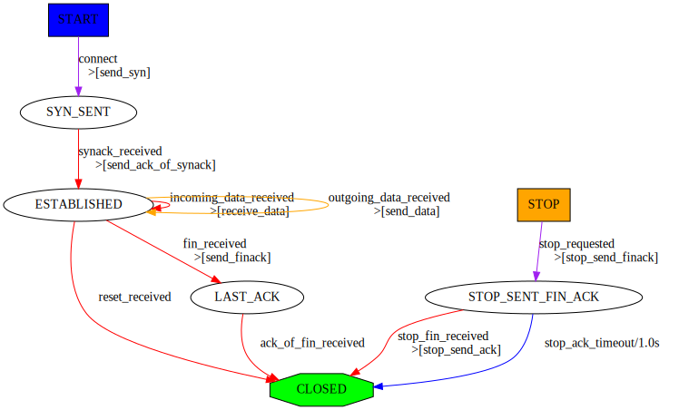

Automata
========

Scapy enables to create easily network automata. Scapy does not stick to a specific model like Moore or Mealy automata. It provides a flexible way for you to choose your way to go.

An automaton in Scapy is deterministic. It has different states. A start state and some end and error states. There are transitions from one state to another. Transitions can be transitions on a specific condition, transitions on the reception of a specific packet or transitions on a timeout. When a transition is taken, one or more actions can be run. An action can be bound to many transitions. Parameters can be passed from states to transitions, and from transitions to states and actions.

From a programmer's point of view, states, transitions and actions are methods from an Automaton subclass. They are decorated to provide meta-information needed in order for the automaton to work.

First example
-------------

Let's begin with a simple example. I take the convention to write states with capitals, but anything valid with Python syntax would work as well.

::

    class HelloWorld(Automaton):
        @ATMT.state(initial=1)
        def BEGIN(self):
            print("State=BEGIN")
    
        @ATMT.condition(BEGIN)
        def wait_for_nothing(self):
            print("Wait for nothing...")
            raise self.END()
    
        @ATMT.action(wait_for_nothing)
        def on_nothing(self):
            print("Action on 'nothing' condition")
    
        @ATMT.state(final=1)
        def END(self):
            print("State=END")

In this example, we can see 3 decorators:

* ``ATMT.state`` that is used to indicate that a method is a state, and that can
  have initial, final, stop and error optional arguments set to non-zero for special states.
* ``ATMT.condition`` that indicate a method to be run when the automaton state 
  reaches the indicated state. The argument is the name of the method representing that state
* ``ATMT.action`` binds a method to a transition and is run when the transition is taken. 

Running this example gives the following result::

    >>> a=HelloWorld()
    >>> a.run()
    State=BEGIN
    Wait for nothing...
    Action on 'nothing' condition
    State=END
    >>> a.destroy()

This simple automaton can be described with the following graph:

.. image:: ../graphics/ATMT_HelloWorld.*

The graph can be automatically drawn from the code with::

    >>> HelloWorld.graph()

.. note:: An ``Automaton`` can be reset using ``restart()``. It is then possible to run it again.

.. warning:: Remember to call ``destroy()`` once you're done using an Automaton. (especially on PyPy)

Changing states
---------------

The ``ATMT.state`` decorator transforms a method into a function that returns an exception. If you raise that exception, the automaton state will be changed. If the change occurs in a transition, actions bound to this transition will be called. The parameters given to the function replacing the method will be kept and finally delivered to the method. The exception has a method action_parameters that can be called before it is raised so that it will store parameters to be delivered to all actions bound to the current transition.

As an example, let's consider the following state::

    @ATMT.state()
    def MY_STATE(self, param1, param2):
        print("state=MY_STATE. param1=%r param2=%r" % (param1, param2))

This state will be reached with the following code::

    @ATMT.receive_condition(ANOTHER_STATE)
    def received_ICMP(self, pkt):
        if ICMP in pkt:
            raise self.MY_STATE("got icmp", pkt[ICMP].type)

Let's suppose we want to bind an action to this transition, that will also need some parameters::

    @ATMT.action(received_ICMP)
    def on_ICMP(self, icmp_type, icmp_code):
        self.retaliate(icmp_type, icmp_code)

The condition should become::

    @ATMT.receive_condition(ANOTHER_STATE)
    def received_ICMP(self, pkt):
        if ICMP in pkt:
            raise self.MY_STATE("got icmp", pkt[ICMP].type).action_parameters(pkt[ICMP].type, pkt[ICMP].code)

Real example
------------

Here is a real example take from Scapy. It implements a TFTP client that can issue read requests.

.. image:: ../graphics/ATMT_TFTP_read.*

::

    class TFTP_read(Automaton):
        def parse_args(self, filename, server, sport = None, port=69, **kargs):
            Automaton.parse_args(self, **kargs)
            self.filename = filename
            self.server = server
            self.port = port
            self.sport = sport
    
        def master_filter(self, pkt):
            return ( IP in pkt and pkt[IP].src == self.server and UDP in pkt
                     and pkt[UDP].dport == self.my_tid
                     and (self.server_tid is None or pkt[UDP].sport == self.server_tid) )
            
        # BEGIN
        @ATMT.state(initial=1)
        def BEGIN(self):
            self.blocksize=512
            self.my_tid = self.sport or RandShort()._fix()
            bind_bottom_up(UDP, TFTP, dport=self.my_tid)
            self.server_tid = None
            self.res = b""
    
            self.l3 = IP(dst=self.server)/UDP(sport=self.my_tid, dport=self.port)/TFTP()
            self.last_packet = self.l3/TFTP_RRQ(filename=self.filename, mode="octet")
            self.send(self.last_packet)
            self.awaiting=1
            
            raise self.WAITING()
            
        # WAITING
        @ATMT.state()
        def WAITING(self):
            pass
    
        @ATMT.receive_condition(WAITING)
        def receive_data(self, pkt):
            if TFTP_DATA in pkt and pkt[TFTP_DATA].block == self.awaiting:
                if self.server_tid is None:
                    self.server_tid = pkt[UDP].sport
                    self.l3[UDP].dport = self.server_tid
                raise self.RECEIVING(pkt)
        @ATMT.action(receive_data)
        def send_ack(self):
            self.last_packet = self.l3 / TFTP_ACK(block = self.awaiting)
            self.send(self.last_packet)
    
        @ATMT.receive_condition(WAITING, prio=1)
        def receive_error(self, pkt):
            if TFTP_ERROR in pkt:
                raise self.ERROR(pkt)
    
        @ATMT.timeout(WAITING, 3)
        def timeout_waiting(self):
            raise self.WAITING()
        @ATMT.action(timeout_waiting)
        def retransmit_last_packet(self):
            self.send(self.last_packet)
    
        # RECEIVED
        @ATMT.state()
        def RECEIVING(self, pkt):
            recvd = pkt[Raw].load
            self.res += recvd
            self.awaiting += 1
            if len(recvd) == self.blocksize:
                raise self.WAITING()
            raise self.END()
    
        # ERROR
        @ATMT.state(error=1)
        def ERROR(self,pkt):
            split_bottom_up(UDP, TFTP, dport=self.my_tid)
            return pkt[TFTP_ERROR].summary()
        
        #END
        @ATMT.state(final=1)
        def END(self):
            split_bottom_up(UDP, TFTP, dport=self.my_tid)
            return self.res

It can be run like this, for instance::

    >>> atmt = TFTP_read("my_file", "192.168.1.128")
    >>> atmt.run()
    >>> atmt.destroy()

Detailed documentation
----------------------

Decorators
^^^^^^^^^^
Decorator for states
~~~~~~~~~~~~~~~~~~~~

States are methods decorated by the result of the ``ATMT.state`` function. It can take 4 optional parameters, ``initial``, ``final``, ``stop`` and ``error``, that, when set to ``True``, indicating that the state is an initial, final, stop or error state.

.. note:: The ``initial`` state is called while starting the automata. The ``final`` step will tell the automata has reached its end. If you call ``atmt.stop()``, the automata will move to the ``stop`` step whatever its current state is. The ``error`` state will mark the automata as errored. If no ``stop`` state is specified, calling ``stop`` and ``forcestop`` will be equivalent.

::

    class Example(Automaton):
        @ATMT.state(initial=1)
        def BEGIN(self):
            pass

        @ATMT.state()
        def SOME_STATE(self):
            pass

        @ATMT.state(final=1)
        def END(self):
            return "Result of the automaton: 42"

        @ATMT.state(stop=1)
        def STOP(self):
            print("SHUTTING DOWN...")
            # e.g. close sockets...

        @ATMT.condition(STOP)
        def is_stopping(self):
            raise self.END()

        @ATMT.state(error=1)
        def ERROR(self):
            return "Partial result, or explanation"
    # [...]

Take for instance the TCP client:

The ``START`` event is ``initial=1``, the ``STOP`` event is ``stop=1`` and the ``CLOSED`` event is ``final=1``.

Decorators for transitions
~~~~~~~~~~~~~~~~~~~~~~~~~~

Transitions are methods decorated by the result of one of ``ATMT.condition``, ``ATMT.receive_condition``, ``ATMT.eof``, ``ATMT.timeout``, ``ATMT.timer``. They all take as argument the state method they are related to. ``ATMT.timeout`` and ``ATMT.timer`` also have a mandatory ``timeout`` parameter to provide the timeout value in seconds. The difference between ``ATMT.timeout`` and ``ATMT.timer`` is that ``ATMT.timeout`` gets triggered only once. ``ATMT.timer`` get reloaded automatically, which is useful for sending keep-alive packets. ``ATMT.condition`` and ``ATMT.receive_condition`` have an optional ``prio`` parameter so that the order in which conditions are evaluated can be forced. The default priority is 0. Transitions with the same priority level are called in an undetermined order.

When the automaton switches to a given state, the state's method is executed. Then transitions methods are called at specific moments until one triggers a new state (something like ``raise self.MY_NEW_STATE()``). First, right after the state's method returns, the ``ATMT.condition`` decorated methods are run by growing prio. Then each time a packet is received and accepted by the master filter all ``ATMT.receive_condition`` decorated hods are called by growing prio. When a timeout is reached since the time we entered into the current space, the corresponding ``ATMT.timeout`` decorated method is called. If the socket raises an ``EOFError`` (closed) during a state, the ``ATMT.EOF`` transition is called. Otherwise it raises an exception and the automaton exits.

::

    class Example(Automaton):
        @ATMT.state()
        def WAITING(self):
            pass
    
        @ATMT.condition(WAITING)
        def it_is_raining(self):
            if not self.have_umbrella:
                raise self.ERROR_WET()
    
        @ATMT.receive_condition(WAITING, prio=1)
        def it_is_ICMP(self, pkt):
            if ICMP in pkt:
                raise self.RECEIVED_ICMP(pkt)
                
        @ATMT.receive_condition(WAITING, prio=2)
        def it_is_IP(self, pkt):
            if IP in pkt:
                raise self.RECEIVED_IP(pkt)
        
        @ATMT.timeout(WAITING, 10.0)
        def waiting_timeout(self):
            raise self.ERROR_TIMEOUT()

Decorator for actions
~~~~~~~~~~~~~~~~~~~~~

Actions are methods that are decorated by the return of ``ATMT.action`` function. This function takes the transition method it is bound to as first parameter and an optional priority ``prio`` as a second parameter. The default priority is 0. An action method can be decorated many times to be bound to many transitions.

::

    from random import random

    class Example(Automaton):
        @ATMT.state(initial=1)
        def BEGIN(self):
            pass
    
        @ATMT.state(final=1)
        def END(self):
            pass
    
        @ATMT.condition(BEGIN, prio=1)
        def maybe_go_to_end(self):
            if random() > 0.5:
                raise self.END()

        @ATMT.condition(BEGIN, prio=2)
        def certainly_go_to_end(self):
            raise self.END()
    
        @ATMT.action(maybe_go_to_end)
        def maybe_action(self):
            print("We are lucky...")

        @ATMT.action(certainly_go_to_end)
        def certainly_action(self):
            print("We are not lucky...")

        @ATMT.action(maybe_go_to_end, prio=1)
        @ATMT.action(certainly_go_to_end, prio=1)
        def always_action(self):
            print("This wasn't luck!...")

The two possible outputs are::

    >>> a=Example()
    >>> a.run()
    We are not lucky...
    This wasn't luck!...
    >>> a.run()
    We are lucky...
    This wasn't luck!...
    >>> a.destroy()

.. note:: If you want to pass a parameter to an action, you can use the ``action_parameters`` function while raising the next state.

In the following example, the ``send_copy`` action takes a parameter passed by ``is_fin``::

    class Example(Automaton):
        @ATMT.state()
        def WAITING(self):
            pass

        @ATMT.state()
        def FIN_RECEIVED(self):
            pass

        @ATMT.receive_condition(WAITING)
        def is_fin(self, pkt):
            if pkt[TCP].flags.F:
                raise self.FIN_RECEIVED().action_parameters(pkt)

        @ATMT.action(is_fin)
        def send_copy(self, pkt):
            send(pkt)

Methods to overload
^^^^^^^^^^^^^^^^^^^

Two methods are hooks to be overloaded:

* The ``parse_args()`` method is called with arguments given at ``__init__()`` and ``run()``. Use that to parametrize the behavior of your automaton.

* The ``master_filter()`` method is called each time a packet is sniffed and decides if it is interesting for the automaton. When working on a specific protocol, this is where you will ensure the packet belongs to the connection you are being part of, so that you do not need to make all the sanity checks in each transition.

Timer configuration
^^^^^^^^^^^^^^^^^^^

Some protocols allow timer configuration. In order to configure timeout values during class initialization one may use ``timer_by_name()`` method, which returns ``Timer`` object associated with the given function name::

    class Example(Automaton):
	def __init__(self, *args, **kwargs):
	    super(Example, self).__init__(*args, **kwargs)
	    timer = self.timer_by_name("waiting_timeout")
	    timer.set(1)

	@ATMT.state(initial=1)
	def WAITING(self):
	    pass

	@ATMT.state(final=1)
	def END(self):
	    pass

	@ATMT.timeout(WAITING, 10.0)
	def waiting_timeout(self):
	    raise self.END()