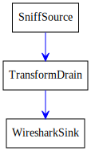
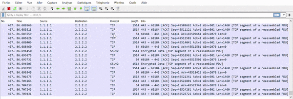
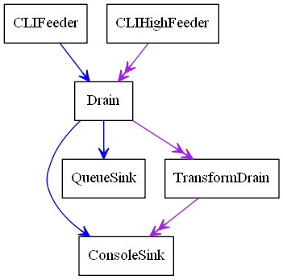

.. _pipetools:

PipeTools
=========

Scapy's ``pipetool`` is a smart piping system allowing to perform complex stream data management.

The goal is to create a sequence of steps with one or several inputs and one or several outputs, with a bunch of blocks in between.
PipeTools can handle varied sources of data (and outputs) such as user input, pcap input, sniffing, wireshark...
A pipe system is implemented by manually linking all its parts. It is possible to dynamically add an element while running or set multiple drains for the same source.

.. note:: Pipetool default objects are located inside ``scapy.pipetool``

Demo: sniff, anonymize, send to Wireshark
-----------------------------------------

The following code will sniff packets on the default interface, anonymize the source and destination IP addresses and pipe it all into Wireshark. Useful when posting online examples, for instance.

.. code-block:: python3

    source = SniffSource(iface=conf.iface)
    wire = WiresharkSink()
    def transf(pkt):
        if not pkt or IP not in pkt:
            return pkt
        pkt[IP].src = "1.1.1.1"
        pkt[IP].dst = "2.2.2.2"
        return pkt

    source > TransformDrain(transf) > wire
    p = PipeEngine(source)
    p.start()
    p.wait_and_stop()

The engine is pretty straightforward:

Let's run it:

Class Types
-----------

There are 3 different class of objects used for data management:

- ``Sources``
- ``Drains``
- ``Sinks``

They are executed and handled by a :class:`~scapy.pipetool.PipeEngine` object.

When running, a pipetool engine waits for any available data from the Source, and send it in the Drains linked to it.
The data then goes from Drains to Drains until it arrives in a Sink, the final state of this data.

Let's see with a basic demo how to build a pipetool system.

For instance, this engine was generated with this code:

.. code:: pycon

    >>> s = CLIFeeder()
    >>> s2 = CLIHighFeeder()
    >>> d1 = Drain()
    >>> d2 = TransformDrain(lambda x: x[::-1])
    >>> si1 = ConsoleSink()
    >>> si2 = QueueSink()
    >>> 
    >>> s > d1
    >>> d1 > si1
    >>> d1 > si2
    >>> 
    >>> s2 >> d1
    >>> d1 >> d2
    >>> d2 >> si1
    >>> 
    >>> p = PipeEngine()
    >>> p.add(s)
    >>> p.add(s2)
    >>> p.graph(target="> the_above_image.png")

``start()`` is used to start the :class:`~scapy.pipetool.PipeEngine`:

.. code:: pycon

    >>> p.start()

Now, let's play with it by sending some input data

.. code:: pycon

    >>> s.send("foo")
    >'foo'
    >>> s2.send("bar")
    >>'rab'
    >>> s.send("i like potato")
    >'i like potato'
    >>> print(si2.recv(), ":", si2.recv())
    foo : i like potato

Let's study what happens here:

- there are **two canals** in a :class:`~scapy.pipetool.PipeEngine`, a lower one and a higher one. Some Sources write on the lower one, some on the higher one and some on both.
- most sources can be linked to any drain, on both lower and higher canals. The use of ``>`` indicates a link on the low canal, and ``>>`` on the higher one.
- when we send some data in ``s``, which is on the lower canal, as shown above, it goes through the :class:`~scapy.pipetool.Drain` then is sent to the :class:`~.scapy.pipetool.QueueSink` and to the :class:`~scapy.pipetool.ConsoleSink`
- when we send some data in ``s2``, it goes through the Drain, then the TransformDrain where the data is reversed (see the lambda), before being sent to :class:`~scapy.pipetool.ConsoleSink` only. This explains why we only have the data of the lower sources inside the QueueSink: the higher one has not been linked.

Most of the sinks receive from both lower and upper canals. This is verifiable using the `help(ConsoleSink)`

.. code:: pycon

    >>> help(ConsoleSink)
    Help on class ConsoleSink in module scapy.pipetool:
    class ConsoleSink(Sink)
     |  Print messages on low and high entries
     |     +-------+
     |  >>-|--.    |->>
     |     | print |
     |   >-|--'    |->
     |     +-------+
     |
     [...]

Sources
^^^^^^^

A Source is a class that generates some data.

There are several source types integrated with Scapy, usable as-is, but you may
also create yours.

Default Source classes
~~~~~~~~~~~~~~~~~~~~~~

For any of those class, have a look at ``help([theclass])`` to get more information or the required parameters.

- :class:`~scapy.pipetool.CLIFeeder` : a source especially used in interactive software. its ``send(data)`` generates the event data on the lower canal
- :class:`~scapy.pipetool.CLIHighFeeder` : same than CLIFeeder, but writes on the higher canal
- :class:`~scapy.pipetool.PeriodicSource` : Generate messages periodically on the low canal.
- :class:`~scapy.pipetool.AutoSource`: the default source, that must be extended to create custom sources. 

Create a custom Source
~~~~~~~~~~~~~~~~~~~~~~

To create a custom source, one must extend the :class:`~scapy.pipetool.AutoSource` class.

.. note::

    Do NOT use the default :class:`~scapy.pipetool.Source` class except if you are really sure of what you are doing: it is only used internally, and is missing some implementation. The :class:`~scapy.pipetool.AutoSource` is made to be used.

To send data through it, the object must call its ``self._gen_data(msg)`` or ``self._gen_high_data(msg)`` functions, which send the data into the PipeEngine.

The Source should also (if possible), set ``self.is_exhausted`` to ``True`` when empty, to allow the clean stop of the :class:`~scapy.pipetool.PipeEngine`. If the source is infinite, it will need a force-stop (see PipeEngine below)

For instance, here is how :class:`~scapy.pipetool.CLIHighFeeder` is implemented:

.. code:: python3

    class CLIFeeder(CLIFeeder):
        def send(self, msg):
            self._gen_high_data(msg)
        def close(self):
            self.is_exhausted = True

Drains
^^^^^^

Default Drain classes
~~~~~~~~~~~~~~~~~~~~~

Drains need to be linked on the entry that you are using. It can be either on the lower one (using ``>``) or the upper one (using ``>>``).
See the basic example above.

- :class:`~scapy.pipetool.Drain` : the most basic Drain possible. Will pass on both low and high entry if linked properly.
- :class:`~scapy.pipetool.TransformDrain` : Apply a function to messages on low and high entry
- :class:`~scapy.pipetool.UpDrain` : Repeat messages from low entry to high exit
- :class:`~scapy.pipetool.DownDrain` : Repeat messages from high entry to low exit

Create a custom Drain
~~~~~~~~~~~~~~~~~~~~~

To create a custom drain, one must extend the :class:`~scapy.pipetool.Drain` class.

A :class:`~scapy.pipetool.Drain` object will receive data from the lower canal in its ``push`` method, and from the higher canal from its ``high_push`` method.

To send the data back into the next linked Drain / Sink, it must call the ``self._send(msg)`` or ``self._high_send(msg)`` methods.

For instance, here is how :class:`~scapy.pipetool.TransformDrain` is implemented::

    class TransformDrain(Drain):
        def __init__(self, f, name=None):
            Drain.__init__(self, name=name)
            self.f = f
        def push(self, msg):
            self._send(self.f(msg))
        def high_push(self, msg):
            self._high_send(self.f(msg))

Sinks
^^^^^

Sinks are destinations for messages.

A :py:class:`~scapy.pipetool.Sink` receives data like a :py:class:`~scapy.pipetool.Drain`, but doesn't send any
messages after it.

Messages on the low entry come from :py:meth:`~scapy.pipetool.Sink.push`, and messages on the
high entry come from :py:meth:`~scapy.pipetool.Sink.high_push`.

Default Sinks classes
~~~~~~~~~~~~~~~~~~~~~

- :class:`~scapy.pipetool.ConsoleSink` : Print messages on low and high entries to ``stdout``
- :class:`~scapy.pipetool.RawConsoleSink` : Print messages on low and high entries, using os.write
- :class:`~scapy.pipetool.TermSink` : Prints messages on the low and high entries, on a separate terminal
- :class:`~scapy.pipetool.QueueSink` : Collects messages on the low and high entries into a :py:class:`Queue`

Create a custom Sink
~~~~~~~~~~~~~~~~~~~~

To create a custom sink, one must extend :py:class:`~scapy.pipetool.Sink` and implement
:py:meth:`~scapy.pipetool.Sink.push` and/or :py:meth:`~scapy.pipetool.Sink.high_push`.

This is a simplified version of :py:class:`~scapy.pipetool.ConsoleSink`:

.. code-block:: python3

    class ConsoleSink(Sink):
        def push(self, msg):
            print(">%r" % msg)
        def high_push(self, msg):
            print(">>%r" % msg)

Link objects
------------

As shown in the example, most sources can be linked to any drain, on both low
and high entry.

The use of ``>`` indicates a link on the low entry, and ``>>`` on the high
entry.

For example, to link ``a``, ``b`` and ``c`` on the low entries:

.. code-block:: pycon

    >>> a = CLIFeeder()
    >>> b = Drain()
    >>> c = ConsoleSink()
    >>> a > b > c
    >>> p = PipeEngine()
    >>> p.add(a)

This wouldn't link the high entries, so something like this would do nothing:

.. code-block:: pycon

    >>> a2 = CLIHighFeeder()
    >>> a2 >> b
    >>> a2.send("hello")

Because ``b`` (:py:class:`~scapy.pipetool.Drain`) and ``c`` (:py:class:`scapy.pipetool.ConsoleSink`) are not
linked on the high entry.

However, using a :py:class:`~scapy.pipetool.DownDrain` would bring the high messages from
:py:class:`~scapy.pipetool.CLIHighFeeder` to the lower channel:

.. code-block:: pycon

    >>> a2 = CLIHighFeeder()
    >>> b2 = DownDrain()
    >>> a2 >> b2
    >>> b2 > b
    >>> a2.send("hello")

The PipeEngine class
--------------------

The :class:`~scapy.pipetool.PipeEngine` class is the core class of the Pipetool system. It must be initialized and passed the list of all Sources.

There are two ways of passing sources:

- during initialization: ``p = PipeEngine(source1, source2, ...)``
- using the ``add(source)`` method

A :class:`~scapy.pipetool.PipeEngine` class must be started with ``.start()`` function. It may be force-stopped with the ``.stop()``, or cleanly stopped with ``.wait_and_stop()``

A clean stop only works if the Sources is exhausted (has no data to send left).

It can be printed into a graph using ``.graph()`` methods. see ``help(do_graph)`` for the list of available keyword arguments.

Scapy advanced PipeTool objects
-------------------------------

.. note:: Unlike the previous objects, those are not located in ``scapy.pipetool`` but in ``scapy.scapypipes``

Now that you know the default PipeTool objects, here are some more advanced ones, based on packet functionalities.

- :class:`~scapy.scapypipes.SniffSource` : Read packets from an interface and send them to low exit.
- :class:`~scapy.scapypipes.RdpcapSource` : Read packets from a PCAP file send them to low exit.
- :class:`~scapy.scapypipes.InjectSink` : Packets received on low input are injected (sent) to an interface
- :class:`~scapy.scapypipes.WrpcapSink` : Packets received on low input are written to PCAP file
- :class:`~scapy.scapypipes.UDPDrain` : UDP payloads received on high entry are sent over UDP (complicated, have a look at ``help(UDPDrain)``)
- :class:`~scapy.scapypipes.FDSourceSink` : Use a file descriptor as source and sink
- :class:`~scapy.scapypipes.TCPConnectPipe`: TCP connect to addr:port and use it as source and sink
- :class:`~scapy.scapypipes.TCPListenPipe` : TCP listen on [addr:]port and use the first connection as source and sink (complicated, have a look at ``help(TCPListenPipe)``)

Triggering
----------

Some special sort of Drains exists: the Trigger Drains.

Trigger Drains are special drains, that on receiving data not only pass it by but also send a "Trigger" input, that is received and handled by the next triggered drain (if it exists).

For example, here is a basic :class:`~scapy.scapypipes.TriggerDrain` usage:

.. code:: pycon

    >>> a = CLIFeeder()
    >>> d = TriggerDrain(lambda msg: True) # Pass messages and trigger when a condition is met
    >>> d2 = TriggeredValve()
    >>> s = ConsoleSink()
    >>> a > d > d2 > s
    >>> d ^ d2 # Link the triggers
    >>> p = PipeEngine(s)
    >>> p.start()
    INFO: Pipe engine thread started.
    >>> 
    >>> a.send("this will be printed")
    >'this will be printed'
    >>> a.send("this won't, because the valve was switched")
    >>> a.send("this will, because the valve was switched again")
    >'this will, because the valve was switched again'
    >>> p.stop()

Several triggering Drains exist, they are pretty explicit. It is highly recommended to check the doc using ``help([the class])``

- :class:`~scapy.scapypipes.TriggeredMessage` : Send a preloaded message when triggered and trigger in chain
- :class:`~scapy.scapypipes.TriggerDrain` : Pass messages and trigger when a condition is met
- :class:`~scapy.scapypipes.TriggeredValve` : Let messages alternatively pass or not, changing on trigger
- :class:`~scapy.scapypipes.TriggeredQueueingValve` : Let messages alternatively pass or queued, changing on trigger
- :class:`~scapy.scapypipes.TriggeredSwitch` : Let messages alternatively high or low, changing on trigger
