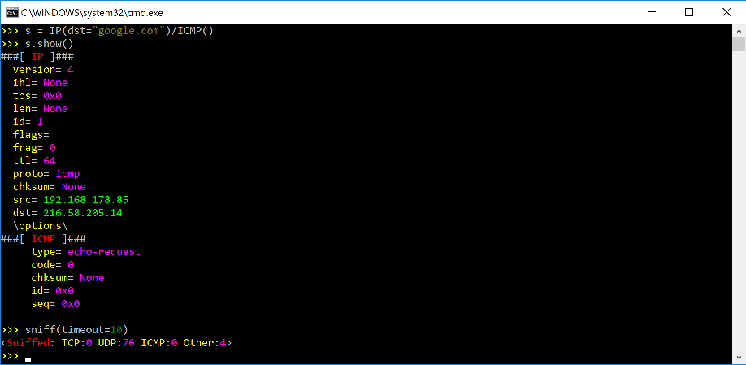
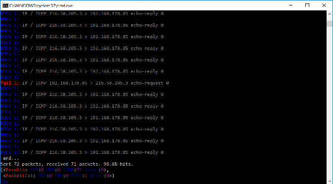

.. highlight:: sh

*************************
Download and Installation
*************************

Overview
========

 0. Install `Python 3.7+ <https://www.python.org/downloads/>`_.
 1. `Download and install Scapy. <#installing-scapy-v2-x>`_
 2. `Follow the platform-specific instructions (dependencies) <#platform-specific-instructions>`_.
 3. (Optional): `Install additional software for special features <#optional-software-for-special-features>`_.
 4. Run Scapy with root privileges.
 
Each of these steps can be done in a different way depending on your platform and on the version of Scapy you want to use.  Follow the platform-specific instructions for more detail.

Scapy versions
==============

.. note:: Scapy 2.5.0 was the last version to support Python 2.7 !

+------------------+-------+-------+--------+
| Scapy version    | 2.3.3 | 2.5.0 | >2.5.0 |
+==================+=======+=======+========+
| Python 2.2-2.6   | ✅    | ❌    | ❌     |
+------------------+-------+-------+--------+
| Python 2.7       | ✅    | ✅    | ❌     |
+------------------+-------+-------+--------+
| Python 3.4-3.6   | ❌    | ✅    | ❌     |
+------------------+-------+-------+--------+
| Python 3.7-3.11  | ❌    | ✅    | ✅     |
+------------------+-------+-------+--------+

Installing Scapy v2.x
=====================

The following steps describe how to install (or update) Scapy itself.
Dependent on your platform, some additional libraries might have to be installed to make it actually work. 
So please also have a look at the platform specific chapters on how to install those requirements.

.. note::

   The following steps apply to Unix-like operating systems (Linux, BSD, Mac OS X). 
   For Windows, see the  `special chapter <#windows>`_ below.

Make sure you have Python installed before you go on.

Latest release
--------------

.. note::
   To get the latest versions, with bugfixes and new features, but maybe not as stable, see the `development version <#current-development-version>`_.

Use pip::

$ pip install scapy

..
    !! COMMENTED UNTIL NEXT RELEASE !!
    Scapy specifies ``optional-dependencies`` so that you can install its optional dependencies directly through pip:

    +----------+------------------------------------------+-----------------------------+
    | Bundle   | Contains                                 | Pip command                 |
    +==========+==========================================+=============================+
    | Default  | Only Scapy                               | ``pip install scapy``       |
    +----------+------------------------------------------+-----------------------------+
    | CLI      | Scapy & IPython. **Highly recommended**  | ``pip install scapy[cli]``  |
    +----------+------------------------------------------+-----------------------------+
    | All      | Scapy & all its optional dependencies    | ``pip install scapy[all]``  |
    +----------+------------------------------------------+-----------------------------+

 
Current development version
----------------------------

.. index::
   single: Git, repository

If you always want the latest version of Scapy with all new the features and bugfixes (but slightly less stable), you can install Scapy from its Git repository.

.. note:: If you don't want to clone Scapy, you can install the development version in one line using::

    $ pip install https://github.com/secdev/scapy/archive/refs/heads/master.zip

1. Check out a clone of Scapy's repository with `git <https://git-scm.com/book/en/v2/Getting-Started-Installing-Git>`_::

   $ git clone https://github.com/secdev/scapy.git
   $ cd scapy

2. Install Scapy using `pip <https://docs.python.org/dev/installing/index.html>`_:: 

   $ pip install .

3. If you used Git, you can always update to the latest version afterwards::

   $ git pull
   $ pip install .

.. note::

   You can run scapy without installing it using the ``run_scapy`` (unix) or ``run_scapy.bat`` (Windows) script.

Optional Dependencies
=====================

For some special features, Scapy will need some dependencies to be installed.
Most of those software are installable via ``pip``.
Here are the topics involved and some examples that you can use to try if your installation was successful.

.. index::
   single: plot()

* Plotting. ``plot()`` needs `Matplotlib <https://matplotlib.org/>`_.

  Matplotlib is installable via ``pip install matplotlib``
 
  .. code-block:: python
   
    >>> p=sniff(count=50)
    >>> p.plot(lambda x:len(x))
 
* 2D graphics. ``psdump()`` and ``pdfdump()`` need `PyX <http://pyx.sourceforge.net/>`_ which in turn needs a LaTeX distribution: `texlive (Unix) <http://www.tug.org/texlive/>`_ or `MikTex (Windows) <https://miktex.org/>`_.
  
  You can install pyx using ``pip install pyx``
  
  .. code-block:: python
   
    >>> p=IP()/ICMP()
    >>> p.pdfdump("test.pdf") 
 
* Graphs. ``conversations()`` needs `Graphviz <http://www.graphviz.org/>`_ and `ImageMagick <http://www.imagemagick.org/>`_.
 
  .. code-block:: python

    >>> p=rdpcap("myfile.pcap")
    >>> p.conversations(type="jpg", target="> test.jpg")

  .. note::
    ``Graphviz`` and ``ImageMagick`` need to be installed separately, using your platform-specific package manager.

* 3D graphics. ``trace3D()`` needs `VPython-Jupyter <https://github.com/vpython/vpython-jupyter/>`_.

  VPython-Jupyter is installable via ``pip install vpython``

  .. code-block:: python

    >>> a,u=traceroute(["www.python.org", "google.com","slashdot.org"])
    >>> a.trace3D()

.. index::
   single: WEP, unwep()

* WEP decryption. ``unwep()`` needs `cryptography <https://cryptography.io>`_. Example using a `Weplap test file <http://weplab.sourceforge.net/caps/weplab-64bit-AA-managed.pcap>`_:

  Cryptography is installable via ``pip install cryptography``

  .. code-block:: python

    >>> enc=rdpcap("weplab-64bit-AA-managed.pcap")
    >>> enc.show()
    >>> enc[0]
    >>> conf.wepkey="AA\x00\x00\x00"
    >>> dec=Dot11PacketList(enc).toEthernet()
    >>> dec.show()
    >>> dec[0]
 
* PKI operations and TLS decryption. `cryptography <https://cryptography.io>`_ is also needed.

* Fingerprinting. ``nmap_fp()`` needs `Nmap <http://nmap.org>`_. You need an `old version <http://nmap.org/dist-old/>`_ (before v4.23) that still supports first generation fingerprinting.

  .. code-block:: python 
  
    >>> load_module("nmap")
    >>> nmap_fp("192.168.0.1")
    Begin emission:
    Finished to send 8 packets.
    Received 19 packets, got 4 answers, remaining 4 packets
    (0.88749999999999996, ['Draytek Vigor 2000 ISDN router'])
 
* VOIP. ``voip_play()`` needs `SoX <http://sox.sourceforge.net/>`_.

Platform-specific instructions
==============================

As a general rule, you can toggle the **libpcap** integration `on` or `off` at any time, using::

    from scapy.config import conf
    conf.use_pcap = True

Linux native
------------

Scapy can run natively on Linux, without libpcap.

* Install `Python 3.7+ <http://www.python.org>`__.
* Install `libpcap <http://www.tcpdump.org>`_. (By default it will only be used to compile BPF filters)
* Make sure your kernel has Packet sockets selected (``CONFIG_PACKET``)
* If your kernel is < 2.6, make sure that Socket filtering is selected ``CONFIG_FILTER``) 

Debian/Ubuntu/Fedora
--------------------

Make sure libpcap is installed:

- Debian/Ubuntu:

.. code-block:: text

    $ sudo apt-get install libpcap-dev

- Fedora:

.. code-block:: text

	$ yum install libpcap-devel

Then install Scapy via ``pip`` or ``apt`` (bundled under ``python3-scapy``)
All dependencies may be installed either via the platform-specific installer, or via PyPI. See `Optional Dependencies <#optional-dependencies>`_ for more information.

Mac OS X
--------

On Mac OS X, Scapy **DOES work natively** since the recent versions.
However, you may want to make Scapy use libpcap.
You can choose to install it using either Homebrew or MacPorts. They both
work fine, yet Homebrew is used to run unit tests with
`Travis CI <https://travis-ci.org>`_. 

.. note:: 
    Libpcap might already be installed on your platform (for instance, if you have tcpdump). This is the case of `OSX <https://developer.apple.com/library/archive/documentation/System/Conceptual/ManPages_iPhoneOS/man3/pcap.3.html>`_

Install using Homebrew
^^^^^^^^^^^^^^^^^^^^^^

1. Update Homebrew::

   $ brew update

2. Install libpcap::

   $ brew install libpcap

Enable it In Scapy::

    conf.use_pcap = True

Install using MacPorts
^^^^^^^^^^^^^^^^^^^^^^

1. Update MacPorts::

   $ sudo port -d selfupdate

2. Install libpcap::

   $ sudo port install libpcap

Enable it In Scapy::

    conf.use_pcap = True

OpenBSD
-------

In a similar manner, to install Scapy on OpenBSD 5.9+, you **may** want to install libpcap, if you do not want to use the native extension:

.. code-block:: text

	$ doas pkg_add libpcap

Then install Scapy via ``pip`` or ``pkg_add`` (bundled under ``python-scapy``)
All dependencies may be installed either via the platform-specific installer, or via PyPI. See `Optional Dependencies <#optional-dependencies>`_ for more information.

SunOS / Solaris
---------------

Solaris / SunOS requires ``libpcap`` (installed by default) to work.

.. note::
    In fact, Solaris doesn't support `AF_PACKET`, which Scapy uses on Linux, but rather uses its own system `DLPI`. See `this page <https://www.oracle.com/technetwork/server-storage/solaris/solaris-linux-app-139382.html>`_.
    We prefer using the very universal `libpcap` that spending time implementing support for `DLPI`.

.. _windows_installation:

Windows
-------

You need to install Npcap in order to install Scapy on Windows (should also work with Winpcap, but unsupported nowadays):

  * Download link: `Npcap <https://nmap.org/npcap/>`_: `the latest version <https://nmap.org/npcap/#download>`_
  * During installation:
      * we advise to turn **off** the ``Winpcap compatibility mode``
      * if you want to use your wifi card in monitor mode (if supported), make sure you enable the ``802.11`` option

Once that is done, you can `continue with Scapy's installation <#latest-release>`_.

You should then be able to open a ``cmd.exe`` and just call ``scapy``. If not, you probably haven't enabled the "Add Python to PATH" option when installing Python. You can follow the instructions `over here <https://docs.python.org/3/using/windows.html#finding-the-python-executable>`_ to change that (or add it manually).

Screenshots
^^^^^^^^^^^

Build the documentation offline
===============================

The Scapy project's documentation is written using reStructuredText (files \*.rst) and can be built using
the `Sphinx <http://www.sphinx-doc.org/>`_ python library. The official online version is available
on `readthedocs <http://scapy.readthedocs.io/>`_.

HTML version
------------
The instructions to build the HTML version are: ::

   (activate a virtualenv)
   pip install sphinx
   cd doc/scapy
   make html

You can now open the resulting HTML file ``_build/html/index.html`` in your favorite web browser.

To use the ReadTheDocs' template, you will have to install the corresponding theme with: ::

   pip install sphinx_rtd_theme

UML diagram
-----------
Using ``pyreverse`` you can build a UML representation of the Scapy source code's object hierarchy. Here is an
example of how to build the inheritance graph for the Fields objects : ::

   (activate a virtualenv)
   pip install pylint
   cd scapy/
   pyreverse -o png -p fields scapy/fields.py

This will generate a ``classes_fields.png`` picture containing the inheritance hierarchy. Note that you can provide as many
modules or packages as you want, but the result will quickly get unreadable.

To see the dependencies between the DHCP layer and the ansmachine module, you can run: ::

   pyreverse -o png -p dhcp_ans scapy/ansmachine.py scapy/layers/dhcp.py scapy/packet.py

In this case, Pyreverse will also generate a ``packages_dhcp_ans.png`` showing the link between the different python modules provided.
