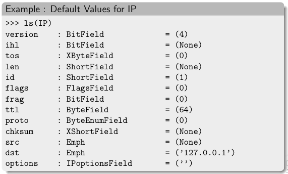

************
Introduction
************

.. sectionauthor:: Philippe Biondi <phil at secdev.org>

About Scapy
===========
Scapy is a Python program that enables the user to send, sniff and dissect and forge network packets. This capability allows construction of tools that can probe, scan or attack networks.

In other words, Scapy is a powerful interactive packet manipulation program. 
It is able to forge or decode packets of a wide number of protocols,
send them on the wire, capture them, match requests and replies, and 
much more. Scapy can easily handle most classical tasks like scanning,
tracerouting, probing, unit tests, attacks or network discovery. It can replace hping, arpspoof, arp-sk, arping, p0f and even some parts of Nmap, tcpdump, and tshark). 

.. image:: graphics/testing-taxonomy.*
   :scale: 50
    
Scapy also performs very well on a lot of other
specific tasks that most other tools can't handle, like sending invalid frames,
injecting your own 802.11 frames, combining techniques 
(VLAN hopping+ARP cache poisoning, VOIP decoding on WEP encrypted channel, ...), etc. 

The idea is simple. Scapy mainly does two things: sending packets and receiving answers. You define a set of packets, it sends them, receives answers, matches requests with answers and returns a list of packet couples (request, answer) and a list of unmatched packets. This has the big advantage over tools like Nmap or hping that an answer is not reduced to (open/closed/filtered), but is the whole packet.

On top of this can be build more high level functions, for example one that does traceroutes and give as a result only the start TTL of the request and the source IP of the answer. One that pings a whole network and gives the list of machines answering. One that does a portscan and returns a LaTeX report.

What makes Scapy so special
===========================

First, with most other networking tools, you won't build someting the author did not imagine. These tools have been built for a specific goal and can't deviate much from it. For example, an ARP cache poisoning program won't let you use double 802.1q encapsulation. Or try to find a program that can send, say, an ICMP packet with padding (I said *padding*, not *payload*, see?). In fact, each time you have a new need, you have to build a new tool.

Second, they usually confuse decoding and interpreting. Machines are good at decoding and can help human beings with that. Interpretation is reserved to human beings. Some programs try to mimic this behaviour. For instance they say "*this port is open*" instead of "*I received a SYN-ACK*". Sometimes they are right. Sometimes not. It's easier for beginners, but when you know what you're doing, you keep on trying to deduce what really happened from the program's interpretation to make your own, which is hard because you lost a big amount of information. And you often end up using ``tcpdump -xX`` to decode and interpret what the tool missed.

Third, even programs which only decode do not give you all the information they received. The network's vision they give you is the one their author thought was sufficient. But it is not complete, and you have a bias. For instance, do you know a tool that reports the Ethernet padding?

Scapy tries to overcome those problems. It enables you to build exactly the packets you want. Even if I think stacking a 802.1q layer on top of TCP has no sense, it may have some for somebody else working on some product I don't know. Scapy has a flexible model that tries to avoid such arbitrary limits. You're free to put any value you want in any field you want, and stack them like you want. You're an adult after all.

In fact, it's like building a new tool each time, but instead of dealing with a hundred line C program, you only write 2 lines of Scapy.

After a probe (scan, traceroute, etc.) Scapy always gives you the full decoded packets from the probe, before any interpretation. That means that you can probe once and interpret many times, ask for a traceroute and look at the padding for instance.

Fast packet design
------------------

Other tools stick to the **program-that-you-run-from-a-shell** paradigm.
The result is an awful syntax to describe a packet. For these tools, the 
solution adopted uses a higher but less powerful description, in the form of 
scenarios imagined by the tool's author. As an example, only the IP address must 
be given to a port scanner to trigger the **port scanning** scenario. Even
if the scenario is tweaked a bit, you still are stuck to a port scan.

Scapy's paradigm is to propose a Domain Specific Language (DSL) that 
enables a powerful and fast description of any kind of packet. Using the Python 
syntax and a Python interpreter as the DSL syntax and interpreter has many 
advantages: there is no need to write a separate interpreter, users don't need 
to learn yet another language and they benefit from a complete, concise 
and very powerful language.

Scapy enables the user to describe a packet or set of packets as layers that are
stacked one upon another. Fields of each layer have useful default values that 
can be overloaded. Scapy does not oblige the user to use predetermined methods 
or templates. This alleviates the requirement of writing a new tool each time a 
different scenario is required. In C, it may take an average of 60 lines to 
describe a packet. With Scapy, the packets to be sent may be described in only a
single line with another line to print the result. 90\% of the network probing 
tools can be rewritten in 2 lines of Scapy.

Probe once, interpret many
--------------------------

Network discovery is blackbox testing. When probing a network, many stimuli are 
sent while only a few of them are answered. If the right stimuli are 
chosen, the desired information may be obtained by the responses or the lack of 
responses. Unlike many tools, Scapy gives all the information, i.e. all the 
stimuli sent and all the responses received. Examination of this data will give 
the user the desired information. When the dataset is small, the user can just 
dig for it. In other cases, the interpretation of the data will depend on the 
point of view taken. Most tools choose the viewpoint and discard all the data 
not related to that point of view. Because Scapy gives the complete raw data, 
that data may be used many times allowing the viewpoint to evolve during 
analysis. For example, a TCP port scan may be probed and the data visualized as 
the result of the port scan. The data could then also be visualized with respect
to the TTL of response packet. A new probe need not be initiated to adjust the 
viewpoint of the data.

.. image:: graphics/scapy-concept.*
   :scale: 80

Scapy decodes, it does not interpret
------------------------------------

A common problem with network probing tools is they try to interpret the answers
received instead of only decoding and giving facts. Reporting something like 
**Received a TCP Reset on port 80** is not subject to interpretation errors. 
Reporting **Port 80 is closed** is an interpretation that may be right most 
of the time but wrong in some specific contexts the tool's author did not 
imagine. For instance, some scanners tend to report a filtered TCP port when 
they receive an ICMP destination unreachable packet. This may be right, but in 
some cases it means the packet was not filtered by the firewall but rather there
was no host to forward the packet to.

Interpreting results can help users that don't know what a port scan is but 
it can also make more harm than good, as it injects bias into the results. What 
can tend to happen is that so that they can do the interpretation themselves, 
knowledgeable users will try to reverse engineer the tool's interpretation to 
derive the facts that triggered that interpretation. Unfortunately much 
information is lost in this operation.

Quick demo
==========

First, we play a bit and create four IP packets at once. Let's see how it works. We first instantiate the IP class. Then, we instantiate it again and we provide a destination that is worth four IP addresses (/30 gives the netmask). Using a Python idiom, we develop this implicit packet in a set of explicit packets. Then, we quit the interpreter. As we provided a session file, the variables we were working on are saved, then reloaded:: 

    # ./scapy.py -s mysession
    New session [mysession]
    Welcome to Scapy (0.9.17.108beta)
    >>> IP()
    <IP |>
    >>> target="www.target.com"
    >>> target="www.target.com/30"
    >>> ip=IP(dst=target)
    >>> ip
    <IP dst=<Net www.target.com/30> |>
    >>> [p for p in ip]
    [<IP dst=207.171.175.28 |>, <IP dst=207.171.175.29 |>, 
     <IP dst=207.171.175.30 |>, <IP dst=207.171.175.31 |>]
    >>> ^D
    
::
    
    # scapy -s mysession 
    Using session [mysession]
    Welcome to Scapy (0.9.17.108beta)
    >>> ip
    <IP dst=<Net www.target.com/30> |>

Now, let's manipulate some packets::

    >>> IP()
    <IP |>
    >>> a=IP(dst="172.16.1.40")
    >>> a
    <IP dst=172.16.1.40 |>
    >>> a.dst
    '172.16.1.40'
    >>> a.ttl
    64
    
Let's say I want a broadcast MAC address, and IP payload to ketchup.com 
and to mayo.com, TTL value from 1 to 9, and an UDP payload::
 
    >>> Ether(dst="ff:ff:ff:ff:ff:ff")
          /IP(dst=["ketchup.com","mayo.com"],ttl=(1,9)) 
          /UDP() 

We have 18 packets defined in 1 line (1 implicit packet) 

Sensible default values
-----------------------

Scapy tries to use sensible default values for all packet fields.
If not overriden, 

* IP source is chosen according to destination and routing table 
* Checksum is computed 
* Source MAC is chosen according to the output interface 
* Ethernet type and IP protocol are determined by the upper layer 

Other fields’ default values are chosen to be the most useful ones: 

* TCP source port is 20, destination port is 80. 
* UDP source and destination ports are 53. 
* ICMP type is echo request. 

Learning Python
===============

Scapy uses the Python interpreter as a command board. That means that you can directly use the Python language (assign variables, use loops, define functions, etc.)

If you are new to Python and you really don't understand a word because of that, or if you want to learn this language, take an hour to read the very good `Python tutorial <http://docs.python.org/tutorial/>`_  by Guido Van Rossum. After that, you'll know Python :) (really!). For a more in-depth tutorial `Dive Into Python <http://diveintopython.org/>`_ is a very good start too.

For a quick start, here's an overview of Python's data types:

* ``int`` (signed, 32bits) : ``42`` 
* ``long`` (signed, infinite): ``42L`` 
* ``str`` : ``"bell\x07\n"`` or ``’bell\x07\n’`` 

* ``tuple`` (immutable): ``(1,4,"42")`` 
* ``list`` (mutable): ``[4,2,"1"]`` 
* ``dict` (mutable): ``{ "one":1 , "two":2 }``

There are no block delimiters in Python. Instead, indendation does matter::

    if cond:
        instr
        instr
    elif cond2:
        instr
    else:
        instr
    

