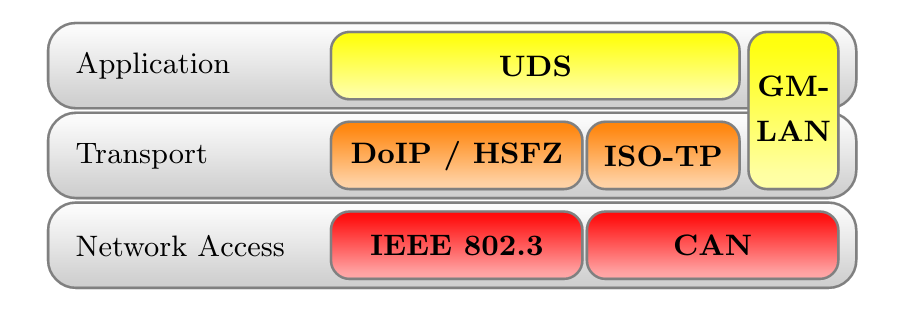

.. note:: This document is under a `Creative Commons Attribution - Non-Commercial - Share Alike 2.5 <http://creativecommons.org/licenses/by-nc-sa/2.5/>`_ license.

#################################
Automotive-specific Documentation
#################################

.. sectionauthor:: Nils Weiss <nils@we155.de>

********
Overview
********

.. note::
    All automotive-related features work best on Linux systems. CANSockets and ISOTPSockets are based on Linux kernel modules. The python-can project is used to support CAN and CANSockets on a wider range of operating systems and CAN hardware interfaces.

Protocols
=========

The following table should give a brief overview of all the automotive-related capabilities
of Scapy. Most application layer protocols have many specialized ``Packet`` classes.
These special-purpose ``Packets`` are not part of this overview. Use the ``explore()``
function to get all information about one specific protocol.

+----------------------+----------------------+--------------------------------------------------------+
| OSI Layer            | Protocol             | Scapy Implementations                                  |
+======================+======================+========================================================+
| Application Layer    | UDS (ISO 14229)      | UDS, UDS_*, UDS_TesterPresentSender                    |
|                      +----------------------+--------------------------------------------------------+
|                      | GMLAN                | GMLAN, GMLAN_*, GMLAN_[Utilities]                      |
|                      +----------------------+--------------------------------------------------------+
|                      | SOME/IP              | SOMEIP, SD                                             |
|                      +----------------------+--------------------------------------------------------+
|                      | BMW HSFZ             | HSFZ, HSFZSocket, ISOTP_HSFZSocket                     |
|                      +----------------------+--------------------------------------------------------+
|                      | OBD                  | OBD, OBD_S0[0-9A]                                      |
|                      +----------------------+--------------------------------------------------------+
|                      | CCP                  | CCP, DTO, CRO                                          |
|                      +----------------------+--------------------------------------------------------+
|                      | XCP                  | XCPOnCAN, XCPOnUDP, XCPOnTCP, CTORequest, CTOResponse, |
|                      |                      | DTO                                                    |
+----------------------+----------------------+--------------------------------------------------------+
| Transportation Layer | ISO-TP (ISO 15765-2) | ISOTPSocket, ISOTPNativeSocket, ISOTPSoftSocket        |
|                      |                      |                                                        |
|                      |                      | ISOTPSniffer, ISOTPMessageBuilder, ISOTPSession        |
|                      |                      |                                                        |
|                      |                      | ISOTPHeader, ISOTPHeaderEA, isotp_scan                 |
|                      |                      |                                                        |
|                      |                      | ISOTP, ISOTP_SF, ISOTP_FF, ISOTP_CF, ISOTP_FC          |
+----------------------+----------------------+--------------------------------------------------------+
| Data Link Layer      | CAN (ISO 11898)      | CAN, CANSocket, rdcandump, CandumpReader               |
+----------------------+----------------------+--------------------------------------------------------+

********************
Technical Background
********************

Parts this section were published in a study report [10]_.

Physical Protocols
==================

More than 20 different communication protocols exist for the vehicle’s internal wired communication. Most vehicles make use of five to ten different protocols for their internal communication. The decision which communication protocol is used from an Original Equipment Manufacturer (OEM) is usually made by the trade-off between the costs for communication technology and the final car price. The four major communication technologies for inter-ECU communication are Controller Area Network (CAN), FlexRay, Local Interconnect Network (LIN), and Automotive Ethernet. For security considerations, these are the most relevant protocols for wired communication in vehicles.

LIN
---
LIN is a single wire communication protocol for low data rates. Actuators and sensors of a vehicle exchange information with an ECU, acting as a LIN master. Software updates over LIN are possible, but the LIN slaves usually do not need software updates because of their limited functionality.

CAN
---
CAN is by far the most used communication technology for inter-ECU communication in vehicles. In older or cheaper vehicles, CAN is still the primary protocol for a vehicle’s backbone communication. Safety-critical communication during a vehicle’s operation, diagnostic information, and software updates are transferred between ECUs over CAN. The lack of security features in the protocol itself, combined with the general use, makes CAN the primary protocol for security investigations.

FlexRay
-------
The FlexRay consortium designed FlexRay as a successor of CAN. Modern vehicles have higher demands on communication bandwidth. By design, FlexRay is a fast and reliable communication protocol for inter-ECU communication. FlexRay components are more expensive than CAN components, leading to a more selective use by OEMs.

Automotive Ethernet
-------------------
Recent upper-class vehicles implement Automotive Ethernet, the new backbone technology for internal vehicle communication. The rapidly grown bandwidth demands already replace FlexRay. The primary reasons for these demands are driver-assistant and autonomous-driving features. Only the physical layer (layer 1) of the Open Systems Interconnection (OSI) model distinguishes Ethernet (IEEE 802.3) from Automotive Ethernet (BroadR-Reach). This design decision leads to multiple advantages. For example, communication stacks of operating systems can be used without modification and routing, filtering, and firewall systems. Automotive Ethernet components are already cheaper than FlexRay components, which will lead to vehicle topologies, where CAN and Automotive Ethernet are the most used communication protocols.

Topologies
==========

Line-Bus
--------

.. _fig-line-bus:

        Line-Bus network topology

The first vehicles with CAN bus used a single network with a line-bus topology. Some lower-priced vehicles still use one or two shared CAN bus networks for their internal communication nowadays. The downside of this topology is its vulnerability and the lack of network separation. All ECUs of a vehicle are connected on a shared bus. Since CAN does not support security features from its protocol definition, any participant on this bus can communicate directly with all other participants, which allows an attacker to affect all ECUs, even safety-critical ones, by compromising one single ECU. The overall security level of this network is given from the security level of the weakest participant.

Central Gateway
---------------

.. _fig-cgw:

        Network topology with central GW ECU

The central Gateway (GW) topology can be found in higher-priced older cars and medium-priced to lower-priced recent cars. A centralized GW ECU separates domain-specific sub-networks. This allows an OEM to encapsulate all ECUs with remote attack surfaces in one sub-network. ECUs with safety-critical functionalities are located in an individual CAN network. Next to CAN, FlexRay might also be used as a communication protocol inside a separate network domain. The security of a safety-critical network in this topology depends mainly on the central GW ECU’s security. This architecture increases the overall security level of a vehicle through domain separation. After an attacker successfully exploited an ECU through an arbitrary attack surface, a second exploitable vulnerability or a logical bug is necessary to compromise a different domain, a safety-critical network, inside a vehicle. This second exploit or logical bug is necessary to overcome the network separation of the central GW ECU.

Central Gateway and Domain Controller
-------------------------------------

.. _fig-dc:

        Network topology with Automotive-Ethernet backbone and DC

A new topology with central GW and Domain Controllers (DCs) can be found in the latest higher-priced vehicles. The increasing demand for bandwidth in modern vehicles with autonomous driving and driver assistant features led to this topology. An Automotive Ethernet network is used as a communication backbone for the entire vehicle. Individual domains, connected through a DC with the central GW, form the vehicle’s backbone. The individual DCs can control and regulate the data communication between a domain and the vehicle’s backbone. This topology achieves a very-high security level through a strong network separation with individual DCs, acting as gateway and firewall, to the vehicle’s backbone network. OEMs have the advantage of dynamic information routing next to this security improvement, an enabler for Feature on Demand (FoD) services.

Automotive Communication Protocols
==================================

This section provides an overview of relevant communication protocols for security evaluations in automotive networks. In contrast to section "Physical Protocols", this section focuses on properties for data communication.

CAN
---

The CAN communication technology was invented in 1983 as a message-based robust vehicle bus communication system. The Robert Bosch GmbH designed multiple communication features into the CAN standard to achieve a robust and computation efficient protocol for controller area networks. Remarkable for the communication behavior of CAN is the internal state machine for transmission errors. This state machine implements a fail silent behavior to protect a safety-critical network from babbling idiot nodes. If a specific limit of reception errors (REC) or transmission errors (TEC) occurred, the CAN driver changes its state from error-active to error-passive and finally to bus-off.

.. _fig-can-bus-states:

        CAN bus states on transmission errors. Receive Error Counter (REC), Transmit Error Counter (TEC)

In recent years, this protocol specification was abused for Denial of Service (DoS) attacks and information gathering attacks on the CAN network of a vehicle. Cho et al. demonstrated a DoS attack against CAN networks by abusing the bus-off state of ECUs [1]_. Injections of communication errors in CAN frames of one specific node caused a high transmission error count in the node under attack, forcing the attacked node to enter the bus-off state. In 2019 Kulandaivel et al. combined this attack with statistical analysis to achieve a fast and inexpensive network mapping in vehicular networks [2]_. They combined statistical analysis of the CAN network traffic before and after the bus-off attack was applied to a node. All missing CAN frames in the network traffic after an ECU was attacked could now be mapped to the ECU under attack, helping researchers identify the origin ECU of a CAN frame. Ken Tindell published a comprehensive summary of low level attacks on CANs in 2019 [3]_.

.. _fig-can-full-frame:

.. figure:: ../graphics/automotive/CAN-full-frame.jpg

        Complete CAN data frame structure [9]_

The above figure shows a CAN frame and its fields as it is transferred over the network. For information exchange, only the fields arbitration, control, and data are relevant. These are the only fields to which a usual application software has access. All other fields are evaluated on a hardware-layer and, in most cases, are not forwarded to an application. The data field has a variable length and can hold up to eight bytes. The length of the data field is specified by the data length code inside the control field. Important variations of this example are CAN-frames with extended arbitration fields and the Controller Area Network Flexible Data-Rate (CAN FD) protocol. On Linux, every received CAN frame is passed to SocketCAN. SocketCAN allows the CAN handling via network sockets of the operating system. SocketCAN was created by Oliver Hartkopp and added to the Linux Kernel version 2.6.25 [4]_. Figure 2.7 shows the frame structure, how CAN frames are encoded if a user-land application receives data from a CAN socket.

.. _fig-can-socket-frame:

        CAN frame defined by SocketCAN

The comparison of above figures clearly shows the loss of information during the CAN frame processing from a physical layer driver. Almost every CAN driver acts in the same way, whether an application code runs on a microcontroller or a Linux kernel. This also means that a standard application does not have access to the Cyclic Redundancy Check (CRC) field, the acknowledgment bit, or the end-of-frame field.

Through the CAN communication in a vehicle or a separated domain, ECUs exchange sensor-data and control inputs; this data is mainly not secured and can be modified by assailants. Attackers can easily spoof sensor values on a CAN bus to trigger malicious reactions of other ECUs. Miller and Valasek described this spoofing attack during their studies on automotive networks [5]_. To prevent attacks on safety-critical data transferred over CAN, Automotive Open System Architecture (AUTOSAR) released a secure onboard communication specification [6]_.

ISO-TP (ISO 15765-2)
--------------------

The CAN protocol supports only eight bytes of data. Use-cases like diagnostic operations or ECU programming require much higher payloads than the CAN protocol supports. For these purposes, the automotive industry standardized the Transport Layer (ISO-TP) (ISO 15765-2) protocol [7]_. ISO-TP is a transportation layer protocol on top of CAN. Payloads with up to 4095 bytes can be transferred between ISO-TP endpoints fragmented in CAN frames. The ISO-TP protocol handling requires four special frame types.

.. _fig-isotp-flow:

        ISO-TP fragmented communication

The different types of ISO-TP frames are shown in the following figure. The payload of a CAN frame gets replaced by one of the four ISO-TP frames. The individual ISO-TP frames have different purposes. A single frame can transfer between 1 and 7 bytes of ISO-TP message data. The len field of a Single Frame or a First Frame indicates the ISO-TP message length. Every message with more than 7 bytes of payload data must be fragmented into a First Frame, followed by multiple Consecutive Frames. This communication is illustrated in the above figure. After the First Frame is sent from a sender, the receiver has to communicate its reception capabilities through a Flow Control Frame to the sender. Only after this Flow Control Frame is received, the sender is allowed to communicate the Consecutive Frames according to the receiver’s capabilities.

.. _fig-isotp-frames:

        ISO-TP frame types

ISO-TP acts as a transport protocol with the support of directed communication through addressing mechanisms. In vehicles, ISO-TP is mainly used as a transport protocol for diagnostic communication. In rare cases, ISO-TP is also used to exchange larger data between ECUs of a vehicle. Security measures have to be applied to the application layer protocol transported through ISO-TP since ISO-TP has no capabilities to secure its transported data.

DoIP
----

Diagnostic over IP (DoIP) was first implemented on automotive networks with a centralized gateway topology. A centralized GW functions as a DoIP endpoint that routes diagnostic messages to the desired network, allowing manufacturers to program or diagnose multiple ECUs in parallel. Since the Internet Protocol (IP) communication between a repair-shop tester and the GW is many times faster than the communication between the GW ECU and a target ECU connected over CAN, the remaining bandwidth of the IP communication can be used to start further DoIP connections to other ECUs in different CAN domains. DoIP is specified as part of AUTOSAR and in ISO 13400-2. Similar to ISO-TP, DoIP does not specify special security measures. The responsibility regarding secured communication is delegated to the application layer protocol.

Diagnostic Protocols
--------------------

Two examples of diagnostic protocols are General Motor Local Area Network (GMLAN) and Unified Diagnostic Service (UDS) (ISO 14229-2). The General Motors Cooperation uses GMLAN. German OEMs mainly use UDS. Both protocols are very similar from a specification point of view, and both protocols use either ISO-TP or DoIP messages for a directed communication with a target ECU. Since different OEMs use UDS, every manufacturer adds its custom additions to the standard. Also, every manufacturer uses individual ISO-TP addressing for the directed communication with an ECU. GMLAN includes more precise definitions about ECU addressing and an ECUs internal behavior compared to UDS.

UDS and GMLAN follow a tree-like message structure, where the first byte identifies the service. Every service is answered by a response. Two types of responses are defined in the standard. Negative responses are indicated through the service 0x7F. Positive responses are identified by the request service identifier incremented with 0x40.

.. _fig-diag-stack:

        Automotive Diagnostic Protocol Stack

A clear separation between the transport and the application layer allows creating application layer tools for both network stacks. The figure above provides an overview of relevant protocols and the corresponding layers. UDS defines a clean separation between application and transport layer. On CAN based networks, ISO-TP is used for this purpose. The CAN protocol can be treated as the network access protocol. This allows to replace ISO-TP and CAN with DoIP or HSFZ and Ethernet. The GMLAN protocol combines transport and application layer specifications very similar to ISO-TP and UDS. Because of that similarity, identical application layer-specific scan techniques can be applied. To overcome the bandwidth limitations of CAN, the latest vehicle architectures use an Ethernet-based diagnostic protocol (DoIP, HSFZ) to communicate with a central gateway ECU. The central gateway ECU routes application layer packets from an Ethernet-based network to a CAN based vehicle internal network. In general, the diagnostic functions of all ECUs in a vehicle can be accessed from the OBD connector over UDSonCAN or UDSonIP.

SOME/IP
-------

Scalable service-Oriented MiddlewarE over IP (SOME/IP) defines a new philosophy of data communication in automotive networks. SOME/IP is used to exchange data between network domain controllers in the latest vehicle networks. SOME/IP supports subscription and notification mechanisms, allowing domain controllers to dynamically subscribe to data provided by another domain controller dependent on the vehicle’s state. SOME/IP transports data between domain controllers and the gateway that a vehicle needs during its regular operation. The use-cases of SOME/IP are similar to the use-cases of CAN communication. The main purpose is the information exchange of sensor and actuator data between ECUs. This usage emphasizes SOME/IP communication as a rewarding target for cyber-attacks.

CCP/XCP
-------

Universal Measurement and Calibration Protocol (XCP), the CAN Calibration Protocol (CCP) successor, is a calibration protocol for automotive systems, standardized by ASAM e.V. in 2003. The primary usage of XCP is during the testing and calibration phase of ECU or vehicle development. CCP is designed for use on CAN. No message in CCP exceeds the 8-byte limitation of CAN. To overcome this restriction, XCP was designed to aim for compatibility with a wide range of transport protocols. XCP can be used on top of CAN, CAN FD, Serial Peripheral Interface (SPI), Ethernet, Universal Serial Bus (USB), and FlexRay. The features of CCP and XCP are very similar; however, XCP has a larger functional scope and optimizations for data efficiency.

Both protocols have a session-based communication procedure and support authentication through seed and key mechanisms between a master and multiple slave nodes. A master node is typically an engineering Personal Computer (PC). In vehicles, slave nodes are ECUs for configuration. XCP also supports simulation. A vehicle engineer can debug a MATLAB Simulink model through XCP. In this case, the simulated model acts as the XCP slave node. CCP and XCP can read and write to the memory of an ECU. Another main feature is data acquisition. Both protocols support a procedure that allows an engineer to configure a so-called data acquisition list with memory addresses of interest. All memory specified in such a list will be read periodically and be broadcast in a CCP or XCP Data Acquisition (DAQ) packet on the chosen communication channel. The following figure gives an overview of all supported communication and packet types in XCP. In the Command Transfer Object (CTO) area, all communication follows a request and response procedure always initiated by the XCP master. A Command Packet (CMD) can receive a Command Response Packet (RES), an Error (ERR) packet, an Event Packet (EV), or a Service Request Packet (SERV) as a response. After the configuration of a slave through CTO CMDs, a slave can listen for Stimulation (STIM) packets and periodically send configured DAQ packets. The resources section in the following figure indicates the possible attack surfaces of this protocol (Programming (PGM), Calibration (CAL), DAQ, STIM) which an attacker could abuse. It is crucial for a vehicle’s security and safety that such protocols, which have their use only during calibration and development of a vehicle, are disabled or removed before a vehicle is shipped to a customer.

.. _fig-xcp-reference:

.. figure:: ../graphics/automotive/XCP_ReferenceBook.png

        XCP communication model between XCP Master and XCP Slave. This model shows the communication direction for CTO/Data Transfer Object (DTO) packages [8]_.

**References**

.. [1] Kyong-Tak Cho and Kang G. Shin. Error handling of in-vehicle networks makes them vulnerable. In Proceedings of the 2016 ACM SIGSAC Conference on Computer and Communications Security, CCS ’16, page 1044–1055, New York, NY, USA, 2016. Association for Computing Machinery.

.. [2] Sekar Kulandaivel, Tushar Goyal, Arnav Kumar Agrawal, and Vyas Sekar. Canvas: Fast and inexpensive automotive network mapping. In 28th USENIX Security Symposium (USENIX Security 19), pages 389–405, Santa Clara, CA, August 2019. USENIX Association.

.. [3] Ken Tindell. CAN Bus Security - Attacks on CAN bus and their mitigations, 2019. https://canislabs.com/wp-content/uploads/2020/12/2020-02-14-White-Paper-CAN-Security.pdf

.. [4] Oliver Hartkopp. Readme file for the Controller Area Network Protocol Family (aka SocketCAN), 2020 (accessed January 29, 2020). https://www.kernel.org/doc/Documentation/networking/can.txt

.. [5] Dr. Charlie Miller and Chris Valasek. Adventures in Automotive Networks and Control Units. DEF CON 21 Hacking Conference. Las Vegas, NV: DEF CON, August 2013. http://illmatics.com/car_hacking.pdf (accessed 2020-05-27)

.. [6] AUTOSAR. Specification of Secure Onboard Communication, 2020 (accessed January 31, 2020). https://www.autosar.org/fileadmin/user_upload/standards/classic/4-3/AUTOSAR_SWS_SecureOnboardCommunication.pdf

.. [7] ISO Central Secretary. Road vehicles – Diagnostic communication over Controller Area Network (DoCAN) – Part 2: Transport protocol and network layer services. Standard ISO 15765-2:2016, International Organization for Standardization, Geneva, CH, 2016.

.. [8] Vector Informatik GmbH. XCP – The Standard Protocol for ECU Development. Vector Informatik GmbH, 2020 (accessed January 30, 2020). https://assets.vector.com/cms/content/application-areas/ecu-calibration/xcp/XCP_ReferenceBook_V3.0_EN.pdf

.. [9] Pico Technology Ltd. Complete CAN data frame structure, 2020 (accessed February 14, 2020). https://www.picotech.com/images/uploads/library/topics/_med/CAN-full-frame.jpg

.. [10] Nils Weiss. Security Testing in Safety-Critical Networks. PhD Study Report. http://www.kiv.zcu.cz/site/documents/verejne/vyzkum/publikace/technicke-zpravy/2020/Rigo_Weiss_2020_2.pdf

******
Layers
******

.. note:: **ATTENTION**: Animations below might be outdated.

CAN
===

How-To
------

Send and receive a message over Linux SocketCAN::

   load_layer("can")
   load_contrib('cansocket')

   socket = CANSocket(channel='can0')
   packet = CAN(identifier=0x123, data=b'01020304')

   socket.send(packet)
   rx_packet = socket.recv()

   socket.sr1(packet, timeout=1)

Send and receive a message over a Vector CAN-Interface::

   load_layer("can")
   conf.contribs['CANSocket'] = {'use-python-can' : True}
   load_contrib('cansocket')

   socket = CANSocket(bustype='vector', channel=0, bitrate=1000000)
   packet = CAN(identifier=0x123, data=b'01020304')

   socket.send(packet)
   rx_packet = socket.recv()

   socket.sr1(packet)

CAN Frame
---------

Basic information about CAN can be found here: https://en.wikipedia.org/wiki/CAN_bus

The following examples assume that CAN layer in your Scapy session is loaded.
If it isn't, the CAN layer can be loaded with this command in your Scapy session::

    >>> load_layer("can")

Creation of a standard CAN frame::

    >>> frame = CAN(identifier=0x200, length=8, data=b'\x01\x02\x03\x04\x05\x06\x07\x08')

Creation of an extended CAN frame::

   frame = CAN(flags='extended', identifier=0x10010000, length=8, data=b'\x01\x02\x03\x04\x05\x06\x07\x08')
   >>> frame.show()
   ###[ CAN ]###
     flags= extended
     identifier= 0x10010000
     length= 8
     reserved= 0
     data= '\x01\x02\x03\x04\x05\x06\x07\x08'

CAN Frame in- and export
------------------------

CAN Frames can be written to and read from ``pcap`` files::

   x = CAN(identifier=0x7ff,length=8,data=b'\x01\x02\x03\x04\x05\x06\x07\x08')
   wrpcap('/tmp/scapyPcapTest.pcap', x, append=False)
   y = rdpcap('/tmp/scapyPcapTest.pcap', 1)

Additionally CAN Frames can be imported from ``candump`` output and log files.
The ``CandumpReader`` class can be used in the same way as a ``socket`` object.
This allows you to use ``sniff`` and other functions from Scapy::

    with CandumpReader("candump.log") as sock:
        can_msgs = sniff(count=50, opened_socket=sock)

DBC File Format and CAN Signals
-------------------------------

In order to support the DBC file format, ``SignalFields`` and the ``SignalPacket``
classes were added to Scapy. ``SignalFields`` should only be used inside a ``SignalPacket``.
Multiplexer fields (MUX) can be created through ``ConditionalFields``. The following
example demonstrates the usage::

    DBC Example:

    BO_ 4 muxTestFrame: 7 TEST_ECU
     SG_ myMuxer M : 53|3@1+ (1,0) [0|0] ""  CCL_TEST
     SG_ muxSig4 m0 : 25|7@1- (1,0) [0|0] ""  CCL_TEST
     SG_ muxSig3 m0 : 16|9@1+ (1,0) [0|0] ""  CCL_TEST
     SG_ muxSig2 m0 : 15|8@0- (1,0) [0|0] ""  CCL_TEST
     SG_ muxSig1 m0 : 0|8@1- (1,0) [0|0] ""  CCL_TEST
     SG_ muxSig5 m1 : 22|7@1- (0.01,0) [0|0] ""  CCL_TEST
     SG_ muxSig6 m1 : 32|9@1+ (2,10) [0|0] "mV"  CCL_TEST
     SG_ muxSig7 m1 : 2|8@0- (0.5,0) [0|0] ""  CCL_TEST
     SG_ muxSig8 m1 : 0|6@1- (10,0) [0|0] ""  CCL_TEST
     SG_ muxSig9 : 40|8@1- (100,-5) [0|0] "V"  CCL_TEST

    BO_ 3 testFrameFloat: 8 TEST_ECU
     SG_ floatSignal2 : 32|32@1- (1,0) [0|0] ""  CCL_TEST
     SG_ floatSignal1 : 7|32@0- (1,0) [0|0] ""  CCL_TEST

Scapy implementation of this DBC description::

    class muxTestFrame(SignalPacket):
        fields_desc = [
            LEUnsignedSignalField("myMuxer", default=0, start=53, size=3),
            ConditionalField(LESignedSignalField("muxSig4", default=0, start=25, size=7), lambda p: p.myMuxer == 0),
            ConditionalField(LEUnsignedSignalField("muxSig3", default=0, start=16, size=9), lambda p: p.myMuxer == 0),
            ConditionalField(BESignedSignalField("muxSig2", default=0, start=15, size=8), lambda p: p.myMuxer == 0),
            ConditionalField(LESignedSignalField("muxSig1", default=0, start=0, size=8), lambda p: p.myMuxer == 0),
            ConditionalField(LESignedSignalField("muxSig5", default=0, start=22, size=7, scaling=0.01), lambda p: p.myMuxer == 1),
            ConditionalField(LEUnsignedSignalField("muxSig6", default=0, start=32, size=9, scaling=2, offset=10, unit="mV"), lambda p: p.myMuxer == 1),
            ConditionalField(BESignedSignalField("muxSig7", default=0, start=2, size=8, scaling=0.5), lambda p: p.myMuxer == 1),
            ConditionalField(LESignedSignalField("muxSig8", default=0, start=3, size=3, scaling=10), lambda p: p.myMuxer == 1),
            LESignedSignalField("muxSig9", default=0, start=41, size=7, scaling=100, offset=-5, unit="V"),
        ]

    class testFrameFloat(SignalPacket):
        fields_desc = [
            LEFloatSignalField("floatSignal2", default=0, start=32),
            BEFloatSignalField("floatSignal1", default=0, start=7)
        ]

    bind_layers(SignalHeader, muxTestFrame, identifier=0x123)
    bind_layers(SignalHeader, testFrameFloat, identifier=0x321)

    dbc_sock = CANSocket("can0", basecls=SignalHeader)

    pkt = SignalHeader()/testFrameFloat(floatSignal2=3.4)

    dbc_sock.send(pkt)

This example uses the class ``SignalHeader`` as header. The payload is specified by individual ``SignalPackets``.
``bind_layers`` combines the header with the payload dependent on the CAN identifier.
If you want to directly receive ``SignalPackets`` from your ``CANSocket``, provide the parameter ``basecls`` to
the ``init`` function of your ``CANSocket``.

Canmatrix supports the creation of Scapy files from DBC or AUTOSAR XML files https://github.com/ebroecker/canmatrix

CANSockets
==========

Linux SocketCAN
---------------

This subsection summarizes some basics about Linux SocketCAN. An excellent overview
from Oliver Hartkopp can be found here: https://wiki.automotivelinux.org/_media/agl-distro/agl2017-socketcan-print.pdf

Virtual CAN Setup
^^^^^^^^^^^^^^^^^

Linux SocketCAN supports virtual CAN interfaces. These interfaces are an easy way
to do some first steps on a CAN-Bus without the requirement of special hardware.
Besides that, virtual CAN interfaces are heavily used in Scapy unit tests for
automotive-related contributions.

Virtual CAN sockets require a special Linux kernel module. The following shell command loads the required module::

    sudo modprobe vcan

In order to use a virtual CAN interface some additional commands for setup are required.
This snippet chooses the name ``vcan0`` for the virtual CAN interface. Any name can be chosen here::

    sudo ip link add name vcan0 type vcan
    sudo ip link set dev vcan0 up

The same commands can be executed from Scapy like this::

   from scapy.layers.can import *
   import os

   bashCommand = "/bin/bash -c 'sudo modprobe vcan; sudo ip link add name vcan0 type vcan; sudo ip link set dev vcan0 up'"
   os.system(bashCommand)

If it's required, a CAN interface can be set into a ``listen-only`` or ``loopback`` mode with ``ip link set`` commands::

   ip link set vcan0 type can help  # shows additional information

Linux can-utils
^^^^^^^^^^^^^^^

As part of Linux SocketCAN, some very useful command line tools are provided from
Oliver Hartkopp: https://github.com/linux-can/can-utils

The following example shows the basic functions of Linux can-utils. These utilities
are very handy for quick checks, dumping, sending, or logging of CAN messages
from the command line.

.. image:: ../graphics/animations/animation-cansend.svg

Scapy CANSocket
---------------

In Scapy, two kind of CANSockets are implemented. One implementation is called **Native CANSocket**,
the other implementation is called **Python-can CANSocket**.

Since Python 3 supports ``PF_CAN`` sockets, **Native CANSockets** can be used on a
Linux based system with Python 3 or higher. These sockets have a performance advantage
because ``select`` is callable on them. This has a big effect in MITM scenarios.

For compatibility reasons, **Python-can CANSockets** were added to Scapy.
On Windows or OSX and on all systems without Python 3, CAN buses can be accessed
through ``python-can``. ``python-can`` needs to be installed on the system: https://github.com/hardbyte/python-can/
**Python-can CANSockets** are a wrapper of python-can interface objects for Scapy.
Both CANSockets provide the same API which makes them exchangeable under most conditions.
Nevertheless some unique behaviours of each CANSocket type has to be respected.
Some CAN-interfaces, like Vector hardware is only supported on Windows.
These interfaces can be used through **Python-can CANSockets**.

Native CANSocket
^^^^^^^^^^^^^^^^

Creating a simple native CANSocket::

   conf.contribs['CANSocket'] = {'use-python-can': False} #(default)
   load_contrib('cansocket')

   # Simple Socket
   socket = CANSocket(channel="vcan0")

Creating a native CANSocket only listen for messages with Id == 0x200::

   socket = CANSocket(channel="vcan0", can_filters=[{'can_id': 0x200, 'can_mask': 0x7FF}])

Creating a native CANSocket only listen for messages with Id >= 0x200 and Id <= 0x2ff::

   socket = CANSocket(channel="vcan0", can_filters=[{'can_id': 0x200, 'can_mask': 0x700}])

Creating a native CANSocket only listen for messages with Id != 0x200::

   socket = CANSocket(channel="vcan0", can_filters=[{'can_id': 0x200 | CAN_INV_FILTER, 'can_mask': 0x7FF}])

Creating a native CANSocket with multiple can_filters::

   socket = CANSocket(channel='vcan0', can_filters=[{'can_id': 0x200, 'can_mask': 0x7ff},
                                                  {'can_id': 0x400, 'can_mask': 0x7ff},
                                                  {'can_id': 0x600, 'can_mask': 0x7ff},
                                                  {'can_id': 0x7ff, 'can_mask': 0x7ff}])

Creating a native CANSocket which also receives its own messages::

   socket = CANSocket(channel="vcan0", receive_own_messages=True)

Sniff on a CANSocket:

CANSocket python-can
^^^^^^^^^^^^^^^^^^^^

python-can is required to use various CAN-interfaces on Windows, OSX or Linux.
The python-can library is used through a CANSocket object. To create a python-can
CANSocket object, all parameters of a python-can ``interface.Bus`` object has to 
be used for the initialization of the CANSocket.

Ways of creating a python-can CANSocket::

   conf.contribs['CANSocket'] = {'use-python-can': True}
   load_contrib('cansocket')

Creating a simple python-can CANSocket::

   socket = CANSocket(bustype='socketcan', channel='vcan0', bitrate=250000)

Creating a python-can CANSocket with multiple filters::

   socket = CANSocket(bustype='socketcan', channel='vcan0', bitrate=250000,
                   can_filters=[{'can_id': 0x200, 'can_mask': 0x7ff},
                               {'can_id': 0x400, 'can_mask': 0x7ff},
                               {'can_id': 0x600, 'can_mask': 0x7ff},
                               {'can_id': 0x7ff, 'can_mask': 0x7ff}])

For further details on python-can check: https://python-can.readthedocs.io/

CANSocket MITM attack with bridge and sniff
^^^^^^^^^^^^^^^^^^^^^^^^^^^^^^^^^^^^^^^^^^^
This example shows how to use bridge and sniff on virtual CAN interfaces.
For real world applications, use real CAN interfaces.
Set up two vcans on Linux terminal::

   sudo modprobe vcan
   sudo ip link add name vcan0 type vcan
   sudo ip link add name vcan1 type vcan
   sudo ip link set dev vcan0 up
   sudo ip link set dev vcan1 up

Import modules::

   import threading
   load_contrib('cansocket')
   load_layer("can")

Create can sockets for attack::

   socket0 = CANSocket(channel='vcan0')
   socket1 = CANSocket(channel='vcan1')

Create a function to send packet with threading::

   def sendPacket():
       sleep(0.2)
       socket0.send(CAN(flags='extended', identifier=0x10010000, length=8, data=b'\x01\x02\x03\x04\x05\x06\x07\x08'))

Create a function for forwarding or change packets::

   def forwarding(pkt):
       return pkt

Create a function to bridge and sniff between two sockets::

   def bridge():
       bSocket0 = CANSocket(channel='vcan0')
       bSocket1 = CANSocket(channel='vcan1')
       bridge_and_sniff(if1=bSocket0, if2=bSocket1, xfrm12=forwarding, xfrm21=forwarding, timeout=1)
       bSocket0.close()
       bSocket1.close()

Create threads for sending packet and to bridge and sniff::

   threadBridge = threading.Thread(target=bridge)
   threadSender = threading.Thread(target=sendMessage)

Start the threads::

   threadBridge.start()
   threadSender.start()

Sniff packets::

   packets = socket1.sniff(timeout=0.3)

Close the sockets::

   socket0.close()
   socket1.close()

.. image:: ../graphics/animations/animation-scapy-cansockets-mitm2.svg

CAN Calibration Protocol (CCP)
==============================

CCP is derived from CAN. The CAN-header is part of a CCP frame. CCP has two types
of message objects. One is called Command Receive Object (CRO), the other is called
Data Transmission Object (DTO). Usually CROs are sent to an Ecu, and DTOs are received
from an Ecu. The information, if one DTO answers a CRO is implemented through a counter
field (ctr). If both objects have the same counter value, the payload of a DTO object
can be interpreted from the command of the associated CRO object.

Creating a CRO message::

    load_contrib('automotive.ccp')
    CCP(identifier=0x700)/CRO(ctr=1)/CONNECT(station_address=0x02)
    CCP(identifier=0x711)/CRO(ctr=2)/GET_SEED(resource=2)
    CCP(identifier=0x711)/CRO(ctr=3)/UNLOCK(key=b"123456")

If we aren't interested in the DTO of an Ecu, we can just send a CRO message like this:
Sending a CRO message::

    pkt = CCP(identifier=0x700)/CRO(ctr=1)/CONNECT(station_address=0x02)
    sock = CANSocket(bustype='socketcan', channel='vcan0')
    sock.send(pkt)

If we are interested in the DTO of an Ecu, we need to set the basecls parameter of the
CANSocket to CCP and we need to use sr1:
Sending a CRO message::

    cro = CCP(identifier=0x700)/CRO(ctr=0x53)/PROGRAM_6(data=b"\x10\x11\x12\x10\x11\x12")
    sock = CANSocket(bustype='socketcan', channel='vcan0', basecls=CCP)
    dto = sock.sr1(cro)
    dto.show()
    ###[ CAN Calibration Protocol ]###
      flags=
      identifier= 0x700
      length= 8
      reserved= 0
    ###[ DTO ]###
         packet_id= 0xff
         return_code= acknowledge / no error
         ctr= 83
    ###[ PROGRAM_6_DTO ]###
            MTA0_extension= 2
            MTA0_address= 0x34002006

Since sr1 calls the answers function, our payload of the DTO objects gets interpreted with the
command of our CRO object.

Universal calibration and measurement protocol (XCP)
====================================================

XCP is the successor of CCP. It is usable with several protocols. Scapy includes CAN, UDP and TCP.
XCP has two types of message types: Command Transfer Object (CTO) and Data Transmission Object (DTO).
CTOs send to an Ecu are requests (commands) and the Ecu has to reply with a positive response or an error.
Additionally, the Ecu can send a CTO to inform the master about an asynchronous event (EV) or request a service execution (SERV).
DTOs sent by the Ecu are called DAQ (Data AcQuisition) and include measured values.
DTOs received by the Ecu are used for a periodic stimulation and are called STIM (Stimulation).

Creating a CTO message::

    CTORequest() / Connect()
    CTORequest() / GetDaqResolutionInfo()
    CTORequest() / GetSeed(mode=0x01, resource=0x00)

To send the message over CAN a header has to be added

    pkt = XCPOnCAN(identifier=0x700) / CTORequest() / Connect()
    sock = CANSocket(iface=can.interface.Bus(bustype='socketcan', channel='vcan0'))
    sock.send(pkt)

If we are interested in the response of an Ecu, we need to set the basecls parameter of the
CANSocket to XCPonCAN and we need to use sr1:
Sending a CTO message::

    sock = CANSocket(bustype='socketcan', channel='vcan0', basecls=XCPonCAN)
    dto = sock.sr1(pkt)

Since sr1 calls the answers function, our payload of the XCP-response objects gets interpreted with the
command of our CTO object. Otherwise it could not be interpreted.
The first message should always be the "CONNECT" message, the response of the Ecu determines how the messages are read. E.g.: byte order.
Otherwise, one must set the address granularity, and max size of the DTOs and CTOs per hand in the contrib config::

    conf.contribs['XCP']['Address_Granularity_Byte'] = 1  # Can be 1, 2 or 4
    conf.contribs['XCP']['MAX_CTO'] = 8
    conf.contribs['XCP']['MAX_DTO'] = 8

If you do not want this to be set after receiving the message you can also disable that feature::

    conf.contribs['XCP']['allow_byte_order_change'] = False
    conf.contribs['XCP']['allow_ag_change'] = False
    conf.contribs['XCP']['allow_cto_and_dto_change'] = False

To send a pkt over TCP or UDP another header must be used.
TCP::

    prt1, prt2 = 12345, 54321
    XCPOnTCP(sport=prt1, dport=prt2) / CTORequest() / Connect()

UDP::

    XCPOnUDP(sport=prt1, dport=prt2) / CTORequest() / Connect()

XCPScanner
---------------

The XCPScanner is a utility to find the CAN identifiers of ECUs that support XCP.

Commandline usage example::

    python -m scapy.tools.automotive.xcpscanner -h
    Finds XCP slaves using the "GetSlaveId"-message(Broadcast) or the "Connect"-message.

    positional arguments:
      channel               Linux SocketCAN interface name, e.g.: vcan0

    optional arguments:
      -h, --help            show this help message and exit
      --start START, -s START
                            Start identifier CAN (in hex).
                            The scan will test ids between --start and --end (inclusive)
                            Default: 0x00
      --end END, -e END     End identifier CAN (in hex).
                            The scan will test ids between --start and --end (inclusive)
                            Default: 0x7ff
      --sniff_time', '-t'   Duration in milliseconds a sniff is waiting for a response.
                            Default: 100
      --broadcast, -b       Use Broadcast-message GetSlaveId instead of default "Connect"
                            (GetSlaveId is an optional Message that is not always implemented)
      --verbose VERBOSE, -v
                            Display information during scan

        Examples:
            python3.6 -m scapy.tools.automotive.xcpscanner can0
            python3.6 -m scapy.tools.automotive.xcpscanner can0 -b 500
            python3.6 -m scapy.tools.automotive.xcpscanner can0 -s 50 -e 100
            python3.6 -m scapy.tools.automotive.xcpscanner can0 -b 500 -v

Interactive shell usage example::
    >>> conf.contribs['CANSocket'] = {'use-python-can': False}
    >>> load_layer("can")
    >>> load_contrib("automotive.xcp.xcp")
    >>> sock = CANSocket("vcan0")
    >>> sock.basecls = XCPOnCAN
    >>> scanner = XCPOnCANScanner(sock)
    >>> result = scanner.start_scan()

The result includes the slave_id (the identifier of the Ecu that receives XCP messages),
and the response_id (the identifier that the Ecu will send XCP messages to).

ISOTP
=====

ISOTP message
-------------

Creating an ISOTP message::

   load_contrib('isotp')
   ISOTP(src=0x241, dst=0x641, data=b"\x3eabc")

Creating an ISOTP message with extended addressing::

   ISOTP(src=0x241, dst=0x641, exdst=0x41, data=b"\x3eabc")

Creating an ISOTP message with extended addressing::

   ISOTP(src=0x241, dst=0x641, exdst=0x41, exsrc=0x41, data=b"\x3eabc")

Create CAN-frames from an ISOTP message::

   ISOTP(src=0x241, dst=0x641, exdst=0x41, exsrc=0x55, data=b"\x3eabc" * 10).fragment()

Send ISOTP message over ISOTP socket::

   isoTpSocket = ISOTPSocket('vcan0', sid=0x241, did=0x641)
   isoTpMessage = ISOTP('Message')
   isoTpSocket.send(isoTpMessage)

Sniff ISOTP message::

   isoTpSocket = ISOTPSocket('vcan0', sid=0x641, did=0x241)
   packets = isoTpSocket.sniff(timeout=0.5)

ISOTP Sockets
-------------

Scapy provides two kinds of ISOTP-Sockets. One implementation, the ``ISOTPNativeSocket``
is using the Linux kernel module from Hartkopp. The other implementation, the ``ISOTPSoftSocket``
is completely implemented in Python. This implementation can be used on Linux,
Windows, and OSX.

An ``ISOTPSocket`` will not respect ``src, dst, exdst, exsrc`` of an ``ISOTP``
message object.

System compatibilities
^^^^^^^^^^^^^^^^^^^^^^

Dependent on your setup, different implementations have to be used.

+---------------------+----------------------+-------------------------------------+----------------------------------------------------------+
| Python \ OS         | Linux with can_isotp | Linux wo can_isotp                  | Windows / OSX                                            |
+=====================+======================+=====================================+==========================================================+
| Python 3            | ISOTPNativeSocket    | ISOTPSoftSocket                     | ISOTPSoftSocket                                          |
|                     +----------------------+-------------------------------------+                                                          |
|                     | ``conf.contribs['CANSocket'] = {'use-python-can': False}`` | ``conf.contribs['CANSocket'] = {'use-python-can': True}``|
+---------------------+------------------------------------------------------------+----------------------------------------------------------+
| Python 2            | ISOTPSoftSocket                                                                                                       |
|                     |                                                                                                                       |
|                     | ``conf.contribs['CANSocket'] = {'use-python-can': True}``                                                             |
+---------------------+------------------------------------------------------------+----------------------------------------------------------+

The class ``ISOTPSocket`` can be set to a ``ISOTPNativeSocket`` or a ``ISOTPSoftSocket``.
The decision is made dependent on the configuration ``conf.contribs['ISOTP'] = {'use-can-isotp-kernel-module': True}`` (to select ``ISOTPNativeSocket``) or
``conf.contribs['ISOTP'] = {'use-can-isotp-kernel-module': False}`` (to select ``ISOTPSoftSocket``).
This will allow you to write platform independent code. Apply this configuration before loading the ISOTP layer
with ``load_contrib('isotp')``.

Another remark in respect to ISOTPSocket compatibility. Always use ``with`` for
socket creation. This ensures that ``ISOTPSoftSocket`` objects will get closed
properly.
Example::

    with ISOTPSocket("vcan0", did=0x241, sid=0x641) as sock:
        sock.send(...)

ISOTPNativeSocket
^^^^^^^^^^^^^^^^^

**Requires:**

* Python3
* Linux
* Hartkopp's Linux kernel module: ``https://github.com/hartkopp/can-isotp.git`` (merged into mainline Linux in 5.10)

During pentests, the ISOTPNativeSockets has a better performance and
reliability, usually. If you are working on Linux, consider this implementation::

   conf.contribs['ISOTP'] = {'use-can-isotp-kernel-module': True}
   load_contrib('isotp')
   sock = ISOTPSocket("can0", sid=0x641, did=0x241)

Since this implementation is using a standard Linux socket, all Scapy functions
like ``sniff, sr, sr1, bridge_and_sniff`` work out of the box.

ISOTPSoftSocket
^^^^^^^^^^^^^^^

ISOTPSoftSockets can use any CANSocket. This gives the flexibility to use all
python-can interfaces. Additionally, these sockets work on Python2 and Python3.
Usage on Linux with native CANSockets::

   conf.contribs['ISOTP'] = {'use-can-isotp-kernel-module': False}
   load_contrib('isotp')
   with ISOTPSocket("can0", sid=0x641, did=0x241) as sock:
       sock.send(...)

Usage with python-can CANSockets::

   conf.contribs['ISOTP'] = {'use-can-isotp-kernel-module': False}
   conf.contribs['CANSocket'] = {'use-python-can': True}
   load_contrib('isotp')
   with ISOTPSocket(CANSocket(bustype='socketcan', channel="can0"), sid=0x641, did=0x241) as sock:
       sock.send(...)

This second example allows the usage of any ``python_can.interface`` object.

**Attention:** The internal implementation of ISOTPSoftSockets requires a background
thread. In order to be able to close this thread properly, we suggest the use of
Pythons ``with`` statement.

ISOTP MITM attack with bridge and sniff
---------------------------------------

Set up two vcans on Linux terminal::

   sudo modprobe vcan
   sudo ip link add name vcan0 type vcan
   sudo ip link add name vcan1 type vcan
   sudo ip link set dev vcan0 up
   sudo ip link set dev vcan1 up

Import modules::

   import threading
   load_contrib('cansocket')
   conf.contribs['ISOTP'] = {'use-can-isotp-kernel-module': True}
   load_contrib('isotp')

Create to ISOTP sockets for attack::

   isoTpSocketVCan0 = ISOTPSocket('vcan0', sid=0x241, did=0x641)
   isoTpSocketVCan1 = ISOTPSocket('vcan1', sid=0x641, did=0x241)

Create function to send packet on vcan0 with threading::

   def sendPacketWithISOTPSocket():
       sleep(0.2)
       packet = ISOTP('Request')
       isoTpSocketVCan0.send(packet)

Create function to forward packet::

   def forwarding(pkt):
       return pkt

Create function to bridge and sniff between two buses::

   def bridge():
       bSocket0 = ISOTPSocket('vcan0', sid=0x641, did=0x241)
       bSocket1 = ISOTPSocket('vcan1', sid=0x241, did=0x641)
       bridge_and_sniff(if1=bSocket0, if2=bSocket1, xfrm12=forwarding, xfrm21=forwarding, timeout=1)
       bSocket0.close()
       bSocket1.close()

Create threads for sending packet and to bridge and sniff::

   threadBridge = threading.Thread(target=bridge)
   threadSender = threading.Thread(target=sendPacketWithISOTPSocket)

Start threads::

   threadBridge.start()
   threadSender.start()

Sniff on vcan1::

   receive = isoTpSocketVCan1.sniff(timeout=1)

Close sockets::

   isoTpSocketVCan0.close()
   isoTpSocketVCan1.close()

isotp_scan and ISOTPScanner
---------------------------

isotp_scan is a utility function to find ISOTP-Endpoints on a CAN-Bus.
ISOTPScanner is a commandline-utility for the identical function.

.. image:: ../graphics/animations/animation-scapy-isotpscan.svg

Commandline usage example::

    python -m scapy.tools.automotive.isotpscanner -h
    usage:	isotpscanner [-i interface] [-c channel] [-b bitrate]
                    [-n NOISE_LISTEN_TIME] [-t SNIFF_TIME] [-x|--extended]
                    [-C|--piso] [-v|--verbose] [-h|--help] [-s start] [-e end]

        Scan for open ISOTP-Sockets.

        required arguments:
        -c, --channel         python-can channel or Linux SocketCAN interface name
        -s, --start           Start scan at this identifier (hex)
        -e, --end             End scan at this identifier (hex)

        additional required arguments for WINDOWS or Python 2:
        -i, --interface       python-can interface for the scan.
                              Depends on used interpreter and system,
                              see examples below. Any python-can interface can
                              be provided. Please see:
                              https://python-can.readthedocs.io for
                              further interface examples.
        -b, --bitrate         python-can bitrate.

        optional arguments:
        -h, --help            show this help message and exit
        -n NOISE_LISTEN_TIME, --noise_listen_time NOISE_LISTEN_TIME
                              Seconds listening for noise before scan.
        -t SNIFF_TIME, --sniff_time SNIFF_TIME
                              Duration in milliseconds a sniff is waiting for a
                              flow-control response.
        -x, --extended        Scan with ISOTP extended addressing.
        -C, --piso            Print 'Copy&Paste'-ready ISOTPSockets.
        -v, --verbose         Display information during scan.

        Example of use:

        Python2 or Windows:
        python2 -m scapy.tools.automotive.isotpscanner --interface=pcan --channel=PCAN_USBBUS1 --bitrate=250000 --start 0 --end 100
        python2 -m scapy.tools.automotive.isotpscanner --interface vector --channel 0 --bitrate 250000 --start 0 --end 100
        python2 -m scapy.tools.automotive.isotpscanner --interface socketcan --channel=can0 --bitrate=250000 --start 0 --end 100

        Python3 on Linux:
        python3 -m scapy.tools.automotive.isotpscanner --channel can0 --start 0 --end 100

Interactive shell usage example::

    >>> conf.contribs['ISOTP'] = {'use-can-isotp-kernel-module': True}
    >>> conf.contribs['CANSocket'] = {'use-python-can': False}
    >>> load_contrib('cansocket')
    >>> load_contrib('isotp')
    >>> socks = isotp_scan(CANSocket("vcan0"), range(0x700, 0x800), can_interface="vcan0")
    >>> socks
    [<<ISOTPNativeSocket: read/write packets at a given CAN interface using CAN_ISOTP socket > at 0x7f98e27c8210>,
     <<ISOTPNativeSocket: read/write packets at a given CAN interface using CAN_ISOTP socket > at 0x7f98f9079cd0>,
     <<ISOTPNativeSocket: read/write packets at a given CAN interface using CAN_ISOTP socket > at 0x7f98f90cd490>,
     <<ISOTPNativeSocket: read/write packets at a given CAN interface using CAN_ISOTP socket > at 0x7f98f912ec50>,
     <<ISOTPNativeSocket: read/write packets at a given CAN interface using CAN_ISOTP socket > at 0x7f98f912e950>,
     <<ISOTPNativeSocket: read/write packets at a given CAN interface using CAN_ISOTP socket > at 0x7f98f906c0d0>]

UDS
===

The main usage of UDS is flashing and diagnostic of an Ecu. UDS is an
application layer protocol and can be used as a DoIP or HSFZ payload or a UDS packet
can directly be sent over an ISOTPSocket. Every OEM has its own customization of UDS.
This increases the difficulty of generic applications and OEM specific knowledge is
required for penetration tests. RoutineControl jobs and ReadDataByIdentifier/WriteDataByIdentifier
services are heavily customized.

Use the argument ``basecls=UDS`` on the ``init`` function of an ISOTPSocket.

Here are two usage examples:

Customization of UDS_RDBI, UDS_WDBI
-----------------------------------

In real-world use-cases, the UDS layer is heavily customized. OEMs define their own substructure of packets.
Especially the packets ReadDataByIdentifier or WriteDataByIdentifier have a very OEM or even Ecu specific
substructure. Therefore a ``StrField`` ``dataRecord`` is not added to the ``field_desc``.
The intended usage is to create Ecu or OEM specific description files, which extend the general UDS layer of
Scapy with further protocol implementations.

Customization example::

    cat scapy/contrib/automotive/OEM-XYZ/car-model-xyz.py
    #! /usr/bin/env python

    # Protocol customization for car model xyz of OEM XYZ
    # This file contains further OEM car model specific UDS additions.

    from scapy.packet import Packet
    from scapy.contrib.automotive.uds import *

    # Define a new packet substructure

    class DBI_IP(Packet):
    name = 'DataByIdentifier_IP_Packet'
    fields_desc = [
        ByteField('ADDRESS_FORMAT_ID', 0),
        IPField('IP', ''),
        IPField('SUBNETMASK', ''),
        IPField('DEFAULT_GATEWAY', '')
    ]

    # Bind the new substructure onto the existing UDS packets

    bind_layers(UDS_RDBIPR, DBI_IP, dataIdentifier=0x172b)
    bind_layers(UDS_WDBI, DBI_IP, dataIdentifier=0x172b)

    # Give add a nice name to dataIdentifiers enum

    UDS_RDBI.dataIdentifiers[0x172b] = 'GatewayIP'

If one wants to work with this custom additions, these can be loaded at runtime
to the Scapy interpreter::

    >>> load_contrib('automotive.uds')
    >>> load_contrib('automotive.OEM-XYZ.car-model-xyz')

    >>> pkt = UDS()/UDS_WDBI()/DBI_IP(IP='192.168.2.1', SUBNETMASK='255.255.255.0', DEFAULT_GATEWAY='192.168.2.1')

    >>> pkt.show()
    ###[ UDS ]###
      service= WriteDataByIdentifier
    ###[ WriteDataByIdentifier ]###
         dataIdentifier= GatewayIP
         dataRecord= 0
    ###[ DataByIdentifier_IP_Packet ]###
            ADDRESS_FORMAT_ID= 0
            IP= 192.168.2.1
            SUBNETMASK= 255.255.255.0
            DEFAULT_GATEWAY= 192.168.2.1

    >>> hexdump(pkt)
    0000  2E 17 2B 00 C0 A8 02 01 FF FF FF 00 C0 A8 02 01  ..+.............

GMLAN
=====

GMLAN is very similar to UDS. It's GMs application layer protocol for
flashing, calibration and diagnostic of their cars.
Use the argument ``basecls=GMLAN`` on the ``init`` function of an ISOTPSocket.

Usage example:

.. image:: ../graphics/animations/animation-scapy-gmlan.svg

Ecu Utility examples
====================

The Ecu utility can be used to analyze the internal states of an Ecu under investigation.
This utility depends heavily on the support of the used protocol. ``UDS`` is supported.

Log all commands applied to an Ecu
----------------------------------

This example shows the logging mechanism of an Ecu object. The log of an Ecu
is a dictionary of applied UDS commands. The key for this dictionary is the
UDS service name. The value consists of a list of tuples, containing a timestamp
and a log value

Usage example::

    ecu = Ecu(verbose=False, store_supported_responses=False)
    ecu.update(PacketList(msgs))
    print(ecu.log)
    timestamp, value = ecu.log["DiagnosticSessionControl"][0]

Trace all commands applied to an Ecu
------------------------------------

This example shows the trace mechanism of an Ecu object. Traces of the current
state of the Ecu object and the received message are printed on stdout.
Some messages, depending on the protocol, will change the internal state of the Ecu.

Usage example::

    ecu = Ecu(verbose=True, logging=False, store_supported_responses=False)
    ecu.update(PacketList(msgs))
    print(ecu.current_session)

Generate supported responses of an Ecu
--------------------------------------

This example shows a mechanism to clone a real world Ecu by analyzing a list of Packets.

Usage example::

    ecu = Ecu(verbose=False, logging=False, store_supported_responses=True)
    ecu.update(PacketList(msgs))
    supported_responses = ecu.supported_responses
    unanswered_packets = ecu.unanswered_packets
    print(supported_responses)
    print(unanswered_packets)

Analyze multiple UDS messages
-----------------------------

This example shows how to load ``UDS`` messages from a ``.pcap`` file containing
``CAN`` messages. A ``PcapReader`` object is used as socket and an
``ISOTPSession`` parses ``CAN`` frames to ``ISOTP`` frames which are
then casted to ``UDS`` objects through the ``basecls`` parameter

Usage example::

    with PcapReader("test/contrib/automotive/ecu_trace.pcap") as sock:
        udsmsgs = sniff(session=ISOTPSession, session_kwargs={"use_ext_addr":False, "basecls":UDS}, count=50, opened_socket=sock)

    ecu = Ecu()
    ecu.update(udsmsgs)
    print(ecu.log)
    print(ecu.supported_responses)
    assert len(ecu.log["TransferData"]) == 2

Analyze on the fly with EcuSession
----------------------------------

This example shows the usage of an EcuSession in sniff. An ISOTPSocket or any
socket like object which returns entire messages of the right protocol can be
used. An ``EcuSession`` is used as supersession in an ``ISOTPSession``.
To obtain the ``Ecu`` object from an ``EcuSession``, the ``EcuSession``
has to be created outside of sniff.

Usage example::

    session = EcuSession()

    with PcapReader("test/contrib/automotive/ecu_trace.pcap") as sock:
        udsmsgs = sniff(session=ISOTPSession, session_kwargs={"supersession": session, "use_ext_addr":False, "basecls":UDS}, count=50, opened_socket=sock)

    ecu = session.ecu
    print(ecu.log)
    print(ecu.supported_responses)

SOME/IP and SOME/IP SD messages
===============================

Creating a SOME/IP message
--------------------------

This example shows a SOME/IP message which requests a service 0x1234 with the
method 0x421. Different types of SOME/IP messages follow the same procedure
and their specifications can be seen here
``http://www.some-ip.com/papers/cache/AUTOSAR_TR_SomeIpExample_4.2.1.pdf``.

Load the contribution::

   load_contrib('automotive.someip')

Create UDP package::

   u = UDP(sport=30509, dport=30509)

Create IP package::

   i = IP(src="192.168.0.13", dst="192.168.0.10")

Create SOME/IP package::

   sip = SOMEIP()
   sip.iface_ver = 0
   sip.proto_ver = 1
   sip.msg_type = "REQUEST"
   sip.retcode = "E_OK"
   sip.srv_id = 0x1234
   sip.method_id = 0x421

Add the payload::

   sip.add_payload(Raw ("Hello"))

Stack it and send it::

   p = i/u/sip
   send(p)

Creating a SOME/IP SD message
-----------------------------

In this example a SOME/IP SD offer service message is shown with an IPv4 endpoint. Different entries and options basically follow the same procedure as shown here and can be seen at ``https://www.autosar.org/fileadmin/user_upload/standards/classic/4-3/AUTOSAR_SWS_ServiceDiscovery.pdf``.

Load the contribution::

   load_contrib('automotive.someip')

Create UDP package::

   u = UDP(sport=30490, dport=30490)

The UDP port must be the one which was chosen for the SOME/IP SD transmission.

Create IP package::

   i = IP(src="192.168.0.13", dst="224.224.224.245")

The IP source must be from the service and the destination address needs to be the chosen multicast address.

Create the entry array input::

   ea = SDEntry_Service()

   ea.type = 0x01
   ea.srv_id = 0x1234
   ea.inst_id = 0x5678
   ea.major_ver = 0x00
   ea.ttl = 3

Create the options array input::

   oa = SDOption_IP4_EndPoint()
   oa.addr = "192.168.0.13"
   oa.l4_proto = 0x11
   oa.port = 30509

l4_proto defines the protocol for the communication with the endpoint, UDP in this case.

Create the SD package and put in the inputs::

   sd = SD()
   sd.set_entryArray(ea)
   sd.set_optionArray(oa)

Stack it and send it::

   p = i/u/sd
   send(p)

OBD
===

OBD is implemented on top of ISOTP. Use an ISOTPSocket for the communication with an Ecu.
You should set the parameters ``basecls=OBD`` and ``padding=True`` in your ISOTPSocket init call.

OBD is split into different service groups. Here are some example requests:

Request supported PIDs of service 0x01::

   req = OBD()/OBD_S01(pid=[0x00])

The response will contain a PacketListField, called `data_records`. This field contains the actual response::

   resp = OBD()/OBD_S01_PR(data_records=[OBD_S01_PR_Record()/OBD_PID00(supported_pids=3196041235)])
   resp.show()
   ###[ On-board diagnostics ]###
     service= CurrentPowertrainDiagnosticDataResponse
   ###[ Parameter IDs ]###
        \data_records\
         |###[ OBD_S01_PR_Record ]###
         |  pid= 0x0
         |###[ PID_00_PIDsSupported ]###
         |     supported_pids= PID20+PID1F+PID1C+PID15+PID14+PID13+PID11+PID10+PID0F+PID0E+PID0D+PID0C+PID0B+PID0A+PID07+PID06+PID05+PID04+PID03+PID01

Let's assume our Ecu under test supports the pid 0x15::

   req = OBD()/OBD_S01(pid=[0x15])
   resp = sock.sr1(req)
   resp.show()
   ###[ On-board diagnostics ]### 
     service= CurrentPowertrainDiagnosticDataResponse
   ###[ Parameter IDs ]### 
        \data_records\
         |###[ OBD_S01_PR_Record ]###
         |  pid= 0x15
         |###[ PID_15_OxygenSensor2 ]### 
         |     outputVoltage= 1.275 V
         |     trim= 0 %

The different services in OBD support different kinds of data. 
Service 01 and Service 02 support Parameter Identifiers (pid).
Service 03, 07 and 0A support Diagnostic Trouble codes (dtc).
Service 04 doesn't require a payload.
Service 05 is not implemented on OBD over CAN.
Service 06 supports Monitoring Identifiers (mid).
Service 08 supports Test Identifiers (tid).
Service 09 supports Information Identifiers (iid).

Examples:
---------

Request supported Information Identifiers::

   req = OBD()/OBD_S09(iid=[0x00])

Request the Vehicle Identification Number (VIN)::

   req = OBD()/OBD_S09(iid=0x02)
   resp = sock.sr1(req)
   resp.show()
   ###[ On-board diagnostics ]### 
     service= VehicleInformationResponse
   ###[ Infotype IDs ]###
        \data_records\
         |###[ OBD_S09_PR_Record ]###
         |  iid= 0x2
         |###[ IID_02_VehicleIdentificationNumber ]###
         |     count= 1
         |     vehicle_identification_numbers= ['W0L000051T2123456']

   
.. image:: ../graphics/animations/animation-scapy-obd.svg

Test-Setup Tutorials
====================

ISO-TP Kernel Module Installation
---------------------------------

A Linux ISO-TP kernel module can be downloaded from this website:
``https://github.com/hartkopp/can-isotp.git``. The file
``README.isotp`` in this repository provides all information and
necessary steps for downloading and building this kernel module. The
ISO-TP kernel module should also be added to the ``/etc/modules`` file,
to load this module automatically at system boot.

CAN-Interface Setup
-------------------

As the final step to prepare CAN interfaces for usage, these
interfaces have to be set up through some terminal commands. The bitrate
can be chosen to fit the bitrate of a CAN bus under test.

How-To::

    ip link set can0 up type can bitrate 500000
    ip link set can1 up type can bitrate 500000

Raspberry Pi SOME/IP setup
--------------------------

To build a small test environment in which you can send SOME/IP messages to and from server instances or disguise yourself as a server, one Raspberry Pi, your laptop and the vsomeip library are sufficient.

#. | **Download image**

   Download the latest raspbian image (``https://www.raspberrypi.org/downloads/raspbian/``) and install it on the Raspberry.

#. | **Vsomeip setup**

   Download the vsomeip library on the Rapsberry, apply the git patch so it can work with the newer boost libraries and then install it.

   ::

      git clone https://github.com/GENIVI/vsomeip.git
      cd vsomeip
      wget -O 0001-Support-boost-v1.66.patch.zip \
      https://github.com/GENIVI/vsomeip/files/2244890/0001-Support-boost-v1.66.patch.zip
      unzip 0001-Support-boost-v1.66.patch.zip
      git apply 0001-Support-boost-v1.66.patch
      mkdir build
      cd build
      cmake -DENABLE_SIGNAL_HANDLING=1 ..
      make
      make install

#. | **Make applications**

   Write some small applications which function as either a service or a client and use the Scapy SOME/IP implementation to communicate with the client or the server. Examples for vsomeip applications are available on the vsomeip github wiki page (``https://github.com/GENIVI/vsomeip/wiki/vsomeip-in-10-minutes``).

Cannelloni Framework
--------------------

The Cannelloni framework is a small application written in C++ to
transfer CAN data over UDP. In this way, a researcher can map the CAN
communication of a remote device to its workstation, or even combine
multiple remote CAN devices on his machine. The framework can be
downloaded from this website:
``https://github.com/mguentner/cannelloni.git``. The ``README.md`` file
explains the installation and usage in detail. Cannelloni needs virtual
CAN interfaces on the operator's machine. The next listing shows the
setup of virtual CAN interfaces.

How-To::

    modprobe vcan

    ip link add name vcan0 type vcan
    ip link add name vcan1 type vcan

    ip link set dev vcan0 up
    ip link set dev vcan1 up

    tc qdisc add dev vcan0 root tbf rate 300kbit latency 100ms burst 1000
    tc qdisc add dev vcan1 root tbf rate 300kbit latency 100ms burst 1000

    cannelloni -I vcan0 -R <remote-IP> -r 20000 -l 20000 &
    cannelloni -I vcan1 -R <remote-IP> -r 20001 -l 20001 &

