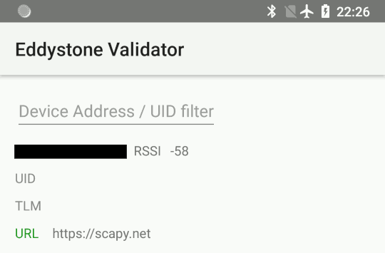
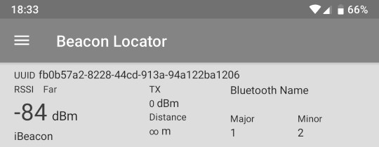

*********
Bluetooth
*********

.. note::

   If you're new to using Scapy, start with the :doc:`usage documentation
   <../usage>`, which describes how to use Scapy with Ethernet and IP.

.. warning::

   Scapy does not support Bluetooth interfaces on Windows.

What is Bluetooth?
==================

Bluetooth is a short range, mostly point-to-point wireless communication
protocol that operates on the 2.4GHz `ISM band`__.

__ https://en.wikipedia.org/wiki/ISM_band

`Bluetooth standards are publicly available`__ from the `Bluetooth Special
Interest Group.`__

__ https://www.bluetooth.com/specifications/bluetooth-core-specification

__ https://www.bluetooth.com/

Broadly speaking, Bluetooth has *three* distinct physical-layer protocols:

Bluetooth Basic Rate (BR) and Enhanced Data Rate (EDR)
   These are the "classic" Bluetooth physical layers.
   
   :abbr:`BR (Basic Rate)` reaches effective speeds of up to 721kbit/s. This was
   ratified as ``IEEE 802.15.1-2002`` (v1.1) and ``-2005`` (v1.2).

   :abbr:`EDR (Enhanced Data Rate)` was introduced as an optional feature of
   Bluetooth 2.0 (2004). It can reach effective speeds of 2.1Mbit/s, and has
   lower power consumption than BR.

   In Bluetooth 4.0 and later, this is not supported by *Low Energy* interfaces,
   unless they are marked as *dual-mode*.

Bluetooth High Speed (HS)
  Introduced as an optional feature of Bluetooth 3.0 (2009), this extends
  Bluetooth by providing ``IEEE 802.11`` (WiFi) as an alternative, higher-speed
  data transport. Nodes negotiate switching with
  :abbr:`AMP (Alternative MAC/PHY)`.
    
  This is only supported by Bluetooth interfaces marked as *+HS*. Not all
  Bluetooth 3.0 and later interfaces support it.

Bluetooth Low Energy (BLE)
  Introduced in Bluetooth 4.0	(2010), this is an alternate physical layer
  designed for low power, embedded systems. It has shorter setup times, lower
  data rates and smaller :abbr:`MTU (maximum transmission unit)` sizes.  It adds
  broadcast and mesh network topologies, in addition to point-to-point links.

  This is only supported by Bluetooth interface marked as *+LE* or
  *Low Energy* -- not all Bluetooth 4.0 and later interfaces support it.

Most Bluetooth interfaces on PCs use USB connectivity (even on laptops), and
this is controlled with the Host-Controller Interface (HCI).  This typically
doesn't support promiscuous mode (sniffing), however there are many other
dedicated, non-HCI devices that support it.

Bluetooth sockets (``AF_BLUETOOTH``)
------------------------------------

There are multiple protocols available for Bluetooth through ``AF_BLUETOOTH``
sockets:

Host-controller interface (HCI) ``BTPROTO_HCI``
  Scapy class: ``BluetoothHCISocket``

  This is the "base" level interface for communicating with a Bluetooth
  controller.  Everything is built on top of this, and this represents about as
  close to the physical layer as one can get with regular Bluetooth hardware.

Logical Link Control and Adaptation Layer Protocol (L2CAP) ``BTPROTO_L2CAP``
  Scapy class: ``BluetoothL2CAPSocket``

  Sitting above the HCI, it provides connection and connection-less data
  transport to higher level protocols. It provides protocol multiplexing, packet
  segmentation and reassembly operations.

  When communicating with a single device, one may use a L2CAP channel.

RFCOMM ``BluetoothRFCommSocket``
  Scapy class: ``BluetoothRFCommSocket``

  RFCOMM is a serial port emulation protocol which operates over L2CAP.
  
  In addition to regular data transfer, it also supports manipulation of all of
  RS-232's non-data control circuitry (:abbr:`RTS (Request To Send)`,
  :abbr:`DTR (Data Terminal Ready)`, etc.)

Bluetooth on Linux
------------------

Linux's Bluetooth stack is developed by `the BlueZ project`__. `The Linux kernel
contains drivers to provide access to Bluetooth`__ interfaces using HCI, which
are exposed through sockets with ``AF_BLUETOOTH``.

__ http://www.bluez.org/

__ https://git.kernel.org/pub/scm/linux/kernel/git/bluetooth/bluetooth.git

BlueZ also provides a user-space companion to these kernel interfaces. The key
components are:

``bluetoothd``
  A daemon that provides access to Bluetooth devices over D-Bus.

``bluetoothctl``
  An interactive command-line program which interfaces with the ``bluetoothd``
  over D-Bus.

``hcitool``
  A command-line program which interfaces directly with kernel interfaces.

`Support for Classic Bluetooth in bluez is quite mature`__, however `BLE is
under active development`__.

__ http://www.bluez.org/profiles/

__ https://git.kernel.org/pub/scm/bluetooth/bluez.git/tree/TODO

First steps
===========

.. note::

   You must run these examples as ``root``.  These have only been tested on
   Linux, and require Scapy v2.4.3 or later.

Verify Bluetooth device
-----------------------

Before doing anything else, you'll want to check that your Bluetooth device has
actually been detected by the operating system:

.. code-block:: console

   $ hcitool dev
   Devices:
	   hci0	xx:xx:xx:xx:xx:xx

.. _hci-open:

Opening a HCI socket
--------------------

The first step in Scapy is to open a HCI socket to the underlying Bluetooth
device:

.. code-block:: pycon

   >>> # Open a HCI socket to device hci0
   >>> bt = BluetoothHCISocket(0)

Send a control packet
---------------------

This packet contains no operation (ie: it does nothing), but it will test that
you can communicate through the HCI device:

.. code-block:: pycon

   >>> ans, unans = bt.sr(HCI_Hdr()/HCI_Command_Hdr())
   Received 1 packets, got 1 answers, remaining 0 packets

You can then inspect the response:

.. code-block:: pycon

   >>> # ans[0] = Answered packet #0
   >>> # ans[0][1] = The response packet
   >>> p = ans[0][1]
   >>> p.show()
   ###[ HCI header ]###
     type= Event
   ###[ HCI Event header ]###
        code= 0xf
        len= 4
   ###[ Command Status ]###
           status= 1
           number= 2
           opcode= 0x0

Receiving all events
--------------------

To start capturing all events from the HCI device, use ``sniff``:

.. code-block:: pycon

   >>> pkts = bt.sniff()
   (press ^C after a few seconds to stop...)
   >>> pkts
   <Sniffed: TCP:0 UDP:0 ICMP:0 Other:0>

Unless your computer is doing something else with Bluetooth, you'll probably get
0 packets at this point. This is because ``sniff`` doesn't actually enable any
promiscuous mode on the device.

However, this is useful for some other commands that will be explained later on.

Importing and exporting packets
-------------------------------

:ref:`Just like with other protocols <import-export>`, you can save packets for
future use in ``libpcap`` format with ``wrpcap``:

.. code-block:: pycon

   >>> wrpcap("/tmp/bluetooth.pcap", pkts)

And load them up again with ``rdpcap``:

.. code-block:: pycon

   >>> pkts = rdpcap("/tmp/bluetooth.pcap")

Working with Bluetooth Low Energy
=================================

.. note::

   This requires a Bluetooth 4.0 or later interface that supports
   :abbr:`BLE (Bluetooth Low Energy)`, either as a dedicated
   :abbr:`LE (Low Energy)` chipset or a *dual-mode* LE +
   :abbr:`BR (Basic Rate)`/:abbr:`EDR (Enhanced Data Rate)` chipset (such as an
   `RTL8723BU`__).
   
   These instructions only been tested on Linux, and require Scapy v2.4.3 or
   later. There are bugs in earlier versions which decode packets incorrectly.

__ https://www.realtek.com/en/products/communications-network-ics/item/rtl8723bu

These examples presume you have already :ref:`opened a HCI socket <hci-open>`
(as ``bt``).

Discovering nearby devices
--------------------------

Enabling discovery mode
^^^^^^^^^^^^^^^^^^^^^^^

Start active discovery mode with:

.. code-block:: pycon

   >>> # type=1: Active scanning mode
   >>> bt.sr(
   ...   HCI_Hdr()/
   ...   HCI_Command_Hdr()/
   ...   HCI_Cmd_LE_Set_Scan_Parameters(type=1))
   Received 1 packets, got 1 answers, remaining 0 packets

   >>> # filter_dups=False: Show duplicate advertising reports, because these
   >>> # sometimes contain different data!
   >>> bt.sr(
   ...   HCI_Hdr()/
   ...   HCI_Command_Hdr()/
   ...   HCI_Cmd_LE_Set_Scan_Enable(
   ...     enable=True,
   ...     filter_dups=False))
   Received 1 packets, got 1 answers, remaining 0 packets

In the background, there are already HCI events waiting on the socket. You can
grab these events with ``sniff``:

.. code-block:: pycon

   >>> # The lfilter will drop anything that's not an advertising report.
   >>> adverts = bt.sniff(lfilter=lambda p: HCI_LE_Meta_Advertising_Reports in p)
   (press ^C after a few seconds to stop...)
   >>> adverts
   <Sniffed: TCP:0 UDP:0 ICMP:0 Other:101>

Once you have the packets, disable discovery mode with:

.. code-block:: pycon

   >>> bt.sr(
   ...   HCI_Hdr()/
   ...   HCI_Command_Hdr()/
   ...   HCI_Cmd_LE_Set_Scan_Enable(
   ...     enable=False))
   Begin emission:
   Finished sending 1 packets.
   ...*
   Received 4 packets, got 1 answers, remaining 0 packets
   (<Results: TCP:0 UDP:0 ICMP:0 Other:1>, <Unanswered: TCP:0 UDP:0 ICMP:0 Other:0>)

Collecting advertising reports
^^^^^^^^^^^^^^^^^^^^^^^^^^^^^^

You can sometimes get multiple ``HCI_LE_Meta_Advertising_Report`` in a single
``HCI_LE_Meta_Advertising_Reports``, and these can also be for different
devices!

.. code-block:: python3

   # Rearrange into a generator that returns reports sequentially
   from itertools import chain
   reports = chain.from_iterable(
     p[HCI_LE_Meta_Advertising_Reports].reports
     for p in adverts)

   # Group reports by MAC address (consumes the reports generator)
   devices = {}
   for report in reports:
     device = devices.setdefault(report.addr, [])
     device.append(report)

   # Packet counters
   devices_pkts = dict((k, len(v)) for k, v in devices.items())
   print(devices_pkts)
   # {'xx:xx:xx:xx:xx:xx': 408, 'xx:xx:xx:xx:xx:xx': 2}

Filtering advertising reports
^^^^^^^^^^^^^^^^^^^^^^^^^^^^^

.. code-block:: python3

   # Get one packet for each device that broadcasted short UUID 0xfe50 (Google).
   # Android devices broadcast this pretty much constantly.
   google = {}
   for mac, reports in devices.items():
     for report in reports:
       if (EIR_CompleteList16BitServiceUUIDs in report and
           0xfe50 in report[EIR_CompleteList16BitServiceUUIDs].svc_uuids):
         google[mac] = report
         break

   # List MAC addresses that sent such a broadcast
   print(google.keys())
   # dict_keys(['xx:xx:xx:xx:xx:xx', 'xx:xx:xx:xx:xx:xx'])

Look at the first broadcast received:

.. code-block:: pycon

   >>> for mac, report in google.items():
   ...   report.show()
   ...   break
   ...
   ###[ Advertising Report ]###
     type= conn_und
     atype= random
     addr= xx:xx:xx:xx:xx:xx
     len= 13
     \data\
      |###[ EIR Header ]###
      |  len= 2
      |  type= flags
      |###[ Flags ]###
      |     flags= general_disc_mode
      |###[ EIR Header ]###
      |  len= 3
      |  type= complete_list_16_bit_svc_uuids
      |###[ Complete list of 16-bit service UUIDs ]###
      |     svc_uuids= [0xfe50]
      |###[ EIR Header ]###
      |  len= 5
      |  type= svc_data_16_bit_uuid
      |###[ EIR Service Data - 16-bit UUID ]###
      |     svc_uuid= 0xfe50
      |     data= 'AB'
     rssi= -96

Setting up advertising
----------------------

.. note::

   Changing advertisements may not take effect until advertisements have first
   been :ref:`stopped <le-adv-stop>`.

AltBeacon
^^^^^^^^^

`AltBeacon`__ is a proximity beacon protocol developed by Radius Networks.  This
example sets up a virtual AltBeacon:

__ https://github.com/AltBeacon/spec

.. code-block:: python3

    # Load the contrib module for AltBeacon
    load_contrib('altbeacon')

    ab = AltBeacon(
        id1='2f234454-cf6d-4a0f-adf2-f4911ba9ffa6',
        id2=1,
        id3=2,
        tx_power=-59,
    )

    bt.sr(ab.build_set_advertising_data())

Once :ref:`advertising has been started <le-adv-start>`, the beacon may then be
detected with `Beacon Locator`__ (Android).

.. note::

    Beacon Locator v1.2.2 `incorrectly reports the beacon as being an
    iBeacon`__, but the values are otherwise correct.

__ https://github.com/vitas/beaconloc
__ https://github.com/vitas/beaconloc/issues/32

Eddystone
^^^^^^^^^

`Eddystone`__ is a proximity beacon protocol developed by Google. This uses an
Eddystone-specific service data field.

__ https://github.com/google/eddystone/

This example sets up a virtual `Eddystone URL`__ beacon:

__ https://github.com/google/eddystone/tree/master/eddystone-url

.. code-block:: python3

   # Load the contrib module for Eddystone
   load_contrib('eddystone')

   # Eddystone_URL.from_url() builds an Eddystone_URL frame for a given URL.
   #
   # build_set_advertising_data() wraps an Eddystone_Frame into a
   # HCI_Cmd_LE_Set_Advertising_Data payload, that can be sent to the BLE
   # controller.
   bt.sr(Eddystone_URL.from_url(
     'https://scapy.net').build_set_advertising_data())

Once :ref:`advertising has been started <le-adv-start>`, the beacon may then be
detected with `Eddystone Validator`__ or `Beacon Locator`__ (Android):

__ https://github.com/google/eddystone/tree/master/tools/eddystone-validator
__ https://github.com/vitas/beaconloc

.. _adv-ibeacon:

iBeacon
^^^^^^^

`iBeacon`__ is a proximity beacon protocol developed by Apple, which uses their
manufacturer-specific data field.  :ref:`Apple/iBeacon framing <apple-ble>`
(below) describes this in more detail.

__ https://en.wikipedia.org/wiki/IBeacon

This example sets up a virtual iBeacon:

.. code-block:: python3

   # Load the contrib module for iBeacon
   load_contrib('ibeacon')

   # Beacon data consists of a UUID, and two 16-bit integers: "major" and
   # "minor".
   #
   # iBeacon sits ontop of Apple's BLE protocol.
   p = Apple_BLE_Submessage()/IBeacon_Data(
      uuid='fb0b57a2-8228-44cd-913a-94a122ba1206',
      major=1, minor=2)

   # build_set_advertising_data() wraps an Apple_BLE_Submessage or
   # Apple_BLE_Frame into a HCI_Cmd_LE_Set_Advertising_Data payload, that can
   # be sent to the BLE controller.
   bt.sr(p.build_set_advertising_data())

Once :ref:`advertising has been started <le-adv-start>`, the beacon may then be
detected with `Beacon Locator`__ (Android):

__ https://github.com/vitas/beaconloc

.. _le-adv-start:

Starting advertising
--------------------

.. code-block:: python3

   bt.sr(HCI_Hdr()/
         HCI_Command_Hdr()/
         HCI_Cmd_LE_Set_Advertise_Enable(enable=True))

.. _le-adv-stop:

Stopping advertising
--------------------

.. code-block:: python3

   bt.sr(HCI_Hdr()/
         HCI_Command_Hdr()/
         HCI_Cmd_LE_Set_Advertise_Enable(enable=False))

Resources and references
------------------------

  * `16-bit UUIDs for members`__: List of registered UUIDs which appear in
    ``EIR_CompleteList16BitServiceUUIDs`` and ``EIR_ServiceData16BitUUID``.

__ https://www.bluetooth.com/specifications/assigned-numbers/16-bit-uuids-for-members

  * `16-bit UUIDs for SDOs`__: List of registered UUIDs which are used by
    Standards Development Organisations.
  
__ https://www.bluetooth.com/specifications/assigned-numbers/16-bit-uuids-for-sdos

  * `Company Identifiers`__: List of company IDs, which appear in
    ``EIR_Manufacturer_Specific_Data.company_id``.
  
__ https://www.bluetooth.com/specifications/assigned-numbers/company-identifiers

  * `Generic Access Profile`__: List of assigned type IDs and links to
    specification definitions, which appear in ``EIR_Header``.
 
__ https://www.bluetooth.com/specifications/assigned-numbers/generic-access-profile

.. _apple-ble:

Apple/iBeacon broadcast frames
==============================

.. note::

    This describes the wire format for Apple's Bluetooth Low Energy
    advertisements, based on (limited) publicly available information. It is not
    specific to using Bluetooth on Apple operating systems.

`iBeacon`__ is Apple's proximity beacon protocol. Scapy includes a contrib
module, ``ibeacon``, for working with Apple's :abbr:`BLE (Bluetooth Low Energy)`
broadcasts:

__ https://en.wikipedia.org/wiki/IBeacon

.. code-block:: pycon

   >>> load_contrib('ibeacon')

:ref:`Setting up advertising for iBeacon <adv-ibeacon>` (above) describes how to
broadcast a simple beacon.

While this module is called ``ibeacon``, Apple has other "submessages" which are
also advertised within their manufacturer-specific data field, including:

 * `AirDrop`__
 * AirPlay
 * AirPods
 * `Handoff`__
 * Nearby
 * `Overflow area`__

__ https://en.wikipedia.org/wiki/AirDrop
__ https://en.wikipedia.org/wiki/OS_X_Yosemite#Continuity
__ https://developer.apple.com/documentation/corebluetooth/cbperipheralmanager/1393252-startadvertising

For compatibility with these other broadcasts, Apple BLE frames in Scapy are
layered on top of ``Apple_BLE_Submessage`` and ``Apple_BLE_Frame``:

 * ``HCI_Cmd_LE_Set_Advertising_Data``, ``HCI_LE_Meta_Advertising_Report``,
   ``BTLE_ADV_IND``, ``BTLE_ADV_NONCONN_IND`` or ``BTLE_ADV_SCAN_IND`` contain
   one or more...
 * ``EIR_Hdr``, which may have a payload of one...
 * ``EIR_Manufacturer_Specific_Data``, which may have a payload of one...
 * ``Apple_BLE_Frame``, which contains one or more...
 * ``Apple_BLE_Submessage``, which contains a payload of one...
 * ``Raw`` (if not supported), or ``IBeacon_Data``.

This module only presently supports ``IBeacon_Data`` submessages. Other
submessages are decoded as ``Raw``.

One might sometimes see multiple submessages in a single broadcast, such as
Handoff and Nearby.  This is not mandatory -- there are also Handoff-only and
Nearby-only broadcasts.

Inspecting a raw BTLE advertisement frame from an Apple device:

.. code-block:: python3

    p = BTLE(hex_bytes('d6be898e4024320cfb574d5a02011a1aff4c000c0e009c6b8f40440f1583ec895148b410050318c0b525b8f7d4'))
    p.show()

Results in the output:

.. code-block:: text

    ###[ BT4LE ]###
      access_addr= 0x8e89bed6
      crc= 0xb8f7d4
    ###[ BTLE advertising header ]###
         RxAdd= public
         TxAdd= random
         RFU= 0
         PDU_type= ADV_IND
         unused= 0
         Length= 0x24
    ###[ BTLE ADV_IND ]###
            AdvA= 5a:4d:57:fb:0c:32
            \data\
             |###[ EIR Header ]###
             |  len= 2
             |  type= flags
             |###[ Flags ]###
             |     flags= general_disc_mode+simul_le_br_edr_ctrl+simul_le_br_edr_host
             |###[ EIR Header ]###
             |  len= 26
             |  type= mfg_specific_data
             |###[ EIR Manufacturer Specific Data ]###
             |     company_id= 0x4c
             |###[ Apple BLE broadcast frame ]###
             |        \plist\
             |         |###[ Apple BLE submessage ]###
             |         |  subtype= handoff
             |         |  len= 14
             |         |###[ Raw ]###
             |         |     load= '\x00\x9ck\x8f@D\x0f\x15\x83\xec\x89QH\xb4'
             |         |###[ Apple BLE submessage ]###
             |         |  subtype= nearby
             |         |  len= 5
             |         |###[ Raw ]###
             |         |     load= '\x03\x18\xc0\xb5%'
