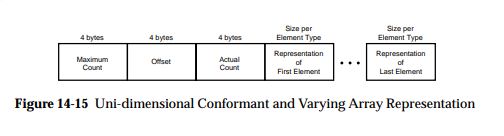
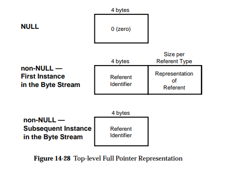

DCE/RPC & [MS-RPCE]
===================

.. note:: DCE/RPC per `DCE/RPC 1.1 <https://pubs.opengroup.org/onlinepubs/9629399/toc.pdf>`_ with the `[MS-RPCE] <https://learn.microsoft.com/en-us/openspecs/windows_protocols/ms-rpce/290c38b1-92fe-4229-91e6-4fc376610c15>`_ additions

Scapy provides support for dissecting and building Microsoft's Windows DCE/RPC calls.

Usage documentation
-------------------

Terminology
~~~~~~~~~~~

- ``NDR`` (and ``NDR64``) are the transfer syntax used by DCE/RPC, i.e. how objects are marshalled and sent over the network
- ``IDL`` or Interface Definition Language is "a language for specifying operations (procedures or functions), parameters to these operations, and data types" in context of DCE/RPC

NDR64 and endianness
~~~~~~~~~~~~~~~~~~~~

All packets built with NDR extend the ``NDRPacket`` class, which adds the arguments ``ndr64`` and ``ndrendian``.

You can therefore specify while dissecting or building packets whether it uses NDR64 or not (**by default: no**), or its endian (**by default: little**)

.. code:: python

    NetrServerReqChallenge_Request(b"\x00....", ndr64=True, ndrendian="big")

Dissecting
~~~~~~~~~~

You can dissect a DCE/RPC packet like any other packet, by calling ``ThePacketClass(<bytes>)``. The only difference is, as mentioned above, that there are extra ``ndr64`` and ``ndrendian`` arguments.

.. note::
    DCE/RPC is stateful, and requires the dissector to remember which interface is bound, how (negotiation), etc.
    Scapy therefore provides a ``DceRpcSession`` session that remembers the context to properly dissect requests and responses.

Here's an example where a pcap (included in the ``test/pcaps`` folder) containing a [MS-NRPC] exchange is dissected using Scapy:

.. code:: python

    >>> load_layer("msrpce")
    >>> bind_layers(TCP, DceRpc, sport=40564)  # the DCE/RPC port
    >>> bind_layers(TCP, DceRpc, dport=40564)
    >>> pkts = sniff(offline='dcerpc_msnrpc.pcapng.gz', session=DceRpcSession)
    >>> pkts[6][DceRpc5].show()
    ###[ DCE/RPC v5 ]###
      rpc_vers  = 5 (connection-oriented)
      rpc_vers_minor= 0
      ptype     = request
      pfc_flags = PFC_FIRST_FRAG+PFC_LAST_FRAG
      endian    = little
      encoding  = ASCII
      float     = IEEE
      reserved1 = 0
      reserved2 = 0
      frag_len  = 58
      auth_len  = 0
      call_id   = 1
      ###[ DCE/RPC v5 - Request ]###
          alloc_hint= 0
          cont_id   = 0
          opnum     = 4
      ###[ NetrServerReqChallenge_Request ]###
              PrimaryName= None
              \ComputerName\
              |###[ NDRConformantArray ]###
              |  max_count = 5
              |  \value     \
              |   |###[ NDRVaryingArray ]###
              |   |  offset    = 0
              |   |  actual_count= 5
              |   |  value     = b'WIN1'
              \ClientChallenge\
              |###[ PNETLOGON_CREDENTIAL ]###
              |  data      = b'12345678'

Scapy has opted to not abstract any of the NDR fields (see `Design choices`_), allowing to keep access to all lengths, offsets, counts, etc... This allows to put wrong length values anywhere to test implementations.

The catch is that accessing the value of a field is a bit tedious::

    >>> pkts[6][DceRpc5].ComputerName.value[0].value
    b'WIN1'

Sometimes, you'll be glad to have access to the size of a ConformantArray. Most times, you won't.
All ``NDRPacket`` therefore include a ``valueof()`` function that goes through any array or pointer containers::

    >>> pkts[6][NetrServerReqChallenge_Request].valueof("ComputerName")
    b'WIN1'

.. warning::

    Note that ``DceRpc5`` packets are NOT ``NDRPacket``, so you need to call ``valueof()`` on the NDR payload itself.

Building
~~~~~~~~

If you were to re-build the previous packet exactly as it was dissected, it would look something like this:

.. code:: python

    >>> pkt = NetrServerReqChallenge_Request(
    ...    ComputerName=NDRConformantArray(max_count=5, value=[
    ...        NDRVaryingArray(offset=0, actual_count=5, value=b'WIN1')
    ...    ]),
    ...    ClientChallenge=PNETLOGON_CREDENTIAL(data=b'12345678'),
    ...    PrimaryName=None
    ... )

If you don't care about specifying ``max_count``, ``offset`` or ``actual_count`` manually, you can however also do the following:

.. code:: python

    >>> pkt = NetrServerReqChallenge_Request(
    ...     ComputerName=b'WIN1',
    ...     ClientChallenge=PNETLOGON_CREDENTIAL(data=b'12345678'),
    ...     PrimaryName=None
    ... )
    >>> pkt.show()
    ###[ NetrServerReqChallenge_Request ]###
      PrimaryName= None
      \ComputerName\
      |###[ NDRConformantArray ]###
      |  max_count = None
      |  \value     \
      |   |###[ NDRVaryingArray ]###
      |   |  offset    = 0
      |   |  actual_count= None
      |   |  value     = 'WIN1'
      \ClientChallenge\
      |###[ PNETLOGON_CREDENTIAL ]###
      |  data      = '12345678'

And Scapy will automatically add the ``NDRConformantArray``, ``NDRVaryingArray``... in the middle.

This applies to ``NDRPointers`` too ! Skipping it will add a default one with a referent id of ``0x20000``. Take ``RPC_UNICODE_STRING`` for instance:

.. code:: python

    >>> RPC_UNICODE_STRING(Buffer=b"WIN").show2()
    ###[ RPC_UNICODE_STRING ]### 
      Length    = 6
      MaximumLength= 6
      \Buffer    \
      |###[ NDRPointer ]###
      |  referent_id= 0x20000
      |  \value     \
      |   |###[ NDRConformantArray ]###
      |   |  max_count = 3
      |   |  \value     \
      |   |   |###[ NDRVaryingArray ]###
      |   |   |  offset    = 0
      |   |   |  actual_count= 3
      |   |   |  value     = 'WIN'

Client
------

Scapy also includes a DCE/RPC client: :class:`~scapy.layers.msrpce.rpcclient.DCERPC_Client`.

It provides a bunch of basic DCE/RPC features:

- :func:`~scapy.layers.msrpce.rpcclient.DCERPC_Client.connect`: connect to a host
- :func:`~scapy.layers.msrpce.rpcclient.DCERPC_Client.bind`: bind to a DCE/RPC interface
- :func:`~scapy.layers.msrpce.rpcclient.DCERPC_Client.connect_and_bind`: connect to a host, use the endpoint mapper to find the interface then reconnect to the host on the matching address
- :func:`~scapy.layers.msrpce.rpcclient.DCERPC_Client.sr1_req`: send/receive a DCE/RPC request

To be able to use an interface, it must have been imported. This makes it so that the :func:`~scapy.layers.dcerpc.register_dcerpc_interface` function is called, allowing the :class:`~scapy.layers.dcerpc.DceRpcSession` session to properly understand the bind/alter requests, and match the DCE/RPCs by opcodes.

In the DCE/RPC world, there are several "Transports". A transport corresponds to the various ways of transporting DCE/RPC. You can have a look at the documentation over `[MS-RPCE] 2.1 <https://learn.microsoft.com/en-us/openspecs/windows_protocols/ms-rpce/472083a9-56f1-4d81-a208-d18aef68c101>`_. In Scapy, this is implemented in the :class:`~scapy.layers.dcerpc.DCERPC_Transport` enum, that currently contains:

- :const:`~scapy.layers.dcerpc.DCERPC_Transport.NCACN_IP_TCP`: the interface is reached over IP/TCP, on a port that varies. This port can typically be queried using the endpoint mapper, a DCE/RPC service that is always on port 135.
- :const:`~scapy.layers.dcerpc.DCERPC_Transport.NCACN_NP`: the interface is reached over a named pipe over SMB. This named pipe is typically well-known, or can also be queried using the endpoint mapper (over SMB) on certain cases.

Here's an example sending a ``ServerAlive`` over the ``IObjectExporter`` interface from `[MS-DCOM] <https://learn.microsoft.com/en-us/openspecs/windows_protocols/ms-dcom/4a893f3d-bd29-48cd-9f43-d9777a4415b0>`_.

.. code-block:: python

    from scapy.layers.dcerpc import *
    from scapy.layers.msrpce.all import *

    client = DCERPC_Client(
        DCERPC_Transport.NCACN_IP_TCP,
        ndr64=False,
    )
    client.connect("192.168.0.100")
    client.bind(find_dcerpc_interface("IObjectExporter"))

    req = ServerAlive_Request(ndr64=False)
    resp = client.sr1_req(req)
    resp.show()

Here's the same example, but this time asking for :const:`~scapy.layers.dcerpc.RPC_C_AUTHN_LEVEL.PKT_PRIVACY` (encryption) using ``NTLMSSP``:

.. code-block:: python

    from scapy.layers.ntlm import *
    from scapy.layers.dcerpc import *
    from scapy.layers.msrpce.all import *

    ssp = NTLMSSP(
        UPN="Administrator",
        PASSWORD="Password1",
    )
    client = DCERPC_Client(
        DCERPC_Transport.NCACN_IP_TCP,
        auth_level=DCE_C_AUTHN_LEVEL.PKT_PRIVACY,
        ssp=ssp,
        ndr64=False,
    )
    client.connect("192.168.0.100")
    client.bind(find_dcerpc_interface("IObjectExporter"))

    req = ServerAlive_Request(ndr64=False)
    resp = client.sr1_req(req)
    resp.show()

Again, but this time using :const:`~scapy.layers.dcerpc.RPC_C_AUTHN_LEVEL.PKT_INTEGRITY` (signing) using ``SPNEGOSSP[KerberosSSP]``:

.. code-block:: python

    from scapy.layers.kerberos import *
    from scapy.layers.spnego import *
    from scapy.layers.dcerpc import *
    from scapy.layers.msrpce.all import *

    ssp = SPNEGOSSP(
        [
            KerberosSSP(
                UPN="Administrator@domain.local",
                PASSWORD="Password1",
                SPN="host/dc1",
            )
        ]
    )
    client = DCERPC_Client(
        DCERPC_Transport.NCACN_IP_TCP,
        auth_level=DCE_C_AUTHN_LEVEL.PKT_INTEGRITY,
        ssp=ssp,
        ndr64=False,
    )
    client.connect("192.168.0.100")
    client.bind(find_dcerpc_interface("IObjectExporter"))

    req = ServerAlive_Request(ndr64=False)
    resp = client.sr1_req(req)
    resp.show()

Here's a different example, this time connecting over :const:`~scapy.layers.dcerpc.DCERPC_Transport.NCACN_NP` to `[MS-SAMR] <https://learn.microsoft.com/en-us/openspecs/windows_protocols/ms-samr/4df07fab-1bbc-452f-8e92-7853a3c7e380>`_ to enumerate the domains a server is in:

.. code-block:: python

    from scapy.layers.ntlm import NTLMSSP, MD4le
    from scapy.layers.dcerpc import *
    from scapy.layers.msrpce.all import *

    ssp = NTLMSSP(
        UPN="User",
        HASHNT=MD4le("Password"),
    )
    client = DCERPC_Client(
        DCERPC_Transport.NCACN_NP,
        ssp=ssp,
        ndr64=False,
    )
    client.connect("192.168.0.100")
    client.open_smbpipe("lsass")  # open the \pipe\lsass pipe
    client.bind(find_dcerpc_interface("samr"))

    # Get Server Handle: call [0] SamrConnect
    serverHandle = client.sr1_req(SamrConnect_Request(
        DesiredAccess=(
            0x00000010 # SAM_SERVER_ENUMERATE_DOMAINS
        )
    )).ServerHandle

    # Enumerate domains: call [6] SamrEnumerateDomainsInSamServer
    EnumerationContext = 0
    while True:
        resp = client.sr1_req(
            SamrEnumerateDomainsInSamServer_Request(
                ServerHandle=serverHandle,
                EnumerationContext=EnumerationContext,
            )
        )
        # note: there are a lot of sub-structures
        print(resp.valueof("Buffer").valueof("Buffer")[0].valueof("Name").valueof("Buffer").decode())
        EnumerationContext = resp.EnumerationContext  # continue enumeration
        if resp.status == 0:  # no domain left to enumerate
            break

    client.close()

.. note:: As you can see, we used the :class:`~scapy.layers.ntlm.NTLMSSP` security provider in the above connection.

There are extensions to the :class:`~scapy.layers.msrpce.rpcclient.DCERPC_Client` class:

- the :class:`~scapy.layers.msrpce.msnrpc.NetlogonClient`, worth mentioning because it implements its own :class:`~scapy.layers.msrpce.msnrpc.NetlogonSSP`:

.. code-block:: python

    from scapy.layers.msrpce.msnrpc import *
    from scapy.layers.msrpce.raw.ms_nrpc import *

    client = NetlogonClient(
        auth_level=DCE_C_AUTHN_LEVEL.PKT_PRIVACY,
        computername="SERVER",
        domainname="DOMAIN",
    )
    client.connect_and_bind("192.168.0.100")
    client.negotiate_sessionkey(bytes.fromhex("77777777777777777777777777777777"))
    client.close()

- the :class:`~scapy.layers.msrpce.msdcom.DCOM_Client` (unfinished)

Server
------

It is also possible to create your own DCE/RPC server. This takes the form of creating a :class:`~scapy.layers.msrpce.rpcserver.DCERPC_Server` class, then serving it over a transport.

This class contains a :func:`~scapy.layers.msrpce.rpcserver.DCERPC_Server.answer` function that is used to register a handler for a Request, such as for instance:

.. code-block:: python

    from scapy.layers.dcerpc import *
    from scapy.layers.msrpce.all import *

    class MyRPCServer(DCERPC_Server):
        @DCERPC_Server.answer(NetrWkstaGetInfo_Request)
        def handle_NetrWkstaGetInfo(self, req):
            """
            NetrWkstaGetInfo [MS-SRVS]
            "returns information about the configuration of a workstation."
            """
            return NetrWkstaGetInfo_Response(
                WkstaInfo=NDRUnion(
                    tag=100,
                    value=LPWKSTA_INFO_100(
                        wki100_platform_id=500,  # NT
                        wki100_ver_major=5,
                    ),
                ),
                ndr64=self.ndr64,
            )

Let's spawn this server, listening on the ``12345`` port using the :const:`~scapy.layers.dcerpc.DCERPC_Transport.NCACN_IP_TCP` transport.

.. code-block:: python

    MyRPCServer.spawn(
        DCERPC_Transport.NCACN_IP_TCP,
        port=12345,
    )

Of course that also works over :const:`~scapy.layers.dcerpc.DCERPC_Transport.NCACN_NP`, with for instance a :class:`~scapy.layers.ntlm.NTLMSSP`:

.. code-block:: python

    from scapy.layers.ntlm import NTLMSSP, MD4le
    ssp = NTLMSSP(
        IDENTITIES={
            "User1": MD4le("Password"),
        }
    )

    MyRPCServer.spawn(
        DCERPC_Transport.NCACN_NP,
        ssp=ssp,
        iface="eth0",
        port=445,
        ndr64=True,
    )

To start an endpoint mapper (this should be a separate process from your RPC server), you can use the default :class:`~scapy.layers.msrpce.rpcserver.DCERPC_Server` as such:

.. code-block:: python

    from scapy.layers.dcerpc import *
    from scapy.layers.msrpce.all import *

    DCERPC_Server.spawn(
        DCERPC_Transport.NCACN_IP_TCP,
        iface="eth0",
        port=135,
        portmap={
            find_dcerpc_interface("wkssvc"): 12345,
        },
        ndr64=True,
    )

.. note:: Currently, a DCERPC_Server will let a client bind on all interfaces that Scapy has registered (imported). Supposedly though, you know which RPCs are going to be queried.

Passive sniffing
----------------

If you're doing passive sniffing of a DCE/RPC session, you can instruct Scapy to still use its DCE/RPC session in order to check the INTEGRITY and decrypt (if PRIVACY is used) the packets.

.. code-block:: python

    from scapy.all import *

    # Bind DCE/RPC port
    bind_bottom_up(TCP, DceRpc5, dport=12345)
    bind_bottom_up(TCP, DceRpc5, dport=12345)

    # Enable passive DCE/RPC session
    conf.dcerpc_session_enable = True

    # Define SSPs that can be used for decryption / verify
    conf.winssps_passive = [
        SPNEGOSSP([
            NTLMSSP(
                IDENTITIES={
                    "User1": MD4le("Password1!"),
                },
            ),
        ])
    ]

    # Sniff
    pkts = sniff(offline="dcerpc_exchange.pcapng", session=TCPSession)
    pkts.show()

.. warning:: NTLM, KerberosSSP and SPNEGOSSP are currently supported. NetlogonSSP is still unsupported.

Define custom packets
---------------------

TODO: Add documentation on how to define NDR packets.

.. _Design choices:

Design choices
--------------

NDR is a rather complex encoding. For instance, there are multiple types of arrays:

- fixed arrays
- conformant arrays
- varying arrays
- conformant varying arrays

All of which have slightly different representations on the network, but generally speaking it can look like this:

Those lengths are mostly computable, but this raises the question of: **what should Scapy report to the user?**.

Some implementations (like impacket's), have chosen to abstract the lengths, offsets, etc. and hide it to the user. This has the big advantage that it makes packets much easier to build, but has the inconvenience that it is in fact hiding part of the information contained in the packet, which really is against Scapy's philosophy.

The same happens when encoding pointers, which looks something like this:

where it is tempting to hide the ``referent_id`` part, which is on Windows in most parts irrelevant.

**In Scapy, you will find all the fields**. The pros are that it is exhaustive and doesn't hide any information, the cons is that you need to use the utils (``valueof()`` on dissection, implicit ``any2i`` on build) in order for it not to be a massive pain.
