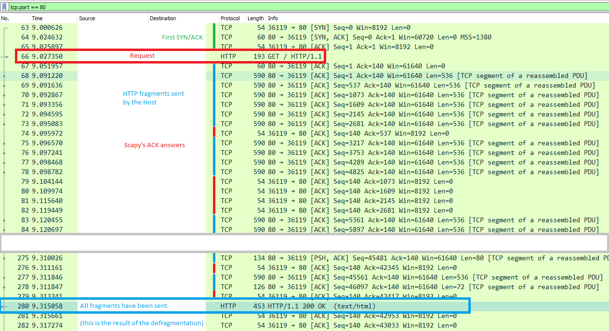

HTTP
====

Scapy supports the sending / receiving of HTTP packets natively.

HTTP 1.X
--------

.. note::
    Support for HTTP 1.X was added in ``2.4.3``, whereas HTTP 2.X was already in ``2.4.0``.

About HTTP 1.X
______________

HTTP 1.X is a *text protocol*. Those are pretty unusual nowadays (HTTP 2.X is binary), therefore its implementation is very different.

For transmission purposes, HTTP 1.X frames are split in various fragments during the connection, which may or not have been encoded.
This is explain over https://developer.mozilla.org/fr/docs/Web/HTTP/Headers/Transfer-Encoding

To summarize, the frames can be split in 3 different ways:

- ``chunks``: split in fragments called chunks that are preceded by their length. The end of a frame is marked by an empty chunk
- using ``Content-Length``: the header of the HTTP frame announces the total length of the frame
- None of the above: the HTTP frame ends when the TCP stream ends / when a TCP push happens.

Moreover, each frame may be aditionnally compressed, depending on the algorithm specified in the HTTP header:

- ``compress``: compressed using *LZW*
- ``deflate``: compressed using *ZLIB*
- ``br``: compressed using *Brotli*
- ``gzip``

Let's have a look at what happens when you perform an HTTPRequest using Scapy's ``TCP_client`` (explained below):

Once the first SYN/ACK is done, the connection is established. Scapy will send the ``HTTPRequest()``, and the host will answer with HTTP fragments. Scapy will ACK each of those, and recompile them using ``TCPSession``, like Wireshark does when it displays the answer frame.

HTTP 1.X in Scapy
_________________

Let's list the module's content::

    >>> explore(scapy.layers.http)
    Packets contained in scapy.layers.http:
    Class       |Name
    ------------|-------------
    HTTP        |HTTP 1
    HTTPRequest |HTTP Request
    HTTPResponse|HTTP Response

There are two frames available: ``HTTPRequest`` and ``HTTPResponse``. The ``HTTP`` is only used during dissection, as a util to choose between the two.
All common header fields should be supported.

- **Default HTTPRequest:**

.. code:: python

    >>> HTTPRequest().show()
    ###[ HTTP Request ]###
      Method= 'GET'
      Path= '/'
      Http_Version= 'HTTP/1.1'
      A_IM= None
      Accept= None
      Accept_Charset= None
      Accept_Datetime= None
      Accept_Encoding= None
      [...]

- **Default HTTPResponse:**

.. code:: python

    >>> HTTPResponse().show()
    ###[ HTTP Response ]###
      Http_Version= 'HTTP/1.1'
      Status_Code= '200'
      Reason_Phrase= 'OK'
      Accept_Patch43= None
      Accept_Ranges= None
      [...]

Use Scapy to send/receive HTTP 1.X
__________________________________

To handle this decompression, Scapy uses `Sessions classes <../usage.html#advanced-sniffing-sessions>`_, more specifically the ``TCPSession`` class.
You have several ways of using it:

+--------------------------------------------+-------------------------------------------+
| ``sniff(session=TCPSession, [...])``       | ``TCP_client.tcplink(HTTP, host, 80)``    |
+============================================+===========================================+
| | Perform decompression / defragmentation  | | Acts as a TCP client: handles SYN/ACK,  |
| | on all TCP streams simultaneously, but   | | and all TCP actions, but only creates   |
| | only acts passively.                     | | one stream.                             |
+--------------------------------------------+-------------------------------------------+

**Examples:**

- ``TCP_client.tcplink``:

Send an HTTPRequest to ``www.secdev.org`` and write the result in a file:

.. code:: python

    load_layer("http")
    req = HTTP()/HTTPRequest(
        Accept_Encoding=b'gzip, deflate',
        Cache_Control=b'no-cache',
        Connection=b'keep-alive',
        Host=b'www.secdev.org',
        Pragma=b'no-cache'
    )
    a = TCP_client.tcplink(HTTP, "www.secdev.org", 80)
    answser = a.sr1(req)
    a.close()
    with open("www.secdev.org.html", "wb") as file:
        file.write(answser.load)

``TCP_client.tcplink`` makes it feel like it only received one packet, but in reality it was recombined in ``TCPSession``.
If you performed a plain ``sniff()``, you would have seen those packets.

**This code is implemented in a utility function:** ``http_request()``, usable as so:

.. code:: python

    load_layer("http")
    http_request("www.google.com", "/", display=True)

This will open the webpage in your default browser thanks to ``display=True``.

- ``sniff()``:

Dissect a pcap which contains a JPEG image that was sent over HTTP using chunks.

.. note::

    The ``http_chunk.pcap.gz`` file is available in ``scapy/test/pcaps``

.. code:: python

    load_layer("http")
    pkts = sniff(offline="http_chunk.pcap.gz", session=TCPSession)
    # a[29] is the HTTPResponse
    with open("image.jpg", "wb") as file:
        file.write(pkts[29].load)

HTTP 2.X
--------

The HTTP 2 documentation is available as a Jupyther notebook over here: `HTTP 2 Tuto <https://github.com/secdev/scapy/blob/master/doc/notebooks/HTTP_2_Tuto.ipynb>`_