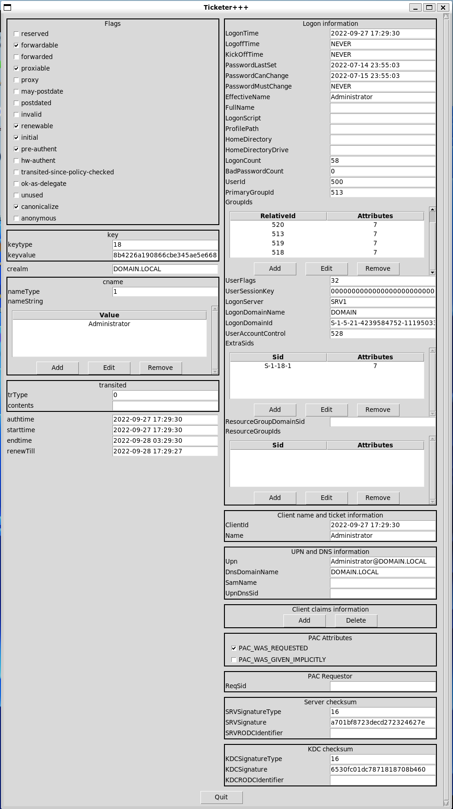
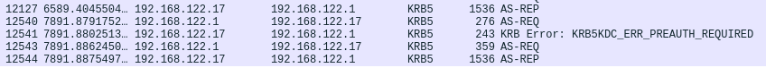
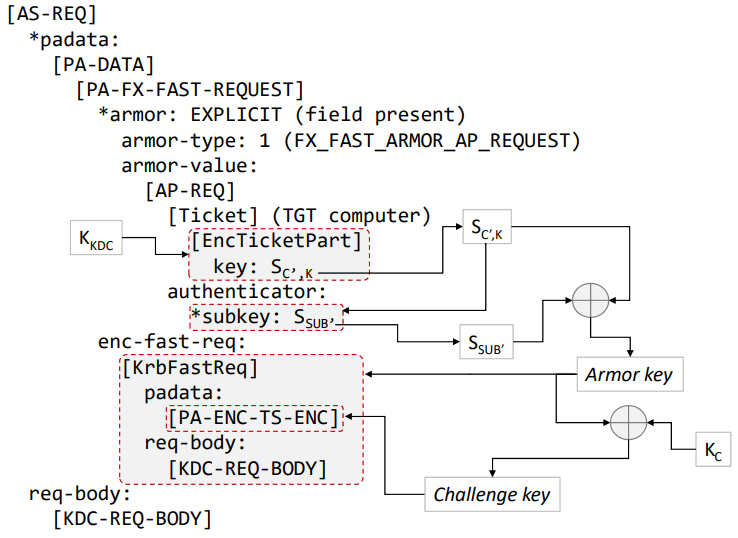

Kerberos
========

.. note:: Kerberos per `RFC4120 <https://datatracker.ietf.org/doc/html/rfc6113.html>`_ + `RFC6113 <https://datatracker.ietf.org/doc/html/rfc6113.html>`_ (FAST) + `[MS-KILE] <https://learn.microsoft.com/en-us/openspecs/windows_protocols/ms-kile/2a32282e-dd48-4ad9-a542-609804b02cc9>`_ (Windows)

Scapy's Kerberos implementation is accessed through two main components:

- :class:`~scapy.modules.ticketer.Ticketer`: a module that allows manipulating Kerberos tickets;
- :class:`~scapy.layers.kerberos.KerberosSSP`: an implementation of a GSSAPI SSP for Kerberos, usable in any of Scapy's client that support GSSAPI, for both authentication and encryption.

The general idea is that the first one allows to request tickets and perform almost all Kerberos related operations (S4U2Self, S4U2Proxy, FAST armoring, U2U, DMSA, etc.). The latter is used once a final Service Ticket is obtained, by other parts of Scapy, for instance `SMB <smb.html>`_, `LDAP <ldap.html>`_ or `DCE/RPC <dcerpc.html>`_.

Ticketer module
~~~~~~~~~~~~~~~

The :class:`~scapy.modules.ticketer.Ticketer` module can be used both from the CLI or programmatically to perform operations on Kerberos tickets. To use it, you must first create an instance of a :class:`~scapy.modules.ticketer.Ticketer`, which acts as both a **ccache** (holds tickets) and a **keytab** (holds secrets).

This section tries to give many usage examples, but isn't exhaustive. For more details regarding the parameters of each functions, it is encouraged to have a look at the docstrings of :class:`~scapy.layers.kerberos.KerberosClient`.

- **Request TGT**: see the docstring of :func:`~scapy.layers.kerberos.krb_as_req`

.. code:: pycon

    >>> load_module("ticketer")
    >>> t = Ticketer()
    >>> t.request_tgt("Administrator@DOMAIN.LOCAL")
    Enter password: ************
    >>> t.show()
    Tickets:
    0. Administrator@DOMAIN.LOCAL -> krbtgt/DOMAIN.LOCAL@DOMAIN.LOCAL
    Start time         End time           Renew until        Auth time        
    31/08/23 11:38:34  31/08/23 21:38:34  31/08/23 21:38:35  31/08/23 01:38:34

- **Then request a ST, using the TGT**: see the docstring of :func:`~scapy.layers.kerberos.krb_tgs_req`

.. code:: pycon

    >>> # The TGT we just got has an ID of 0
    >>> t.request_st(0, "host/dc1.domain.local")
    >>> t.show()
    Tickets:
    0. Administrator@DOMAIN.LOCAL -> krbtgt/DOMAIN.LOCAL@DOMAIN.LOCAL
    Start time         End time           Renew until        Auth time        
    31/08/23 11:38:34  31/08/23 21:38:34  31/08/23 21:38:35  31/08/23 01:38:34

    1. Administrator@DOMAIN.LOCAL -> host/dc1.domain.local@DOMAIN.LOCAL
    Start time         End time           Renew until        Auth time        
    31/08/23 11:39:07  31/08/23 21:38:34  31/08/23 21:38:35  31/08/23 01:38:34

- **Use ticket as SSP**: the :func:`~scapy.modules.ticketer.Ticketer.ssp` function.

.. code:: pycon

   >>> # We use ticket 1 from the above store.
   >>> smbclient("dc1.domain.local", ssp=t.ssp(1))

- **Request a TGT using a hash**: see the docstring of :func:`~scapy.layers.kerberos.krb_as_req`

.. code:: pycon

    >>> from scapy.libs.rfc3961 import EncryptionType
    >>> load_module("ticketer")
    >>> t = Ticketer()
    >>> # Using the HashNT
    >>> t.request_tgt("Administrator@DOMAIN.LOCAL", key=Key(EncryptionType.RC4_HMAC, bytes.fromhex("2b576acbe6bcfda7294d6bd18041b8fe")))
    >>> # Using the AES-256-SHA1-96 Kerberos Key
   >>> t.request_tgt("Administrator@domain.local", key=Key(EncryptionType.AES256_CTS_HMAC_SHA1_96, bytes.fromhex("63a2577d8bf6abeba0847cded36b9aed202c23750eb9c56b6155be1cc946bb1d")))

- **Renew a TGT or ST**:

.. code::

    >>> t.renew(0)  # renew TGT
    >>> t.renew(1)  # renew ST. Works only with 'host/' SPNs

- **Import tickets from a ccache**:

.. note:: We first added a realm ``DOMAIN.LOCAL`` with a kdc to ``/etc/krb5.conf``

.. code:: pycon

    $ kinit Administrator@DOMAIN.LOCAL
    Password for Administrator@DOMAIN.LOCAL:
    $ scapy
    >>> load_module("ticketer")
    >>> t = Ticketer()
    >>> t.open_ccache("/tmp/krb5cc_1000")
    >>> t.show()
    Tickets:
    1. Administrator@DOMAIN.LOCAL -> krbtgt/DOMAIN.LOCAL@DOMAIN.LOCAL
    Start time         End time           Renew until        Auth time
    31/08/23 12:08:15  31/08/23 22:08:15  01/09/23 12:08:12  31/08/23 12:08:15

- **Export tickets into a ccache**:

.. code:: pycon

    >>> load_module("ticketer")
    >>> t = Ticketer()
    >>> t.request_tgt("Administrator@domain.local", password="ScapyScapy1")
    >>> t.save("/tmp/krb5cc_1000")
    >>> exit()
    $ klist
    Ticket cache: FILE:/tmp/krb5cc_1000
    Default principal: Administrator@DOMAIN.LOCAL

    Valid starting       Expires              Service principal
    08/31/2023 12:08:15  08/31/2023 23:08:15  krbtgt/DOMAIN.LOCAL@DOMAIN.LOCAL
            renew until 09/01/2023 12:08:12

- **Perform S4U2Self**

.. code:: pycon

   >>> load_module("ticketer")
   >>> t = Ticketer()
   >>> t.request_tgt("SERVER1$@domain.local", key=Key(EncryptionType.AES256_CTS_HMAC_SHA1_96, bytes.fromhex("63a2577d8bf6abeba0847cded36b9aed202c23750eb9c56b6155be1cc946bb1d")))
   >>> t.request_st(0, "host/SERVER1", for_user="Administrator@domain.local")
   >>> t.show()
   CCache tickets:
   0. SERVER1$@DOMAIN.LOCAL -> krbtgt/DOMAIN.LOCAL@DOMAIN.LOCAL
      canonicalize+pre-authent+initial+renewable+forwardable
   Start time         End time           Renew until        Auth time
   15/04/25 20:15:17  16/04/25 06:10:22  16/04/25 06:10:22  15/04/25 20:15:17
   
   1. Administrator@domain.local -> host/SERVER1@DOMAIN.LOCAL
      canonicalize+pre-authent+renewable+forwardable
   Start time         End time           Renew until        Auth time
   15/04/25 20:15:20  16/04/25 06:10:22  16/04/25 06:10:22  15/04/25 20:15:17

- **Request a ticket for a DMSA**

For more information about DMSAs and how to create them, consult the `relevant Microsoft documentation <https://learn.microsoft.com/en-us/windows-server/identity/ad-ds/manage/delegated-managed-service-accounts/delegated-managed-service-accounts-set-up-dmsa>`_. In this example we allowed ``SERVER1$`` to retrieve the managed password of ``dmsa_user$``.

.. code:: pycon

   >>> load_module("ticketer")
   >>> t = Ticketer()
   >>> t.request_tgt("SERVER1$@domain.local", key=Key(EncryptionType.AES256_CTS_HMAC_SHA1_96, bytes.fromhex("63a2577d8bf6abeba0847cded36b9aed202c23750eb9c56b6155be1cc946bb1d")))
   >>> t.request_st(0, "krbtgt/domain.local", for_user="dmsa_user$@domain.local", dmsa=True)
   INFO: 3 DMSA keys found and imported !
   >>> t.show()
   Keytab name: UNSAVED
   Principal                Timestamp          KVNO  Keytype
   dmsa_user$@domain.local  22/05/25 22:03:58  1     AES256-CTS-HMAC-SHA1-96
   dmsa_user$@domain.local  22/05/25 22:03:58  2     AES128-CTS-HMAC-SHA1-96
   dmsa_user$@domain.local  22/05/25 22:03:58  3     RC4-HMAC
   
   CCache tickets:
   0. SERVER1$@DOMAIN.LOCAL -> krbtgt/DOMAIN.LOCAL@DOMAIN.LOCAL
      canonicalize+pre-authent+initial+renewable+forwardable
   Start time         End time           Renew until        Auth time
   22/05/25 22:06:32  23/05/25 08:03:53  23/05/25 08:03:53  22/05/25 22:06:32
   
   1. dmsa_user$@domain.local -> krbtgt/DOMAIN.LOCAL@DOMAIN.LOCAL
      canonicalize+pre-authent+renewable+forwardable
   Start time         End time           Renew until        Auth time
   22/05/25 22:06:37  23/05/25 08:03:53  23/05/25 08:03:53  22/05/25 22:06:32

As you can see, DMSA keys were imported in the keytab. You can use those as detailed in some of the following sections.

- **Load and use keytab for client**

.. code:: pycon

    >>> load_module("ticketer")
    >>> t = Ticketer()
    >>> t.open_keytab("test.keytab")
    >>> t.show()
    Keytab name: test.keytab
    Principal                   Timestamp          KVNO  Keytype
    Administrator@domain.local  14/04/25 21:47:59  0     AES128-CTS-HMAC-SHA1-96
    Administrator@domain.local  14/04/25 21:47:59  0     AES256-CTS-HMAC-SHA1-96
    Administrator@domain.local  14/04/25 21:47:59  0     RC4-HMAC
    
    No tickets in CCache.
    >>> t.request_tgt("Administrator@domain.local")

- **Load and use keytab for server:**

.. code:: pycon

    >>> t.open_keytab("server1.keytab")
    >>> t.show()
    Keytab name: server1.keytab
    Principal                             Timestamp          KVNO  Keytype
    host/Server1.domain.local@DOMAIN.LOCAL  01/01/70 01:00:00  10    RC4-HMAC
    
    No tickets in CCache.
    >>> ssp = t.ssp("host/Server11.domain.local@DOMAIN.LOCAL")
    >>> # Example: start a SMB server
    >>> smbserver(ssp=ssp)

- **Create client keytab:**

.. code:: pycon

    >>> t = Ticketer()
    >>> t.add_cred("Administrator@domain.local", etypes="all")
    Enter password: ************
    >>> t.show()
    Keytab name: UNSAVED
    Principal                   Timestamp          KVNO  Keytype
    Administrator@domain.local  15/04/25 20:24:13  1     AES128-CTS-HMAC-SHA1-96
    Administrator@domain.local  15/04/25 20:24:13  2     AES256-CTS-HMAC-SHA1-96
    Administrator@domain.local  15/04/25 20:24:13  3     RC4-HMAC
    
    No tickets in CCache.

- **Change password using kpasswd in 'set' mode:**

.. code:: pycon

    >>> t = Ticketer()
    >>> t.request_tgt("Administrator@domain.local")
    Enter password: ************
    >>> t.kpasswdset(0, "SERVER1$@domain.local")
    INFO: Using 'Set Password' mode. This only works with admin privileges.
    Enter NEW password: ***********

- **Craft tickets**: We can start by showing how to craft a **golden ticket**:

.. code:: pycon

    >>> load_module("ticketer")
    >>> t = Ticketer()
    >>> t.create_ticket()
    User [User]: Administrator
    Domain [DOM.LOCAL]: DOMAIN.LOCAL
    Domain SID [S-1-5-21-1-2-3]: S-1-5-21-4239584752-1119503303-314831486
    Group IDs [513, 512, 520, 518, 519]: 512, 520, 513, 519, 518
    User ID [500]: 500
    Primary Group ID [513]:
    Extra SIDs [] :S-1-18-1
    Expires in (h) [10]:
    What key should we use (AES128-CTS-HMAC-SHA1-96/AES256-CTS-HMAC-SHA1-96/RC4-HMAC) ? [AES256-CTS-HMAC-SHA1-96]:
    Enter the NT hash (AES-256) for this ticket (as hex): 6df5a9a90cb076f4d232a123d9c24f46ae11590a5430710bc1881dca337989ce
    >>> t.show()
    Tickets:
    0. Administrator@DOMAIN.LOCAL -> krbtgt/DOMAIN.LOCAL@DOMAIN.LOCAL
    >>> t.save(fname="blob.ccache")

- **Edit tickets with the GUI**
  
Let's assume you've acquired the KRBTGT of a KDC, plus you've used ``kinit`` to get a ticket.
This ticket was saved to a ``.ccache`` file, that we'll know try to open.

.. note::

    You can get the demo ccache file using the following

    .. code::

        cat <<EOF | base64 -d > krb.ccache
        BQQADAABAAj/////AAAAAAAAAAEAAAABAAAADERPTUFJTi5MT0NBTAAAAA1BZG1pbmlzdHJhdG9y
        AAAAAQAAAAEAAAAMRE9NQUlOLkxPQ0FMAAAADUFkbWluaXN0cmF0b3IAAAACAAAAAgAAAAxET01B
        SU4uTE9DQUwAAAAGa3JidGd0AAAADERPTUFJTi5MT0NBTAASAAAAIItCJqGQhmy+NFrl5miCPt1T
        WcsAvUeaZCi8j+sbpVdSYzMy+mMzMvpjM7+aYzSEdwBQ4QAAAAAAAAAAAAAAAARIYYIERDCCBECg
        AwIBBaEOGwxET01BSU4uTE9DQUyiITAfoAMCAQKhGDAWGwZrcmJ0Z3QbDERPTUFJTi5MT0NBTKOC
        BAQwggQAoAMCARKhAwIBAqKCA/IEggPuZiwq78yj+MeN444a8dY7GN4BHYZNm+wS88EeILC73Ebm
        9cgxGzMbHMJ7Ixk+kPpHunqmpn+6WCah9HVOpQUO6rLgfQej7BApsqEeBYzjHkj03ivOAX6cKRXu
        QP+g9xCVlwiChvopD+bKd3RlFixXV6Z8xTqOMgSEakypz/MMgHPR6ec1tesicX+Xd8Lzj7E9IElS
        2xXk8WDiZTX1lvPOZPmo2WARcY0EBWUNf3xyj4fdLQ4iDkYQNH+qikUJm2OjUfWtz8z2adm2ES4x
        iBr4aVYSlKIetuKxZLjObGx7AyfsbHHCN4SwbBkDCj+BEZ83fLbwOVtUd7/7xcGiJk7Er3b0s5pO
        L3Aw1IyOu8ryEgNuoKWr3V2pH83D+5cA1TefA/vJ/jpHB42uMLBaQY9G7p6iX1IOt+Z7U9lvf0hu
        WHiyLqj0IVE3p9z39Lb1BGNxXZ08VE8pRCDtD3QmlV+gpSfvzoYmT3wpvfws7iw+sifrS3ZR64AI
        4OsmlEakVIgpawQn+CuVmtBwFGzYqa7Z7yNoFb0hSfP4bXMidYTylNyGz0p35O6r+Y9PNC2/xL60
        bYNLDDED2MWWTK1IUu7TZcqOUJN+IZdhItXN4Yxatt1VKMOmgMCiGXEXZt1bajwQOuZa1fVzoxVD
        oOvO/eF0kGKVEDD2OQfN4JIBDCLJB2MkjJ9s0DpvCny5p7dEG8feTEDB10k3Ov7ll6Usnb51M9e6
        JKOibfKUdLk2Q+7Zf2uP/ROXaGmESEG902TyRU1uPOGuZ37AHFksJbUOEgMDJA3arILfqdY7HELC
        ObeKbE67orZFi5JJMcUrIjucnP1s8PCD5iOeMHR/EwLei96U/odWteARj17WHczDhi3byT8QPDFg
        rBWFjL4zBCDW4H4snyQsLK+PBNg/PNcfQEwdVoFMniqnh3Y6vClTNCmUh/RU5LTrXw58PPXjdzdK
        z4J8n+JV4cfNsTEp7wfHMRZO5O7VA/c1gpqLfMLjcY2yPYWDj796Q4YaHI+JDkwzQ3tldJlGtG9s
        /xdnFY9WhLA18uoIb3tWT2pXBQcUtMrVFltyvm96aCCy6fiTZQYUfmSnei+c+cE/5P1ZuDGRiYEB
        BooAPm9/kYAGYWIE/0sYqb9JVJe6DfDfy7iaXmQ8YGN2ZzV/zx2XtCQkDqdfzw0muxWQVRB/gNG8
        aCyQV/IqPvX7D1CtswupdbJQadOTv36yUi8jCRKsHmS7qTyRqnYKuxIJuxMT443d68rDJdJ775nW
        YEXAl5m3ECCkT2S7tZxAVEkwT9lbjWvcbRfkdsuhiPMK0Eu2yR2RsCiwlTmGkpqftCsh9zAoyLof
        QWxwYwAAAAAAAAABAAAAAQAAAAxET01BSU4uTE9DQUwAAAANQWRtaW5pc3RyYXRvcgAAAAAAAAAD
        AAAADFgtQ0FDSEVDT05GOgAAABVrcmI1X2NjYWNoZV9jb25mX2RhdGEAAAAHcGFfdHlwZQAAACBr
        cmJ0Z3QvRE9NQUlOLkxPQ0FMQERPTUFJTi5MT0NBTAAAAAAAAAAAAAAAAAAAAAAAAAAAAAAAAAAA
        AAAAAAAAAAAAAAAAATIAAAAA
        EOF

.. code:: pycon

    >>> load_module("ticketer")
    >>> t = Ticketer()
    >>> t.open_ccache("krb.ccache")
    >>> t.show()
    Tickets:
    1. Administrator@DOMAIN.LOCAL -> krbtgt/DOMAIN.LOCAL@DOMAIN.LOCAL
    >>> t.edit_ticket(0)
    Enter the NT hash (AES-256) for this ticket (as hex): 6df5a9a90cb076f4d232a123d9c24f46ae11590a5430710bc1881dca337989ce
    >>> t.resign_ticket(0)
    >>> t.save()
    1660
    >>> # Other stuff you can do
    >>> tkt = t.dec_ticket(0)
    >>> tkt
    <EncTicketPart  flags=forwardable, proxiable, renewable, .........>
    >>> t.update_ticket(0, tkt)

.. note:: Remember to call ``resign_ticket`` to update the Server and KDC checksums in the PAC.

Cheat sheet
-----------

+---------------------------------------+--------------------------------+
| Command                               | Description                    |
+=======================================+================================+
| ``load_module("ticketer")``           | Load ticketer++                |
+---------------------------------------+--------------------------------+
| ``t = Ticketer()``                    | Create a Ticketer object       |
+---------------------------------------+--------------------------------+
| ``t.open_ccache("/tmp/krb5cc_1000")`` | Open a ccache file             |
+---------------------------------------+--------------------------------+
| ``t.save()``                          | Save a ccache file             |
+---------------------------------------+--------------------------------+
| ``t.show()``                          | List the tickets               |
+---------------------------------------+--------------------------------+
| ``t.create_ticket()``                 | Forge a ticket                 |
+---------------------------------------+--------------------------------+
| ``dTkt = t.dec_ticket(<index>)``      | Decipher a ticket              |
+---------------------------------------+--------------------------------+
| ``t.update_ticket(<index>, dTkt)``    | Re-inject a deciphered ticket  |
+---------------------------------------+--------------------------------+
| ``t.edit_ticket(<index>)``            | Edit a ticket (GUI)            |
+---------------------------------------+--------------------------------+
| ``t.resign_ticket(<index>)``          | Resign a ticket                |
+---------------------------------------+--------------------------------+
| ``t.request_tgt(upn, [...])``         | Request a TGT                  |
+---------------------------------------+--------------------------------+
| ``t.request_st(i, spn, [...])``       | Request a ST using ticket i    |
+---------------------------------------+--------------------------------+
| ``t.renew(i, [...])``                 | Renew a TGT/ST                 |
+---------------------------------------+--------------------------------+

Other useful commands
---------------------

To change your own password, you can use the plain ``kpasswd`` command from ``scapy.layers.kerberos``.

.. code:: pycon

    >>> kpasswd("User1@domain.local")
    Enter password: **********
    Enter NEW password: *********

To change the password of someone else, you can also the following. You need to have the rights to do so. You can also use the method from Scapy's Ticketer.

.. code:: pycon

    >>> kpasswd("Administrator@domain.local", "User1@domain.local")
    Enter password: **********
    Enter NEW password: *********

Inner-workings
~~~~~~~~~~~~~~

Behind the scenes, Scapy includes a (tiny) kerberos client, that has basic functionalities such as:

AS-REQ
------

.. note:: Full doc at :func:`~scapy.layers.kerberos.krb_as_req`. ``krb_as_req`` actually calls a Scapy automaton that has the following behavior:

    .. image:: ../graphics/kerberos/kerberos_atmt.png
        :align: center

.. code:: pycon

    >>> res = krb_as_req("user1@DOMAIN.LOCAL", password="Password1")

This is what it looks like with wireshark:

The result is a named tuple with both the full AP-REP and the decrypted session key:

.. code:: pycon

    >>> res.asrep.show()
    ###[ KRB_AS_REP ]### 
        pvno      = 0x5 <ASN1_INTEGER[5]>
        msgType   = 'AS-REP' 0xb <ASN1_INTEGER[11]>
        \padata    \
        |###[ PADATA ]### 
        |  padataType= 'PA-ETYPE-INFO2' 0x13 <ASN1_INTEGER[19]>
        |  \padataValue\
        |   |###[ ETYPE_INFO2 ]### 
        |   |  \seq       \
        |   |   |###[ ETYPE_INFO_ENTRY2 ]### 
        |   |   |  etype     = 'AES-256' 0x12 <ASN1_INTEGER[18]>
        |   |   |  salt      = <ASN1_GENERAL_STRING[b'DOMAIN.LOCALuser1']>
        |   |   |  s2kparams = None
        crealm    = <ASN1_GENERAL_STRING[b'DOMAIN.LOCAL']>
        [...]
    >>> res.sessionkey.toKey()
    <Key 18 (32 octets)>

Some more examples:

**Enforce RC4:**

.. code:: pycon

    >>> from scapy.libs.rfc3961 import EncryptionType
    >>> res = krb_as_req("user1@DOMAIN.LOCAL", etypes=[EncryptionType.RC4_HMAC])

**Ask for a DES_CBC_MD5 sessionkey:**

.. code:: pycon

    >>> from scapy.libs.rfc3961 import EncryptionType
    >>> res = krb_as_req("user1@DOMAIN.LOCAL", etypes=[EncryptionType.DES_CBC_MD5, EncryptionType.RC4_HMAC])

TGS-REQ
-------

.. note:: Full doc at :func:`~scapy.layers.kerberos.krb_tgs_req`. ``krb_tgs_req`` actually calls a Scapy automaton.

**Ask for a ST:**

Let's reuse the TGT and session key we got in the AS-REQ:

.. code:: pycon

    >>> krb_tgs_req("user1@DOMAIN.LOCAL", "host/DC1", sessionkey=res.sessionkey, ticket=res.asrep.ticket)

.. note::

    There is also a :func:`~scapy.layers.kerberos.krb_as_and_tgs` function that does an AS-REQ then a TGS-REQ::

        >>> krb_as_and_tgs("user1@DOMAIN.LOCAL", "host/DC1", password="Password1")

Other things you can do:

**Renew a TGT:**

.. code:: pycon

    >>> krb_tgs_req("user1@DOMAIN.LOCAL", "krbtgt/DOMAIN.LOCAL", sessionkey=res.sessionkey, ticket=res.asrep.ticket, renew=True)

**Renew a ST:**

.. note:: For some mysterious reason, this is rarely implemented in other tools.

.. code:: pycon

    >>> res2 = krb_tgs_req("user1@DOMAIN.LOCAL", "host/DC1", sessionkey=res.sessionkey, ticket=res.asrep.ticket)
    >>> krb_tgs_req("user1@DOMAIN.LOCAL", "host/DC1", sessionkey=res2.sessionkey, ticket=res2.tgsrep.ticket, renew=True)

KerberosSSP
~~~~~~~~~~~

For Kerberos, the Scapy SSP is implemented in :class:`~scapy.layers.kerberos.KerberosSSP`.
You can typically use it in :class:`~scapy.layers.smbclient.SMB_Client`, :class:`~scapy.layers.smbserver.SMB_Server`, :class:`~scapy.layers.msrpce.rpcclient.DCERPC_Client` or :class:`~scapy.layers.msrpce.rpcserver.DCERPC_Server`.

.. note:: Remember that you can wrap it in a :class:`~scapy.layers.spnego.SPNEGOSSP`

See `GSSAPI <gssapi.html>`_ for usage examples.

Decrypt kerberos packets manually
~~~~~~~~~~~~~~~~~~~~~~~~~~~~~~~~~

.. note:: This section is useful to understand the inner workings of Kerberos, but isn't necessary to use Scapy's implementation.

Kerberos packets contain encrypted content, let's take the following packet:

.. code:: pycon

    >>> pkt = Ether(b"RT\x00iX\x13RT\x00!l+\x08\x00E\x00\x01]\xa7\x18@\x00\x80\x06\xdc\x83\xc0\xa8z\x9c\xc0\xa8z\x11\xc2\t\x00XT\xf6\xab#\x92\xc2[\xd6P\x18 \x14\xb6\xe0\x00\x00\x00\x00\x011j\x82\x01-0\x82\x01)\xa1\x03\x02\x01\x05\xa2\x03\x02\x01\n\xa3c0a0L\xa1\x03\x02\x01\x02\xa2E\x04C0A\xa0\x03\x02\x01\x12\xa2:\x048HHM\xec\xb0\x1c\x9bb\xa1\xca\xbf\xbc?-\x1e\xd8Z\xa5\xe0\x93\xba\x83X\xa8\xce\xa3MC\x93\xaf\x93\xbf!\x1e'O\xa5\x8e\x81Hx\xdb\x9f\rz(\xd9Ns'f\r\xb4\xf3pK0\x11\xa1\x04\x02\x02\x00\x80\xa2\t\x04\x070\x05\xa0\x03\x01\x01\xff\xa4\x81\xb70\x81\xb4\xa0\x07\x03\x05\x00@\x81\x00\x10\xa1\x120\x10\xa0\x03\x02\x01\x01\xa1\t0\x07\x1b\x05win1$\xa2\x0e\x1b\x0cDOMAIN.LOCAL\xa3!0\x1f\xa0\x03\x02\x01\x02\xa1\x180\x16\x1b\x06krbtgt\x1b\x0cDOMAIN.LOCAL\xa5\x11\x18\x0f20370913024805Z\xa6\x11\x18\x0f20370913024805Z\xa7\x06\x02\x04p\x1c\xc5\xd1\xa8\x150\x13\x02\x01\x12\x02\x01\x11\x02\x01\x17\x02\x01\x18\x02\x02\xffy\x02\x01\x03\xa9\x1d0\x1b0\x19\xa0\x03\x02\x01\x14\xa1\x12\x04\x10WIN1            ")
    >>> pkt[TCP].payload.show()
    ###[ KerberosTCPHeader ]### 
    len       = 305
    ###[ Kerberos ]### 
        \root      \
        |###[ KRB_AS_REQ ]### 
        |  pvno      = 0x5 <ASN1_INTEGER[5]>
        |  msgType   = 'AS-REQ' 0xa <ASN1_INTEGER[10]>
        |  \padata    \
        |   |###[ PADATA ]### 
        |   |  padataType= 'PA-ENC-TIMESTAMP' 0x2 <ASN1_INTEGER[2]>
        |   |  \padataValue\
        |   |   |###[ EncryptedData ]### 
        |   |   |  etype     = 'AES-256' 0x12 <ASN1_INTEGER[18]>
        |   |   |  kvno      = None
        |   |   |  cipher    = <ASN1_STRING[b"HHM\xec\xb0\x1c\x9bb\xa1\xca\xbf\xbc?-\x1e\xd8Z\xa5\xe0\x93\xba\x83X\xa8\xce\xa3MC\x93\xaf\x93\xbf!\x1e'O\xa5\x8e\x81Hx\xdb\x9f\rz(\xd9Ns'f\r\xb4\xf3pK"]>
        |   |###[ PADATA ]### 
        |   |  padataType= 'PA-PAC-REQUEST' 0x80 <ASN1_INTEGER[128]>
        |   |  \padataValue\
        |   |   |###[ PA_PAC_REQUEST ]### 
        |   |   |  includePac= True <ASN1_BOOLEAN[-1]>
        |  \reqBody   \
        |   |###[ KRB_KDC_REQ_BODY ]### 
        |   |  kdcOptions= forwardable, renewable, canonicalize, renewable-ok <ASN1_BIT_STRING[0100000010...0000010000]=b'@\x81\x00\x10' (0 unused bit)>
        |   |  \cname     \
        |   |   |###[ PrincipalName ]### 
        |   |   |  nameType  = 'NT-PRINCIPAL' 0x1 <ASN1_INTEGER[1]>
        |   |   |  nameString= [<ASN1_GENERAL_STRING[b'win1$']>]
        |   |  realm     = <ASN1_GENERAL_STRING[b'DOMAIN.LOCAL']>
        |   |  \sname     \
        |   |   |###[ PrincipalName ]### 
        |   |   |  nameType  = 'NT-SRV-INST' 0x2 <ASN1_INTEGER[2]>
        |   |   |  nameString= [<ASN1_GENERAL_STRING[b'krbtgt']>, <ASN1_GENERAL_STRING[b'DOMAIN.LOCAL']>]
        |   |  from      = None
        |   |  till      = 2037-09-13 02:48:05 UTC <ASN1_GENERALIZED_TIME['20370913024805Z']>
        |   |  rtime     = 2037-09-13 02:48:05 UTC <ASN1_GENERALIZED_TIME['20370913024805Z']>
        |   |  nonce     = 0x701cc5d1 <ASN1_INTEGER[1880933841]>
        |   |  etype     = [0x12 <ASN1_INTEGER[18]>, 0x11 <ASN1_INTEGER[17]>, 0x17 <ASN1_INTEGER[23]>, 0x18 <ASN1_INTEGER[24]>, -0x87 <ASN1_INTEGER[-135]>, 0x3 <ASN1_INTEGER[3]>]
        |   |  \addresses \
        |   |   |###[ HostAddress ]### 
        |   |   |  addrType  = 'NetBios' 0x14 <ASN1_INTEGER[20]>
        |   |   |  address   = <ASN1_STRING[b'WIN1            ']>
        |   |  encAuthorizationData= None
        |   |  additionalTickets= None

You likely want to decrypt ``pkt.root.padata[0].padataValue`` which is an :class:`~scapy.layers.kerberos.EncryptedData` packet. To do so, we need the :class:`~scapy.libs.rfc3961.Key` class.

.. code:: pycon

    >>> from scapy.libs.rfc3961 import Key, EncryptionType
    >>> enc = pkt[Kerberos].root.padata[0].padataValue
    >>> k = Key(EncryptionType.AES256_CTS_HMAC_SHA1_96, key=bytes.fromhex("7fada4e566ae4fb270e2800a23ae87127a819d42e69b5e22de0ddc63da80096d"))

The first parameter of the :class:`~scapy.libs.rfc3961.Key` constructor is a value from :class:`~scapy.libs.rfc3961.EncryptionType`, in this case ``EncryptionType.AES256_CTS_HMAC_SHA1_96``. This is the same value than ``enc.etype.val``, which allows to know which key to use.

We can then proceed to perform the decryption:

.. code:: pycon

    >>> enc.decrypt(k)
    <PA_ENC_TS_ENC  patimestamp=2022-07-15 17:18:47 UTC <ASN1_GENERALIZED_TIME['20220715171847Z']> pausec=0x9a4db <ASN1_INTEGER[632027]> |>

Compute Kerberos keys
~~~~~~~~~~~~~~~~~~~~~

.. note:: Encryption for Kerberos 5 is defined in `RFC3961 <https://datatracker.ietf.org/doc/html/rfc3961.html>`_

You may want to compute a Kerberos key from a password + salt. There is an API for that described in RFC3961 as "string-to-key". Our implementation is a class method as follow:

.. function:: Key.string_to_key(etype, string, salt, params=None)

    Compute the kerberos key for a certain encryption type.

    :param int etype: The EncryptionType to use. May be any value from :class:`~scapy.libs.rfc3961.EncryptionType`
    :param bytes string: The "string" bytes to use. This is the user password in almost all well-used cases. They must be passed as bytes.
    :param bytes salt: The salt bytes to use. What value to use depends if you are considering a MACHINE account or a USER account, for the latter, it's just ``the concatenation of the principal's realm and name components, in order, with no separators.`` (RFC4120 sect 4)
    :param bytes params: The opaque "parameter" used by string-to-key. The RFC defines this field in a very general manner but it is basically only used in AES, in which it is the iteration count as a big-endian int (``struct.pack(">L", 4096)`` by default)

Let's run a few examples:

.. code:: pycon

    >>> # Get the AES256 key for User1@DOMAIN.LOCAL with "Password1"
    >>> from scapy.libs.rfc3961 import Key, EncryptionType
    >>> Key.string_to_key(EncryptionType.AES256_CTS_HMAC_SHA1_96, b"Password1", b"DOMAIN.LOCALUser1")
    >>> print(_.key)
    b'm\x07H\xc5F\xf4\xe9\x92\x05\xe7\x8f\x8d\xa7h\x1dN\xc5R\n\xe4\x81UCr\x0c*d|\x1a\xe8\x14\xc9'

.. note:: The following example is from https://datatracker.ietf.org/doc/html/rfc3962#appendix-B

.. code:: pycon

    >>> # Get the AES128 key for raeburn@ATHENA.MIT.EDU with "password", with an iteration count of 1200
    >>> k = Key.string_to_key(EncryptionType.AES128_CTS_HMAC_SHA1_96, b"password", b"ATHENA.MIT.EDUraeburn", struct.pack(">L", 1200))
    >>> print(k.key.hex())
    '4c01cd46d632d01e6dbe230a01ed642a'

Decrypt FAST manually
~~~~~~~~~~~~~~~~~~~~~

.. note:: This section is useful to understand the inner workings of Kerberos FAST, but FAST can simply be used in :class:`~scapy.modules.ticketer.Ticketer` through the ``armor_with`` parameter when performing either a ASREQ or TGSREQ. For more details related to how FAST works, have a look at `RFC6113 <https://datatracker.ietf.org/doc/html/rfc6113.html>`_.

Let's take a Kerberos AS-REQ packet with FAST armoring (RFC6113):

   FAST armoring in AS-REQ. Credit to `this paper by A. Bordes <https://www.sstic.org/media/SSTIC2017/SSTIC-actes/administration_en_silo/SSTIC2017-Article-administration_en_silo-bordes.pdf>`_.

.. code:: pycon

    >>> pkt = Ether(bytes.fromhex(b'52540013d0835254003ea3be08004502089636a1400080063ad3c0a87fd2c0a87fc8fecc0058eea93069573b278e50180402897400000000086a6a82086630820862a103020105a20302010aa38207a23082079e3082079aa10402020088a28207900482078ca082078830820784a082064a30820646a003020101a182063d048206396e82063530820631a003020105a10302010ea20703050000000000a38205796182057530820571a003020105a10c1b0a444f4d312e4c4f43414ca21f301da003020102a11630141b066b72627467741b0a444f4d312e4c4f43414ca382053930820535a003020112a103020102a282052704820523acc8b7671c0d50522f1a8d8452ce450aceb40fff0229e8ee546bccf1512e4877ef93dde465595260a6a5a8e85ea38600ce8dff7d510f3c744e2c43eb9d3187d638f716c29b6e7aa9eb407de28d0161f49013966eda0a161ff174dad42e7aa500cfe298541215448013ffe4883b6b1166f908f50de129487fe77fff874fd4102cdcce8db8dbeb8da02f08cc88b3790cdad5ec499959c7e79d6fef107d1e17ce80cc3df050b7e7a1c31f278e4fd4ea9523c950876f174be363234f8495b9550de1560ba17daeafbf133f78991053d929ad3fd668327d42288e6581671daaef908682ee282e17c31d8f8bb55d27fce155ee2e84a2ff8bc9600891be15e6ede3e1bbd2742a7af8b0a32c48973c9e3776a69647bab11592756c5a15b9101c392efa35d000abb3dabccd97e64426e3fd8d47e0e369c83b5391f38947d536d351c061081d654eef1a3861cdb2ea2bc48222b450d1b7d09c0670493bccc60dfcaa5cfe46fd50adf8e388204a4691dc5f0c3dbae0b4da6ac2dd781f149a444840aaa3a3c3befb5a5c04ee0405baed66afcf9b988d10ea14a955f43df79465e6fc02a12bce3870988950f1ab48e1a4f876f351671c5061e6399a63cb0479f7bd017dfd9bc5be192faf6d4f11e6ee6003933eeaf632f0056c4c1ccd183d7977cfca85419fe5b039674419d802068e792c9576ae2a88bfbeb1f59273226782c6efb288717d8f7a4bc3bf4c697fcac1adc1829f0a914f2559b278ccadd108eb87a11dacc88e4302e9af627474e57171192b94c6b358f8f98e308596215d2fb9d9c2b49c4cbedcb43fc231b86f0493d56b82962cf3383a84f8922c2b99f8fa8fdd85797b09a6e60f72007c0379988be2ff1cfc16f21300c1b4b784174005a9185f760e68ef94b9384eb24decee31b63d1b92278cd75b85d4d80c4e83306533a9d95aa6207cbfbeb0970a41c44aba59839f007923ecd8ff0de8314990a435dbea4dedbee16faf5ab2be9f96d691cfa983a6c843bd183f84c1b4998a3eaa907cae6b82b0ae8363f3edd8cb03d3c9c60ff55a84d8a292ea20555fbd6ce5ad4ad7a6b4bc5bff2e02c477a7a8a98d5a387d389caa172c400b151d95871b2aa16a040dc71a9be5f0774b06a5ca87674ccb4109a2c41db9e3160704218ad495d0751194fbef4becae4d7be24b9d968da592256a2b22cf724e989e71a60d0603b59bebd475285f793794b7a18af49a2b68670e3a6247c453274e35c863a16b5023c6c94659e25abb27c760f989ac0bbf9a5b125d0ea34fb03225cc93d5b8b6829e906883ee76cf8ee61dfacc488e8dc5cbc8ba9705a9e915a68f838232394f97fb1aac4a2a90fe17d46f9c51946a2bf9598df7f5b5e7ee692a78860eea3cef748a5be36529228e40b4aec83ebc8bb14176a4c565b06500e9517229b8340c55812101dbbc6bee693c35873082a5a1a53b35cf3509193d4dc5175c9360a00da71692ba205b3264aecc9ecc8bca31fec43efc8701423bb484f6f21699439dd30f71228f16eaab96b7de3547721d1635bbfe50678900ac378a4958b6c34964f3e0dc843880dbde57fb4a76ab85eba2b190bfdaefc7ba17e109f839493b0f2d6fc7ea17403bebe06f2809314ca514606f54668082364ed6752019f27e1df74f93fcf1c25630a29713a89d4a998c444bc91279c6fc66e0aa5dec72be316e1160cf9f90d5915c464b6bfec5216e901be4726db596a15745511c63736a69ac9ecb9e86601c631b4992653c320e6983562fa613134560cb606621e9661ac5961313ee70868ab48d6010173d8a96fffdb2baf4afe18c846d3fed6f30b9a809d72e647735fc536edec543abc232480d28660395a4819e30819ba003020112a281930481901273d5af61ad426d51d0757e897917caeb6fc1b6950554e8d750f95d27f444e3aaf7ae0bf4595b5e906d9682dbdeedcf6eb42a84ab8092997b783f57710127228165deeb2ce5e09e2ddc71555dc31970a8312d888b8ae766382098276d62b4bd76f34cbc889e24ad5405ec037ceb724fdb71fe247fe2a414a037ed33c796f4475fcfb5993eed147b6d63d740d58da5b0a1173015a003020110a10e040c75f02d8d2954e0ae1a9e0653a282011930820115a003020112a282010c04820108ae9bbc4629c80f4a383a69c4583824295c75f34b000b3fdbdaab073a042935e32c29e0ee2b2b446e4a6a2592362d0d593cddd74dacc24f16353776e1b5d192ad1cf5e63f66f40a134ecb87c077c30922bc0cab00ae23d187d56090d9098f843c54fabe7c012ff87e317dfe339c40911264609d489b041a4e9b52c0eb03ee88a393d17da92786bd1716b92eb0d7a5a24a64ade0870dea8a7e138acdf209ee277cb3fadeedab173fd64cc10a1004010774658b94852639bda10a5e8aff29174e3d2c7032c32631b074afdac0e6832bae74de9be19e522f63bc8499753a209291fee1861c29096cc8ee3cfda5be235b0aa95635916edcfcdaf90b896e2eaa5a57d5e4da0b00408f4201a481af3081aca00703050040810010a11a3018a003020101a111300f1b0d61646d2d302d66617374656e62a2061b04444f4d31a3193017a003020102a110300e1b066b72627467741b04444f4d31a511180f32303337303931333032343830355aa611180f32303337303931333032343830355aa70602043f58a7a0a81530130201120201110201170201180202ff79020103a91d301b3019a003020114a112041053525620202020202020202020202020'))
    >>> pkt[TCP].payload.show()
    ###[ KerberosTCPHeader ]### 
        len       = 2154
    ###[ Kerberos ]### 
        \root      \
        |###[ KRB_AS_REQ ]### 
        |  pvno      = 0x5 <ASN1_INTEGER[5]>
        |  msgType   = 'AS-REQ' 0xa <ASN1_INTEGER[10]>
        |  \padata    \
        |   |###[ PADATA ]### 
        |   |  padataType= 'PA-FX-FAST' 0x88 <ASN1_INTEGER[136]>
        |   |  \padataValue\
        |   |   |###[ PA_FX_FAST_REQUEST ]### 
        |   |   |  \armoredData\
        |   |   |   |###[ KrbFastArmoredReq ]### 
        |   |   |   |  \armor     \
        |   |   |   |   |###[ KrbFastArmor ]### 
        |   |   |   |   |  armorType = 'FX_FAST_ARMOR_AP_REQUEST' 0x1 <ASN1_INTEGER[1]>
        |   |   |   |   |  \armorValue\
        |   |   |   |   |   |###[ KRB_AP_REQ ]### 
        |   |   |   |   |   |  pvno      = 0x5 <ASN1_INTEGER[5]>
        |   |   |   |   |   |  msgType   = 'AP-REQ' 0xe <ASN1_INTEGER[14]>
        |   |   |   |   |   |  apOptions =  <ASN1_BIT_STRING[0000000000...0000000000]=b'\x00\x00\x00\x00' (0 unused bit)>
        |   |   |   |   |   |  \ticket    \
        |   |   |   |   |   |   |###[ KRB_Ticket ]### 
        |   |   |   |   |   |   |  tktVno    = 0x5 <ASN1_INTEGER[5]>
        |   |   |   |   |   |   |  realm     = <ASN1_GENERAL_STRING[b'DOM1.LOCAL']>
        |   |   |   |   |   |   |  \sname     \
        |   |   |   |   |   |   |   |###[ PrincipalName ]### 
        |   |   |   |   |   |   |   |  nameType  = 'NT-SRV-INST' 0x2 <ASN1_INTEGER[2]>
        |   |   |   |   |   |   |   |  nameString= [<ASN1_GENERAL_STRING[b'krbtgt']>, <ASN1_GENERAL_STRING[b'DOM1.LOCAL']>]
        |   |   |   |   |   |   |  \encPart   \
        |   |   |   |   |   |   |   |###[ EncryptedData ]### 
        |   |   |   |   |   |   |   |  etype     = 'AES-256' 0x12 <ASN1_INTEGER[18]>
        |   |   |   |   |   |   |   |  kvno      = 0x2 <ASN1_INTEGER[2]>
        |   |   |   |   |   |   |   |  cipher    = <ASN1_STRING[b'\xac\xc8\xb7g\x1c\rPR/\x1a\x8d\x84R\xceE\n\xce\xb4\x0f\xff\x02)\xe8\xeeTk\xcc\xf1Q.Hw\xef\x93\xdd\xe4eYR`\xa6\xa5\xa8\xe8^\xa3\x86\x00\xce\x8d\xff}Q\x0f<tN,C\xeb\x9d1\x87\xd68\xf7\x16\xc2\x9bnz\xa9\xeb@}\xe2\x8d\x01a\xf4\x90\x13\x96n\xda\n\x16\x1f\xf1t\xda\xd4.z\xa5\x00\xcf\xe2\x98T\x12\x15D\x80\x13\xff\xe4\x88;k\x11f\xf9\x08\xf5\r\xe1)H\x7f\xe7\x7f\xff\x87O\xd4\x10,\xdc\xce\x8d\xb8\xdb\xeb\x8d\xa0/\x08\xcc\x88\xb3y\x0c\xda\xd5\xecI\x99Y\xc7\xe7\x9do\xef\x10}\x1e\x17\xce\x80\xcc=\xf0P\xb7\xe7\xa1\xc3\x1f\'\x8eO\xd4\xea\x95#\xc9P\x87o\x17K\xe3c#O\x84\x95\xb9U\r\xe1V\x0b\xa1}\xae\xaf\xbf\x13?x\x99\x10S\xd9)\xad?\xd6h2}B(\x8ee\x81g\x1d\xaa\xef\x90\x86\x82\xee(.\x17\xc3\x1d\x8f\x8b\xb5]\'\xfc\xe1U\xee.\x84\xa2\xff\x8b\xc9`\x08\x91\xbe\x15\xe6\xed\xe3\xe1\xbb\xd2t*z\xf8\xb0\xa3,H\x97<\x9e7v\xa6\x96G\xba\xb1\x15\x92ulZ\x15\xb9\x10\x1c9.\xfa5\xd0\x00\xab\xb3\xda\xbc\xcd\x97\xe6D&\xe3\xfd\x8dG\xe0\xe3i\xc8;S\x91\xf3\x89G\xd56\xd3Q\xc0a\x08\x1deN\xef\x1a8a\xcd\xb2\xea+\xc4\x82"\xb4P\xd1\xb7\xd0\x9c\x06pI;\xcc\xc6\r\xfc\xaa\\\xfeF\xfdP\xad\xf8\xe3\x88 JF\x91\xdc_\x0c=\xba\xe0\xb4\xdaj\xc2\xddx\x1f\x14\x9aDH@\xaa\xa3\xa3\xc3\xbe\xfbZ\\\x04\xee\x04\x05\xba\xedf\xaf\xcf\x9b\x98\x8d\x10\xea\x14\xa9U\xf4=\xf7\x94e\xe6\xfc\x02\xa1+\xce8p\x98\x89P\xf1\xabH\xe1\xa4\xf8v\xf3Qg\x1cPa\xe69\x9ac\xcb\x04y\xf7\xbd\x01}\xfd\x9b\xc5\xbe\x19/\xafmO\x11\xe6\xee`\x03\x93>\xea\xf62\xf0\x05lL\x1c\xcd\x18=yw\xcf\xca\x85A\x9f\xe5\xb09gD\x19\xd8\x02\x06\x8ey,\x95v\xae*\x88\xbf\xbe\xb1\xf5\x92s"g\x82\xc6\xef\xb2\x88q}\x8fzK\xc3\xbfLi\x7f\xca\xc1\xad\xc1\x82\x9f\n\x91O%Y\xb2x\xcc\xad\xd1\x08\xeb\x87\xa1\x1d\xac\xc8\x8eC\x02\xe9\xafbtt\xe5qq\x19+\x94\xc6\xb3X\xf8\xf9\x8e0\x85\x96!]/\xb9\xd9\xc2\xb4\x9cL\xbe\xdc\xb4?\xc21\xb8o\x04\x93\xd5k\x82\x96,\xf38:\x84\xf8\x92,+\x99\xf8\xfa\x8f\xdd\x85y{\t\xa6\xe6\x0fr\x00|\x03y\x98\x8b\xe2\xff\x1c\xfc\x16\xf2\x13\x00\xc1\xb4\xb7\x84\x17@\x05\xa9\x18_v\x0eh\xef\x94\xb98N\xb2M\xec\xee1\xb6=\x1b\x92\'\x8c\xd7[\x85\xd4\xd8\x0cN\x830e3\xa9\xd9Z\xa6 |\xbf\xbe\xb0\x97\nA\xc4J\xbaY\x83\x9f\x00y#\xec\xd8\xff\r\xe81I\x90\xa45\xdb\xeaM\xed\xbe\xe1o\xafZ\xb2\xbe\x9f\x96\xd6\x91\xcf\xa9\x83\xa6\xc8C\xbd\x18?\x84\xc1\xb4\x99\x8a>\xaa\x90|\xaek\x82\xb0\xae\x83c\xf3\xed\xd8\xcb\x03\xd3\xc9\xc6\x0f\xf5Z\x84\xd8\xa2\x92\xea U_\xbdl\xe5\xadJ\xd7\xa6\xb4\xbc[\xff.\x02\xc4w\xa7\xa8\xa9\x8dZ8}8\x9c\xaa\x17,@\x0b\x15\x1d\x95\x87\x1b*\xa1j\x04\r\xc7\x1a\x9b\xe5\xf0wK\x06\xa5\xca\x87gL\xcbA\t\xa2\xc4\x1d\xb9\xe3\x16\x07\x04!\x8a\xd4\x95\xd0u\x11\x94\xfb\xefK\xec\xaeM{\xe2K\x9d\x96\x8d\xa5\x92%j+"\xcfrN\x98\x9eq\xa6\r\x06\x03\xb5\x9b\xeb\xd4u(_y7\x94\xb7\xa1\x8a\xf4\x9a+hg\x0e:bG\xc4S\'N5\xc8c\xa1kP#\xc6\xc9FY\xe2Z\xbb\'\xc7`\xf9\x89\xac\x0b\xbf\x9a[\x12]\x0e\xa3O\xb02%\xcc\x93\xd5\xb8\xb6\x82\x9e\x90h\x83\xeev\xcf\x8e\xe6\x1d\xfa\xccH\x8e\x8d\xc5\xcb\xc8\xba\x97\x05\xa9\xe9\x15\xa6\x8f\x83\x8229O\x97\xfb\x1a\xacJ*\x90\xfe\x17\xd4o\x9cQ\x94j+\xf9Y\x8d\xf7\xf5\xb5\xe7\xeei*x\x86\x0e\xea<\xeft\x8a[\xe3e)"\x8e@\xb4\xae\xc8>\xbc\x8b\xb1Av\xa4\xc5e\xb0e\x00\xe9Qr)\xb84\x0cU\x81!\x01\xdb\xbck\xeei<5\x870\x82\xa5\xa1\xa5;5\xcf5\t\x19=M\xc5\x17\\\x93`\xa0\r\xa7\x16\x92\xba [2d\xae\xcc\x9e\xcc\x8b\xca1\xfe\xc4>\xfc\x87\x01B;\xb4\x84\xf6\xf2\x16\x99C\x9d\xd3\x0fq"\x8f\x16\xea\xab\x96\xb7\xde5Gr\x1d\x165\xbb\xfePg\x89\x00\xac7\x8aIX\xb6\xc3Id\xf3\xe0\xdc\x848\x80\xdb\xdeW\xfbJv\xab\x85\xeb\xa2\xb1\x90\xbf\xda\xef\xc7\xba\x17\xe1\t\xf89I;\x0f-o\xc7\xea\x17@;\xeb\xe0o(\t1L\xa5\x14`oTf\x80\x826N\xd6u \x19\xf2~\x1d\xf7O\x93\xfc\xf1\xc2V0\xa2\x97\x13\xa8\x9dJ\x99\x8cDK\xc9\x12y\xc6\xfcf\xe0\xaa]\xecr\xbe1n\x11`\xcf\x9f\x90\xd5\x91\\FKk\xfe\xc5!n\x90\x1b\xe4rm\xb5\x96\xa1WEQ\x1ccsji\xac\x9e\xcb\x9e\x86`\x1cc\x1bI\x92e<2\x0ei\x83V/\xa6\x13\x13E`\xcb`f!\xe9f\x1a\xc5\x96\x13\x13\xeep\x86\x8a\xb4\x8d`\x10\x17=\x8a\x96\xff\xfd\xb2\xba\xf4\xaf\xe1\x8c\x84m?\xedo0\xb9\xa8\t\xd7.dw5\xfcSn\xde\xc5C\xab\xc22H\r(f\x03\x95']>
        |   |   |   |   |   |  \authenticator\
        |   |   |   |   |   |   |###[ EncryptedData ]### 
        |   |   |   |   |   |   |  etype     = 'AES-256' 0x12 <ASN1_INTEGER[18]>
        |   |   |   |   |   |   |  kvno      = None
        |   |   |   |   |   |   |  cipher    = <ASN1_STRING[b'\x12s\xd5\xafa\xadBmQ\xd0u~\x89y\x17\xca\xebo\xc1\xb6\x95\x05T\xe8\xd7P\xf9]\'\xf4D\xe3\xaa\xf7\xae\x0b\xf4Y[^\x90m\x96\x82\xdb\xde\xed\xcfn\xb4*\x84\xab\x80\x92\x99{x?Wq\x01\'"\x81e\xde\xeb,\xe5\xe0\x9e-\xdcqU]\xc3\x19p\xa81-\x88\x8b\x8a\xe7f8 \x98\'mb\xb4\xbdv\xf3L\xbc\x88\x9e$\xadT\x05\xec\x03|\xebrO\xdbq\xfe$\x7f\xe2\xa4\x14\xa07\xed3\xc7\x96\xf4G_\xcf\xb5\x99>\xed\x14{mc\xd7@\xd5\x8d\xa5\xb0']>
        |   |   |   |  checksumtype= 'HMAC-SHA1-96-AES256' 0x10 <ASN1_INTEGER[16]>
        |   |   |   |  checksum  = <ASN1_STRING[b'u\xf0-\x8d)T\xe0\xae\x1a\x9e\x06S']>
        |   |   |   |  \encFastReq\
        |   |   |   |   |###[ EncryptedData ]### 
        |   |   |   |   |  etype     = 'AES-256' 0x12 <ASN1_INTEGER[18]>
        |   |   |   |   |  kvno      = None
        |   |   |   |   |  cipher    = <ASN1_STRING[b'<\xaf4\xec\xef\xd8Lxg\x03\xc2\x009\xdea\xbc\x01\xeb\xed\x9b\xe7\xe5\x1c\x90\xa5\x82\xfe\xc8Rik\xf9/\xd1e\xcd[^\xf0\xf9\xb8\xed\xb6f\xc9\xcc\xa5i\r6N\\j\xd6\x9e}[\xc7\xe0Uuz\xaab\x06B\x8a0%$\x14M]\x97\xcc\x0bd\xdb\x133PE\x03\x91q\xed\x1f\r\x11\x1c\xa1\xbdFQ\xeb\xca=t\xdb\x02\x9e\\m<\x7f\x86\x00\xc4NU\xb1L\xd3\xc7\xf6\xa1\\\x913@\x0eBU\xd7\x1f#{\xf2\x88\xc1\x86\x13|\xd0J_,\xab\xba1f\xde[\xf1\x11\x90\xa2\xe5\x96.M\xbb\xfb\x98\x01\xe3\xbes\xed\xe5\xa56\xeb\'\xa0\x86\xb6D\xf1"E\x19\x84Y\xc0c\xb8\xec\xba"\x8e\x1f\x92\t\xe0Z[\xcb\xb3\x9a\x12e\x1e\x1048\xeey\x98\xe6f\xd8b\x88\x12\xfa4\xbc\x07\xf4\xc4\xd0\xa4\xd8o\xe2\x07\x12\x8d\xe3~\x1f\xfd\x16\x9aL\xb8y\xcb[\x9d\xb8\xf9\xc3\xe8aC\xbf\xd44\t\xcaG\xe9\x0f;\xc8H\xa1\x83\x8f\xcer\t\xf5r\x96\xe4Ic\xa2\xd1\xe3\xd4']>
        |  \reqBody   \
        |   |###[ KRB_KDC_REQ_BODY ]### 
        |   |  kdcOptions= forwardable, renewable, canonicalize, renewable-ok <ASN1_BIT_STRING[0100000010...0000010000]=b'@\x81\x00\x10' (0 unused bit)>
        |   |  \cname     \
        |   |   |###[ PrincipalName ]### 
        |   |   |  nameType  = 'NT-PRINCIPAL' 0x1 <ASN1_INTEGER[1]>
        |   |   |  nameString= [<ASN1_GENERAL_STRING[b'adm-0-fastenb']>]
        |   |  realm     = <ASN1_GENERAL_STRING[b'DOM1']>
        |   |  \sname     \
        |   |   |###[ PrincipalName ]### 
        |   |   |  nameType  = 'NT-SRV-INST' 0x2 <ASN1_INTEGER[2]>
        |   |   |  nameString= [<ASN1_GENERAL_STRING[b'krbtgt']>, <ASN1_GENERAL_STRING[b'DOM1']>]
        |   |  from      = None
        |   |  till      = 2037-09-13 02:48:05 UTC <ASN1_GENERALIZED_TIME['20370913024805Z']>
        |   |  rtime     = 2037-09-13 02:48:05 UTC <ASN1_GENERALIZED_TIME['20370913024805Z']>
        |   |  nonce     = 0x3f58a7a0 <ASN1_INTEGER[1062774688]>
        |   |  etype     = [0x12 <ASN1_INTEGER[18]>, 0x11 <ASN1_INTEGER[17]>, 0x17 <ASN1_INTEGER[23]>, 0x18 <ASN1_INTEGER[24]>, -0x87 <ASN1_INTEGER[-135]>, 0x3 <ASN1_INTEGER[3]>]
        |   |  \addresses \
        |   |   |###[ HostAddress ]### 
        |   |   |  addrType  = 'NetBios' 0x14 <ASN1_INTEGER[20]>
        |   |   |  address   = <ASN1_STRING[b'SRV             ']>
        |   |  encAuthorizationData= None
        |   |  additionalTickets= None

There are 3 encrypted payloads:

- ``pkt.root.padata[0].padataValue.armoredData.armor.armorValue.ticket.encPart``, encrypted using the KRBTGT
- ``pkt.root.padata[0].padataValue.armoredData.armor.armorValue.authenticator``, encrypted using the ticket session key (that the clients gets from the first AS-REQ, and that that is also included in tickets for the server to use)
- ``pkt.root.padata[0].padataValue.armoredData.encFastReq``, encrypted using using the armor key

We have the krbtgt for this demo:

.. code:: pycon

    >>> from scapy.libs.rfc3961 import Key, EncryptionType
    >>> krbtgt_hex = "ac67a63d7155791fe31dace230ab516e818c453dfdbd44cbe691b240725c4907"
    >>> krbtgt = Key(EncryptionType.AES256_CTS_HMAC_SHA1_96, key=bytes.fromhex(krbtgt_hex))

We can therefore decrypt the first payload:

.. code:: pycon

    >>> enc = pkt.root.padata[0].padataValue.armoredData.armor.armorValue.ticket.encPart
    >>> encticketpart = enc.decrypt(krbtgt)
    >>> encticketpart.show()
    ###[ EncTicketPart ]### 
        flags     = forwardable, renewable, initial, pre-authent <ASN1_BIT_STRING[0100000011...0000000000]=b'@\xe1\x00\x00' (0 unused bit)>
        \key       \
        |###[ EncryptionKey ]### 
        |  keytype   = 'AES-256' 0x12 <ASN1_INTEGER[18]>
        |  keyvalue  = <ASN1_STRING[b'\xe3\xa2\x0f\x8e\xb2\xe1*\xe0\x7f\x86\xcc\x88\xe6,\x08>B\xd8)m/G\x82B;\x9f+\x86\xcd\xcd\xf4\x05']>
        crealm    = <ASN1_GENERAL_STRING[b'DOM1.LOCAL']>
        \cname     \
        |###[ PrincipalName ]### 
        |  nameType  = 'NT-PRINCIPAL' 0x1 <ASN1_INTEGER[1]>
        |  nameString= [<ASN1_GENERAL_STRING[b'SRV$']>]
        \transited \
        |###[ TransitedEncoding ]### 
        |  trType    = 0x0 <ASN1_INTEGER[0]>
        |  contents  = <ASN1_STRING[b'']>
        authtime  = 2022-07-12 23:02:25 UTC <ASN1_GENERALIZED_TIME['20220712230225Z']>
        starttime = 2022-07-12 23:02:25 UTC <ASN1_GENERALIZED_TIME['20220712230225Z']>
        endtime   = 2022-07-13 09:02:25 UTC <ASN1_GENERALIZED_TIME['20220713090225Z']>
        renewTill = 2022-07-19 23:02:25 UTC <ASN1_GENERALIZED_TIME['20220719230225Z']>
        addresses = None
    [...]

We can see the ticket session key in there, let's retrieve it and build a :class:`~scapy.libs.rfc3961.Key` object:

.. note:: We use the ``.toKey()`` function in the ``EncryptedKey`` type which is a shorthand for ``Key(<keytype>, key=<keyvalue>)``

.. code:: pycon

    >>> ticket_session_key = encticketpart.key.toKey()
    >>> ticket_session_key.key
    b'\xe3\xa2\x0f\x8e\xb2\xe1*\xe0\x7f\x86\xcc\x88\xe6,\x08>B\xd8)m/G\x82B;\x9f+\x86\xcd\xcd\xf4\x05'

We can now decrypt the second payload:

.. code:: pycon

    >>> enc = pkt.root.padata[0].padataValue.armoredData.armor.armorValue.authenticator
    >>> authenticator = enc.decrypt(ticket_session_key)
    >>> authenticator.show()
    ###[ KRB_Authenticator ]### 
        authenticatorPvno= 0x5 <ASN1_INTEGER[5]>
        crealm    = <ASN1_GENERAL_STRING[b'DOM1.LOCAL']>
        \cname     \
        |###[ PrincipalName ]### 
        |  nameType  = 'NT-PRINCIPAL' 0x1 <ASN1_INTEGER[1]>
        |  nameString= [<ASN1_GENERAL_STRING[b'SRV$']>]
        checksumtype= 0x0 <ASN1_INTEGER[0]>
        checksum  = <ASN1_STRING['']>
        cusec     = 0x3c <ASN1_INTEGER[60]>
        ctime     = 2022-07-12 23:54:37 UTC <ASN1_GENERALIZED_TIME['20220712235437Z']>
        \subkey    \
        |###[ EncryptionKey ]### 
        |  keytype   = 'AES-256' 0x12 <ASN1_INTEGER[18]>
        |  keyvalue  = <ASN1_STRING[b'%\xa4n\xe1\xd0\xf5\x8d\xc4\x8d\xecv\xe8\x9c\xd3\xc9\xee\x1bu\xc9\xa5\xa6\xf8\x83f\x98\xa1\xd9\xe7*I\x9b\xf8']>
        seqNumber = 0x0 <ASN1_INTEGER[0]>
        encAuthorizationData= None

Again, we see inside this the subkey that is used to compute the armor key. We get it:

.. code:: pycon

    >>> subkey = authenticator.subkey.toKey()
    >>> subkey.key
    b'%\xa4n\xe1\xd0\xf5\x8d\xc4\x8d\xecv\xe8\x9c\xd3\xc9\xee\x1bu\xc9\xa5\xa6\xf8\x83f\x98\xa1\xd9\xe7*I\x9b\xf8'

Following `RFC6113 sect 5.4.1.1 <https://datatracker.ietf.org/doc/html/rfc6113.html#section-5.4.1.1>`_, we can now compute the armor key using:

.. code:: pycon

    >>> from scapy.libs.rfc3961 import KRB_FX_CF2
    >>> armorkey = KRB_FX_CF2(subkey, ticket_session_key, b"subkeyarmor", b"ticketarmor")
    >>> print(armorkey.key)
    b'\x9f\x18L]I\x16\xd0\xe5\xa6\xd9\x92+\xbf\xbc\xe0\n\xd1\xcb6\xf3\xd1.C\xc2\xdcp\xf0H(\x99\x14\x80'

That we can now use to decrypt the last payload:

.. code:: pycon

    >>> enc = pkt.root.padata[0].padataValue.armoredData.encFastReq
    >>> krbfastreq = enc.decrypt(armorkey)
    >>> krbfastreq.show()
    ###[ KrbFastReq ]### 
        fastOptions=  <ASN1_BIT_STRING[0000000000...0000000000]=b'\x00\x00\x00\x00' (0 unused bit)>
        \padata    \
        |###[ PADATA ]### 
        |  padataType= 'PA-PAC-REQUEST' 0x80 <ASN1_INTEGER[128]>
        |  \padataValue\
        |   |###[ PA_PAC_REQUEST ]### 
        |   |  includePac= True <ASN1_BOOLEAN[-1]>
        |###[ PADATA ]### 
        |  padataType= 'PA-PAC-OPTIONS' 0xa7 <ASN1_INTEGER[167]>
        |  \padataValue\
        |   |###[ PA_PAC_OPTIONS ]### 
        |   |  options   = Claims <ASN1_BIT_STRING[1000000000...0000000000]=b'\x80\x00\x00\x00' (0 unused bit)>
        \reqBody   \
        |###[ KRB_KDC_REQ_BODY ]### 
        |  kdcOptions= forwardable, renewable, canonicalize, renewable-ok <ASN1_BIT_STRING[0100000010...0000010000]=b'@\x81\x00\x10' (0 unused bit)>
        |  \cname     \
        |   |###[ PrincipalName ]### 
        |   |  nameType  = 'NT-PRINCIPAL' 0x1 <ASN1_INTEGER[1]>
        |   |  nameString= [<ASN1_GENERAL_STRING[b'adm-0-fastenb']>]
        |  realm     = <ASN1_GENERAL_STRING[b'DOM1']>
        |  \sname     \
        |   |###[ PrincipalName ]### 
        |   |  nameType  = 'NT-SRV-INST' 0x2 <ASN1_INTEGER[2]>
        |   |  nameString= [<ASN1_GENERAL_STRING[b'krbtgt']>, <ASN1_GENERAL_STRING[b'DOM1']>]
        |  from      = None
        |  till      = 2037-09-13 02:48:05 UTC <ASN1_GENERALIZED_TIME['20370913024805Z']>
        |  rtime     = 2037-09-13 02:48:05 UTC <ASN1_GENERALIZED_TIME['20370913024805Z']>
        |  nonce     = 0x3f58a7a0 <ASN1_INTEGER[1062774688]>
        |  etype     = [0x12 <ASN1_INTEGER[18]>, 0x11 <ASN1_INTEGER[17]>, 0x17 <ASN1_INTEGER[23]>, 0x18 <ASN1_INTEGER[24]>, -0x87 <ASN1_INTEGER[-135]>, 0x3 <ASN1_INTEGER[3]>]
        |  \addresses \
        |   |###[ HostAddress ]### 
        |   |  addrType  = 'NetBios' 0x14 <ASN1_INTEGER[20]>
        |   |  address   = <ASN1_STRING[b'SRV             ']>
        |  encAuthorizationData= None
        |  additionalTickets= None

Manually using Kerberos encryption
~~~~~~~~~~~~~~~~~~~~~~~~~~~~~~~~~~

A  :func:`~scapy.libs.rfc3961.Key.encrypt` function exists in the :class:`~scapy.libs.rfc3961.Key` object in order to do the opposite of :func:`~scapy.libs.rfc3961.Key.decrypt`.

For instance, during pre-authentication, encode ``PA-ENC-TIMESTAMP``:

.. code:: pycon

    >>> from datetime import datetime
    >>> from scapy.libs.rfc3961 import Key, EncryptionType
    >>> # Create the PADATA layer with its EncryptedValue
    >>> pkt = PADATA(padataType=0x2, padataValue=EncryptedData())
    >>> # Compute the key
    >>> key = Key.string_to_key(EncryptionType.AES256_CTS_HMAC_SHA1_96, b"Password1", b"DOMAIN.LOCALUser1")
    >>> now_time = datetime.now(timezone.utc).replace(microsecond=0)  # Current time with no milliseconds
    >>> # Encrypt
    >>> pkt.padataValue.encrypt(key, PA_ENC_TS_ENC(patimestamp=ASN1_GENERALIZED_TIME(now_time)))
    >>> pkt.show()
    ###[ PADATA ]### 
        padataType= 2
        \padataValue\
        |###[ EncryptedData ]### 
        |  etype     = 18
        |  kvno      = 0x0 <ASN1_INTEGER[0]>
        |  cipher    = b"\xc1\x9a\xaf\x89V\x16\x82\xb6\x9a\xcb\x15[\xaf\xed\xd9\xfc\x04\xbf\x18\xd4&\x91\xb3\xcf~tEk,\x98m\xee\xa4O\x05=\x11b\xe05\xca\x92+80\x99\xb1'~\x8d\xdbtz\xa8"
