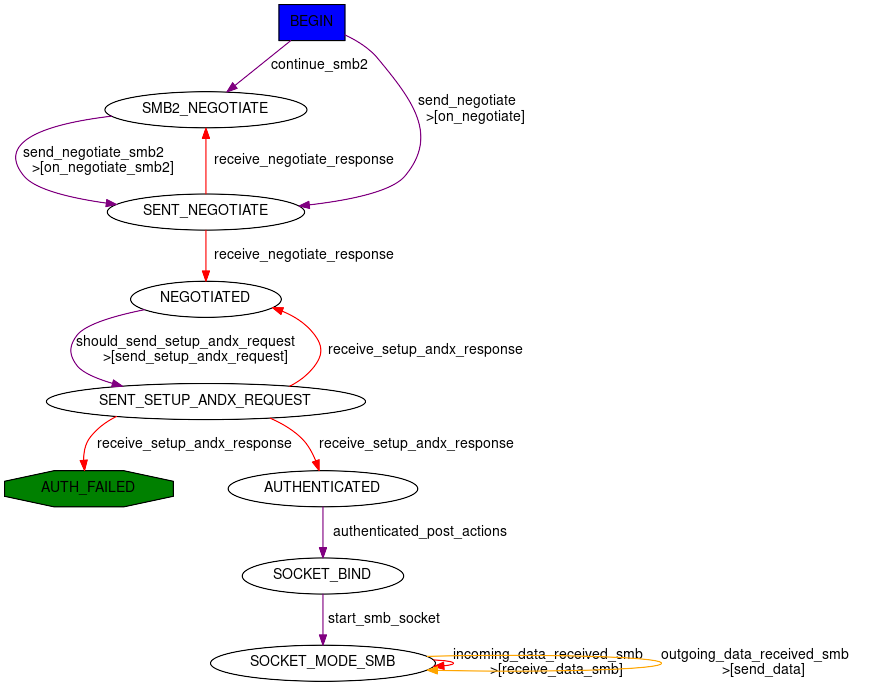
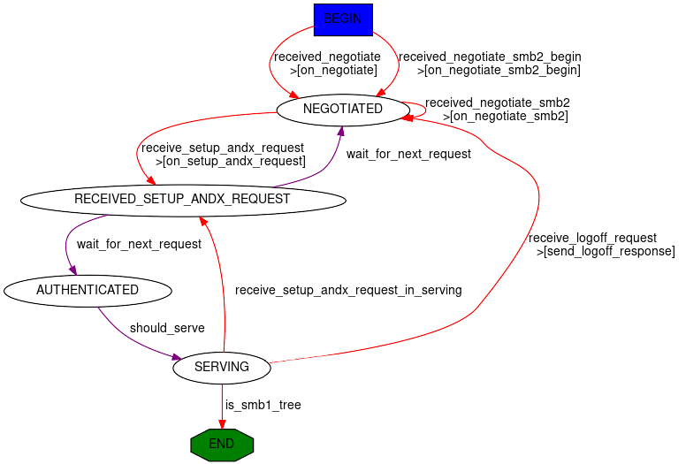

SMB
===

Scapy provides pretty good support for SMB 2/3 and very partial support of SMB1.

You can use the :class:`~scapy.layers.smb2.SMB2_Header` to dissect or build SMB2/3, or :class:`~scapy.layers.smb.SMB_Header` for SMB1.

.. _client:

SMB 2/3 client
--------------

Scapy provides a small SMB 2/3 client Automaton: :class:`~scapy.layers.smbclient.SMB_Client`

Scapy's SMB client stack is as follows:

- the :class:`~scapy.layers.smbclient.SMB_Client` Automaton handles the logic to bind, negotiate and establish the SMB session (eventually using Security Providers).
- This Automaton is wrapped into a :class:`~scapy.layers.smbclient.SMB_SOCKET` object which provides access to basic SMB commands such as open, read, write, close, etc.
- This socket is wrapped into a :class:`~scapy.layers.smbclient.smbclient` class which provides a high-level SMB client, with functions such as ``ls``, ``cd``, ``get``, ``put``, etc.

You can access any of the 3 layers depending on how low-level you want to get.
We'll skip over the lowest one in this documentation, as it not really usable as an API, but note that this is where to look if you want to change SMB negotiation or session setup .(people wanting to use this are welcomed to have a look at the ``scapy/layers/smbclient.py`` code).

High-Level :class:`~scapy.layers.smbclient.smbclient`
~~~~~~~~~~~~~~~~~~~~~~~~~~~~~~~~~~~~~~~~~~~~~~~~~~~~~

From the CLI
____________

Let's start by using :class:`~scapy.layers.smbclient.smbclient` from the Scapy CLI:

.. code:: python

    >>> smbclient("server1.domain.local", "Administrator@domain.local")
    Password: ************
    SMB authentication successful using SPNEGOSSP[KerberosSSP] !
    smb: \> shares
    ShareName  ShareType  Comment            
    ADMIN$     DISKTREE   Remote Admin       
    C$         DISKTREE   Default share      
    IPC$       IPC        Remote IPC         
    NETLOGON   DISKTREE   Logon server share 
    SYSVOL     DISKTREE   Logon server share 
    Users      DISKTREE                      
    common     DISKTREE                      
    smb: \> use c$
    smb: \> cd Program Files\Microsoft\
    smb: \Program Files\Microsoft> ls
    FileName     FileAttributes  EndOfFile  LastWriteTime                          
    .            DIRECTORY       0B         Fri, 24 Feb 2023 17:00:27  (1677254427)
    ..           DIRECTORY       0B         Fri, 24 Feb 2023 17:00:27  (1677254427)
    EdgeUpdater  DIRECTORY       0B         Fri, 24 Feb 2023 17:00:27  (1677254427)

.. note:: You can use ``help`` or ``?`` in the CLI to get the list of available commands.

As you can see, the previous example used Kerberos to authenticate.
By default, the :class:`~scapy.layers.smbclient.smbclient` class will use a :class:`~scapy.layers.spnego.SPNEGOSSP` and provide ask for both ``NTLM`` and ``Kerberos``. but it is possible to have a greater control over this by providing your own ``ssp`` attribute.

**smbclient using a** :class:`~scapy.layers.ntlm.NTLMSSP`

.. code:: python

    >>> smbclient("server1.domain.local", ssp=NTLMSSP(UPN="Administrator", PASSWORD="password"))

You might be wondering if you can pass the ``HashNT`` of the password of the user 'Administrator' directly. The answer is yes, you can 'pass the hash' directly:

.. code:: python

    >>> smbclient("server1.domain.local", ssp=NTLMSSP(UPN="Administrator", HASHNT=bytes.fromhex("8846f7eaee8fb117ad06bdd830b7586c")))

**smbclient using a** :class:`~scapy.layers.ntlm.KerberosSSP`

.. code:: python

    >>> smbclient("server1.domain.local", ssp=KerberosSSP(UPN="Administrator@domain.local", PASSWORD="password"))

**smbclient using a** :class:`~scapy.layers.ntlm.KerberosSSP` **created by** `Ticketer++ <kerberos.html#ticketer>`_:

.. code:: python

    >>> load_module("ticketer")
    >>> t = Ticketer()
    >>> t.request_tgt("Administrator@DOMAIN.LOCAL")
    Enter password: **********
    >>> t.request_st(0, "host/server1.domain.local")
    >>> smbclient("server1.domain.local", ssp=t.ssp(1))
    SMB authentication successful using KerberosSSP !

If you pay very close attention, you'll notice that in this case we aren't using the :class:`~scapy.layers.spnego.SPNEGOSSP` wrapper. You could have used ``ssp=SPNEGOSSP([t.ssp(1)])``.

**smbclient forcing encryption**:

.. code:: python

   >>> smbclient("server1.domain.local", "admin", REQUIRE_ENCRYPTION=True)

.. note::

    It is also possible to start the :class:`~scapy.layers.smbclient.smbclient` directly from the OS, using the following::

        $ python3 -m scapy.layers.smbclient server1.domain.local Administrator@DOMAIN.LOCAL
    
    Use ``python3 -m scapy.layers.smbclient -h`` to see the list of available options.

Programmatically
________________

A cool feature of the :class:`~scapy.layers.smbclient.smbclient` is that all commands that you can call from the CLI, you can also call programmatically.

Let's re-do the initial example programmatically, by turning off the CLI mode. Obviously prompting for passwords will not work so make sure the client has everything it needs for Session Setup.

.. code:: python

    >>> from scapy.layers.smbclient import smbclient
    >>> cli = smbclient("server1.domain.local", "Administrator@domain.local", password="password", cli=False)
    >>> shares = cli.shares()
    >>> shares
    [('ADMIN$', 'DISKTREE', 'Remote Admin'),
    ('C$', 'DISKTREE', 'Default share'),
    ('common', 'DISKTREE', ''),
    ('IPC$', 'IPC', 'Remote IPC'),
    ('NETLOGON', 'DISKTREE', 'Logon server share '),
    ('SYSVOL', 'DISKTREE', 'Logon server share '),
    ('Users', 'DISKTREE', '')]
    >>> cli.use('c$')
    >>> cli.cd(r'Program Files\Microsoft')
    >>> names = [x[0] for x in cli.ls()]
    >>> names
    ['.', '..', 'EdgeUpdater']

Mid-Level :class:`~scapy.layers.smbclient.SMB_SOCKET`
~~~~~~~~~~~~~~~~~~~~~~~~~~~~~~~~~~~~~~~~~~~~~~~~~~~~~

If you know what you're doing, then the High-Level smbclient might not be enough for you. You can go a level lower using the :class:`~scapy.layers.smbclient.SMB_SOCKET`.
You can instantiate the object directly or via the :meth:`~scapy.layers.smbclient.SMB_SOCKET.from_tcpsock` helper.

Let's write a script that connects to a share and list the files in the root folder.

.. code:: python

    import socket
    from scapy.layers.smbclient import SMB_SOCKET
    from scapy.layers.spnego import SPNEGOSSP
    from scapy.layers.ntlm import NTLMSSP, MD4le
    from scapy.layers.kerberos import KerberosSSP
    # Build SSP first. In SMB_SOCKET you have to do this yourself
    password = "password"
    ssp = SPNEGOSSP([
        NTLMSSP(UPN="Administrator", PASSWORD=password),
        KerberosSSP(
            UPN="Administrator@domain.local",
            PASSWORD=password,
        )
    ])
    # Connect to the server
    sock = socket.socket()
    sock.connect(("server1.domain.local", 445))
    smbsock = SMB_SOCKET.from_tcpsock(sock, ssp=ssp)
    # Tree connect
    tid = smbsock.tree_connect("C$")
    smbsock.set_TID(tid)
    # Open root folder and query files at root
    fileid = smbsock.create_request('', type='folder')
    files = smbsock.query_directory(fileid)
    names = [x[0] for x in files]
    # Close the handle
    smbsock.close_request(fileid)
    # Close the socket
    smbsock.close()

This has a lot more overhead so make sure you need it.

Something hybrid that might be easier to use, is to access the underlying :class:`~scapy.layers.smbclient.SMB_SOCKET` in a higher-level :class:`~scapy.layers.smbclient.smbclient`:

.. code:: python

    >>> from scapy.layers.smbclient import smbclient
    >>> cli = smbclient("server1.domain.local", "Administrator@domain.local", password="password", cli=False)
    >>> cli.use('c$')
    >>> smbsock = cli.smbsock
    >>> # Open root folder and query files at root
    >>> fileid = smbsock.create_request('', type='folder')
    >>> files = smbsock.query_directory(fileid)
    >>> names = [x[0] for x in files]

Low-Level :class:`~scapy.layers.smbclient.SMB_Client`
~~~~~~~~~~~~~~~~~~~~~~~~~~~~~~~~~~~~~~~~~~~~~~~~~~~~~

Finally, it's also possible to call the underlying :attr:`~scapy.layers.smbclient.SMB_Client.smblink` socket directly.
Again, you can instantiate the object directly or via the :meth:`~scapy.layers.smbclient.SMB_Client.from_tcpsock` helper.

.. code:: python

    >>> import socket
    >>> from scapy.layers.smbclient import SMB_Client
    >>> sock = socket.socket()
    >>> sock.connect(("192.168.0.100", 445))
    >>> lowsmbsock = SMB_Client.from_tcpsock(sock, ssp=NTLMSSP(UPN="Administrator", PASSWORD="password"))
    >>> resp = cli.sock.sr1(SMB2_Tree_Connect_Request(Path=r"\\server1\c$"))

It's also accessible as the ``ins`` attribute of a ``SMB_SOCKET``, or the ``sock`` attribute of a ``smbclient``.

.. code:: python

    >>> from scapy.layers.smbclient import smbclient
    >>> cli = smbclient("server1.domain.local", "Administrator@domain.local", password="password", cli=False)
    >>> lowsmbsock = cli.sock
    >>> resp = cli.sock.sr1(SMB2_Tree_Connect_Request(Path=r"\\server1\c$"))

.. _server:

SMB 2/3 server
--------------

Scapy provides a SMB 2/3 server Automaton: :class:`~scapy.layers.smbserver.SMB_Server`

Once again, Scapy provides high level :class:`~scapy.layers.smbserver.smbserver` class that allows to spawn a SMB server.

High-Level :class:`~scapy.layers.smbserver.smbserver`
~~~~~~~~~~~~~~~~~~~~~~~~~~~~~~~~~~~~~~~~~~~~~~~~~~~~~

The :class:`~scapy.layers.smbserver.smbserver` class allows to spawn a SMB server serving a selection of shares.
A share is identified by a ``name`` and a ``path`` (+ an optional description called ``remark``).

**Start a SMB server with NTLM auth for 2 users:**

.. code:: python

    smbserver(
        shares=[SMBShare(name="Scapy", path="/tmp")],
        iface="eth0",
        ssp=NTLMSSP(
            IDENTITIES={
                "User1": MD4le("Password1"),
                "Administrator": MD4le("Password2"),
            },
        )
    )

**Start a SMB server with NTLM auth in an AD, using machine credentials:**

.. note:: This requires an active account with ``WORKSTATION_TRUST_ACCOUNT`` in its ``userAccountControl``. (otherwise you might get ``STATUS_NO_TRUST_SAM_ACCOUNT``)

.. code:: python

    smbserver(ssp=NTLMSSP_DOMAIN(UPN="Computer1@domain.local", HASHNT=bytes.fromhex("7facdc498ed1680c4fd1448319a8c04f")))

**Start a SMB server with Kerberos auth:**

.. code:: python

    smbserver(
        shares=[SMBShare(name="Scapy", path="/tmp")],
        iface="eth0",
        ssp=KerberosSSP(
            KEY=Key(
                EncryptionType.AES256_CTS_HMAC_SHA1_96,
                key=bytes.fromhex("0000000000000000000000000000000000000000000000000000000000000000"),
            ),
            SPN="cifs/server.domain.local",
        ),
    )

**You can of course combine a NTLM and Kerberos server and provide them both over a** :class:`~scapy.layers.spnego.SPNEGOSSP`:

.. code:: python

    smbserver(
        shares=[SMBShare(name="Scapy", path="/tmp")],
        iface="eth0",
        ssp=SPNEGOSSP(
            [
                KerberosSSP(
                    KEY=Key(
                        EncryptionType.AES256_CTS_HMAC_SHA1_96,
                        key=bytes.fromhex("0000000000000000000000000000000000000000000000000000000000000000"),
                    ),
                    SPN="cifs/server.domain.local",
                ),
                NTLMSSP(
                    IDENTITIES={
                        "User1": MD4le("Password1"),
                        "Administrator": MD4le("Password2"),
                    },
                ),
            ]
        ),
    )

.. note::
    By default, Scapy's SMB server is read-only. You can set ``readonly`` to ``False`` to disable it, as follows.

**Start a SMB server with NTLM in Read-Write mode**

.. code:: python

    smbserver(
        shares=[SMBShare(name="Scapy", path="/tmp")],
        iface="eth0",
        ssp=NTLMSSP(
            IDENTITIES={
                "User1": MD4le("Password1"),
                "Administrator": MD4le("Password2"),
            },
        ),
        # Enable Read-Write
        readonly=False,
    )

**Start a SMB server requiring encryption (two methods)**:

.. code:: python

   # Method 1: require encryption globally (available in SMB 3.0.0+)
   >>> smbserver(..., REQUIRE_ENCRYPTION=True)
   # Method 2: for a specific share (only available in SMB 3.1.1+)
   >>> smbserver(..., shares=[SMBShare(name="Scapy", path="/tmp", encryptdata=True)])

.. note::

    It is possible to start the :class:`~scapy.layers.smbserver.smbserver` (albeit only in unauthenticated mode) directly from the OS, using the following::

        $ python3 -m scapy.layers.smbserver --port 12345

    Use ``python3 -m scapy.layers.smbserver -h`` to see the list of available options.

Low-Level :class:`~scapy.layers.smbserver.SMB_Server`
~~~~~~~~~~~~~~~~~~~~~~~~~~~~~~~~~~~~~~~~~~~~~~~~~~~~~

To change the functionality of the :class:`~scapy.layers.smbserver.SMB_Server`, you shall extend the server class (which is an automaton) and provide additional custom conditions (or overwrite existing ones).

.. code:: python

    from scapy.layers.smbserver import SMB_Server
    class MyCustomSMBServer(SMB_Server):
        """
        Ridiculous demo SMB Server

        We overwrite the handler of "SMB Echo Request" to do some crazy stuff
        """
        @ATMT.action(SMB_Server.receive_echo_request)
        def send_echo_reply(self, pkt):
            super(MyCustomSMBServer, self).send_echo_reply(pkt)  # send echo response
            print("WHAT? An ECHO REQUEST? You MUUUSST be a linux user then, since Windows NEEEVER sends those !")
